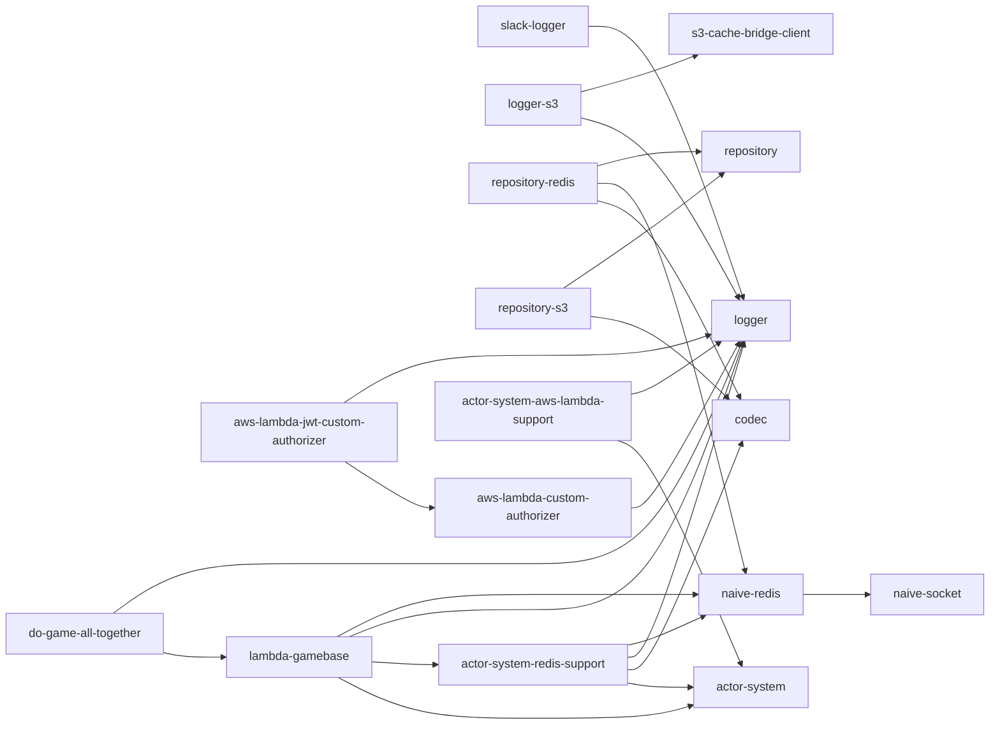

# tslib

TypeScript build-up libraries for [Yingyeothon](https://github.com/yingyeothon) (잉여톤) hackathons, consolidated into a single monorepo. These packages started life as scattered standalone repositories built between hackathons; this repository modernizes them (TypeScript 5.9, ESM+CJS dual output, Node >= 20) and publishes them all under the `@yingyeothon` npm scope with a single shared version.

## Packages

| Package                                                                                    | Description                                              |
| ------------------------------------------------------------------------------------------ | -------------------------------------------------------- |
| [@yingyeothon/codec](packages/codec)                                                       | Tiny codec abstraction (`Codec` + `JsonCodec`)           |
| [@yingyeothon/logger](packages/logger)                                                     | Minimal structured logger with severity filtering        |
| [@yingyeothon/event-broker](packages/event-broker)                                         | Type-safe async event broker                             |
| [@yingyeothon/slack-logger](packages/slack-logger)                                         | Logger that batches records into a Slack webhook         |
| [@yingyeothon/logger-s3](packages/logger-s3)                                               | Buffered log writer flushing into S3 via s3-cache-bridge |
| [@yingyeothon/naive-socket](packages/naive-socket)                                         | Zero-dependency TCP client with queueing and reconnect   |
| [@yingyeothon/naive-redis](packages/naive-redis)                                           | Minimal Redis client built on naive-socket               |
| [@yingyeothon/s3-cache-bridge-client](packages/s3-cache-bridge-client)                     | HTTP client for the s3-cache-bridge server               |
| [@yingyeothon/repository](packages/repository)                                             | Key-value repository abstractions + in-memory impl       |
| [@yingyeothon/repository-redis](packages/repository-redis)                                 | Redis-backed repository                                  |
| [@yingyeothon/repository-s3](packages/repository-s3)                                       | S3-backed repository                                     |
| [@yingyeothon/actor-system](packages/actor-system)                                         | Lightweight actor system (queue/lock/awaiter)            |
| [@yingyeothon/actor-system-redis-support](packages/actor-system-redis-support)             | Redis-backed actor system support                        |
| [@yingyeothon/actor-system-aws-lambda-support](packages/actor-system-aws-lambda-support)   | AWS Lambda glue for the actor system                     |
| [@yingyeothon/aws-lambda-custom-authorizer](packages/aws-lambda-custom-authorizer)         | API Gateway custom authorizer helpers                    |
| [@yingyeothon/aws-lambda-jwt-custom-authorizer](packages/aws-lambda-jwt-custom-authorizer) | JWT-verifying API Gateway authorizer                     |
| [@yingyeothon/lambda-gamebase](packages/lambda-gamebase)                                   | Serverless WebSocket game framework on AWS Lambda        |
| [@yingyeothon/do-game-all-together](packages/do-game-all-together)                         | Wait/running stage game loop plugin for lambda-gamebase  |

## Dependency graph



## Development

Requirements: Node >= 20, pnpm 11 (pinned via `packageManager`), Docker (for Redis testcontainers-based integration tests).

```bash
pnpm install
pnpm build        # tsup dual ESM+CJS+types for every package (topological order)
pnpm lint         # eslint (type-aware)
pnpm typecheck    # tsc --noEmit per package (build first: workspace types resolve from dist)
pnpm test         # vitest across all packages (spins up Redis containers)
pnpm coverage     # with v8 coverage and thresholds
```

Every package ships dual ESM/CJS with type definitions via an `exports` map, targets Node >= 20, and exposes its whole public API as named exports from the package root (legacy deep imports such as `@yingyeothon/naive-redis/lib/get` are gone — see each package README's migration notes).

## Release

All packages share one version. To release:

1. Create a GitHub Release with a tag like `v1.0.0`.
2. The [release workflow](.github/workflows/release.yml) stamps that version into every package, builds, tests, and runs `pnpm -r publish` to npm with provenance.

Publishing auth uses the `NPM_TOKEN` repository secret (or configure npm trusted publishing per package and drop the token).
