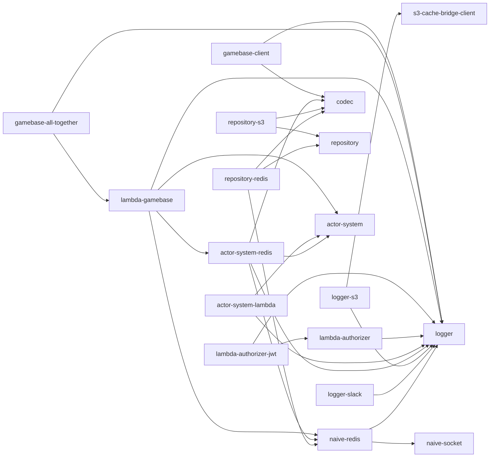

# tslib

TypeScript build-up libraries for [Yingyeothon](https://github.com/yingyeothon) (잉여톤) hackathons, consolidated into a single monorepo. These packages started life as scattered standalone repositories built between hackathons; this repository modernizes them (TypeScript 5.9, ESM+CJS dual output, Node >= 20) and publishes them all under the `@yingyeothon` npm scope with a single shared version.

## Packages

| Package                                                                | Description                                                |
| ---------------------------------------------------------------------- | ---------------------------------------------------------- |
| [@yingyeothon/codec](packages/codec)                                   | Tiny codec abstraction (`Codec` + `jsonCodec`)             |
| [@yingyeothon/logger](packages/logger)                                 | Minimal structured logger with severity filtering          |
| [@yingyeothon/event-broker](packages/event-broker)                     | Type-safe async event broker                               |
| [@yingyeothon/logger-slack](packages/logger-slack)                     | Slack-webhook log writer for @yingyeothon/logger           |
| [@yingyeothon/logger-s3](packages/logger-s3)                           | Buffered log writer flushing into S3 via s3-cache-bridge   |
| [@yingyeothon/naive-socket](packages/naive-socket)                     | Minimal TCP/TLS client with queueing and reconnect         |
| [@yingyeothon/naive-redis](packages/naive-redis)                       | Minimal Redis client built on naive-socket (incl. pub/sub) |
| [@yingyeothon/s3-cache-bridge-client](packages/s3-cache-bridge-client) | HTTP client for the s3-cache-bridge server                 |
| [@yingyeothon/repository](packages/repository)                         | Key-value repository abstractions + in-memory impl         |
| [@yingyeothon/repository-redis](packages/repository-redis)             | Redis-backed repository                                    |
| [@yingyeothon/repository-s3](packages/repository-s3)                   | S3-backed repository                                       |
| [@yingyeothon/actor-system](packages/actor-system)                     | Lightweight actor system (queue/lock/awaiter)              |
| [@yingyeothon/actor-system-redis](packages/actor-system-redis)         | Redis-backed actor system support                          |
| [@yingyeothon/actor-system-lambda](packages/actor-system-lambda)       | AWS Lambda glue for the actor system                       |
| [@yingyeothon/lambda-authorizer](packages/lambda-authorizer)           | API Gateway TOKEN and REQUEST authorizer helpers           |
| [@yingyeothon/lambda-authorizer-jwt](packages/lambda-authorizer-jwt)   | JWT-issuing and JWT-verifying API Gateway authorizers      |
| [@yingyeothon/lambda-gamebase](packages/lambda-gamebase)               | Serverless WebSocket game framework on AWS Lambda          |
| [@yingyeothon/gamebase-all-together](packages/gamebase-all-together)   | Wait/running stage game loop plugin for lambda-gamebase    |
| [@yingyeothon/gamebase-client](packages/gamebase-client)               | Browser-capable client SDK for the yyt WebSocket gateway   |

## Dependency graph



API design rules shared by all packages are documented in [CONVENTIONS.md](CONVENTIONS.md).

## Development

Requirements: Node >= 20, pnpm 11 (pinned via `packageManager`), Docker (for Redis testcontainers-based integration tests).

```bash
pnpm install
pnpm build        # tsup dual ESM+CJS+types for every package (topological order)
pnpm lint         # eslint (type-aware)
pnpm typecheck    # tsc --noEmit per package (build first: workspace types resolve from dist)
pnpm test         # vitest across all packages (spins up Redis containers)
pnpm coverage     # with v8 coverage and thresholds
```

Every package ships dual ESM/CJS with type definitions via an `exports` map, targets Node >= 20, and exposes its whole public API as named exports from the package root (legacy deep imports such as `@yingyeothon/naive-redis/lib/get` are gone — see each package README's migration notes).

## Release

All packages share one version. To release:

1. Run the [Release workflow](.github/workflows/release.yml) from the GitHub Actions tab with the version to publish (e.g. `2.0.0`; it must exceed every version already published for any package).
2. The workflow stamps that version into every package, builds and tests, commits `Release vX.Y.Z`, tags that commit, pushes commit and tag atomically, publishes all packages with `pnpm -r publish` and npm provenance, and creates the GitHub Release.

The committed `version` fields therefore always equal the last release, and the tag points at the commit that was published. Publishing auth uses npm Trusted Publishing via the workflow's `id-token: write` permission; no npm token is stored. A package name that is new to npm needs one manual `scripts/bootstrap-publish.sh` run first so its Trusted Publisher can be registered.
