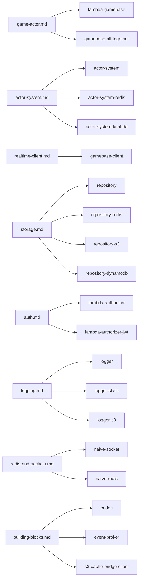

# tslib documentation

The twenty packages in this repository are the server half of the yyt platform,
plus `gamebase-client`, which is its browser half. This folder is the guide; the
package READMEs are the per-package reference, and the `service` repository owns
the wire protocol and the channels.

## Start here

1. **[The platform](platform.md)** — the whole picture in three diagrams: what
   yyt runs, what you run, and which of the two channel kinds your game needs.
2. **[Getting started](getting-started.md)** — an empty repository to a game
   running on a `q` channel, in order, with nothing assumed.
3. **[The game actor](game-actor.md)** — the contract between the gateway and
   your Lambda. Four of this repository's silent failures live in it.

## By what you are building

| You want to                                      | Read                                      |
| ------------------------------------------------ | ----------------------------------------- |
| Run a game loop on Lambda                        | [The game actor](game-actor.md)           |
| Serialise work per key, without a game           | [Actor system](actor-system.md)           |
| Connect a browser to a lobby or a run            | [The realtime client](realtime-client.md) |
| Keep something after the run ends                | [Storage](storage.md)                     |
| Verify a token on `$connect`                     | [Authentication](auth.md)                 |
| Deploy it and stay inside the limits             | [Operations](operations.md)               |
| Log without leaking a token, a payload or a name | [Logging](logging.md)                     |
| Talk to Redis from a Lambda that freezes         | [Redis and sockets](redis-and-sockets.md) |
| Encode a frame, broker an event, cache a blob    | [Building blocks](building-blocks.md)     |
| Work out why nothing is happening                | [Troubleshooting](troubleshooting.md)     |

Which page owns which package — because a reader arriving from npm knows a
package name, not a task name:

Those are ownership, not dependencies: the [root README](../README.md) has the
exact edge list, and it is the only place that does.

Only `gamebase-client` names the platform at all; `lambda-gamebase` and
`gamebase-all-together` are shaped by it without depending on it, and everything
else is a general library that a game happens to need. Each is usable on its
own.

## Worked examples

Compiled and smoke-tested, so they cannot rot. **Every one runs with no AWS
credentials, no Docker and no deployed gateway.**

| Example                                                      | Shows                                                             |
| ------------------------------------------------------------ | ----------------------------------------------------------------- |
| [`actor-game`](../examples/actor-game/README.md)             | A whole game through the real `handleActor`                       |
| [`gateway-contract`](../examples/gateway-contract/README.md) | The three ways a gateway silently fails to reach an actor         |
| [`gateway-client`](../examples/gateway-client/README.md)     | Both clients, and a finished run against an aborted one           |
| [`repository-cas`](../examples/repository-cas/README.md)     | Two writers racing on one document, and the write that keeps both |

The full deployable stacks — a Serverless deployment, an auth service, a real
channel — live in the [`examples`](https://github.com/yingyeothon/examples)
repository as `sample-dungeon` and `sample-morpg`.

## Reference

Each package's README carries its own `## Public API` — the actual named exports
of its `src/index.ts`, gated against drift — a diagram of its mechanism, its
options and defaults, and its `## Migrating from the legacy package` notes. Read
those before changing a call: the migration section is usually where a surprise
already has a name.

[`CONVENTIONS.md`](../CONVENTIONS.md) is canonical for API design — why there
are no exported classes, why every entry point is a `create*` factory, and why
library code never reads `process.env`.

## What lives in the `service` repository

tslib follows the platform; it never defines it.
[The platform § What the `service` repository owns](platform.md#what-the-service-repository-owns)
lists the normative documents.

When this guide and the gateway README disagree, the gateway README is right —
and that is a bug here worth reporting.
