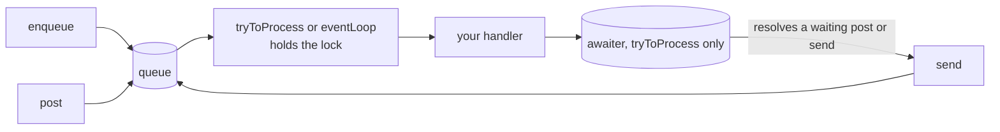
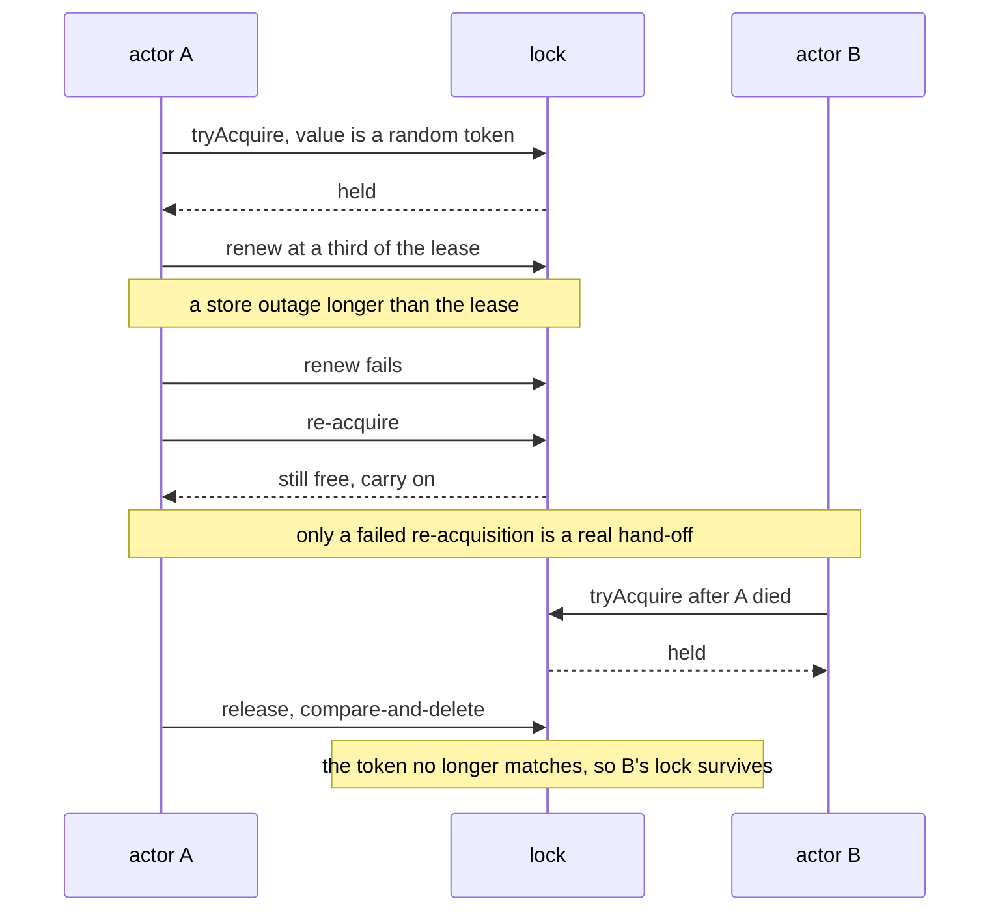
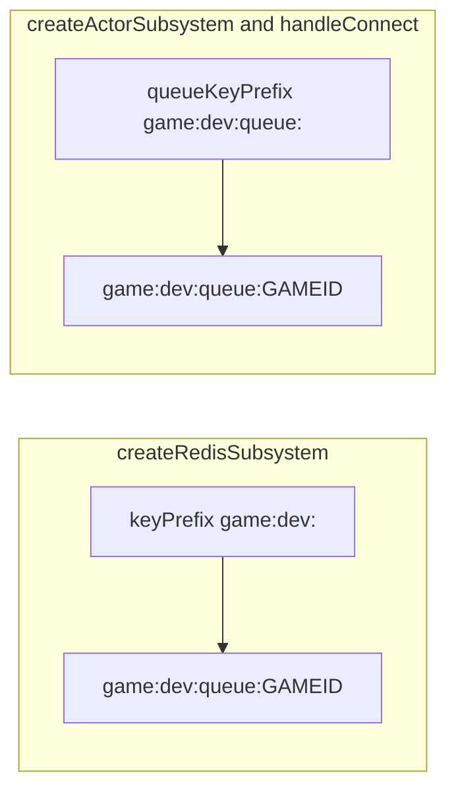
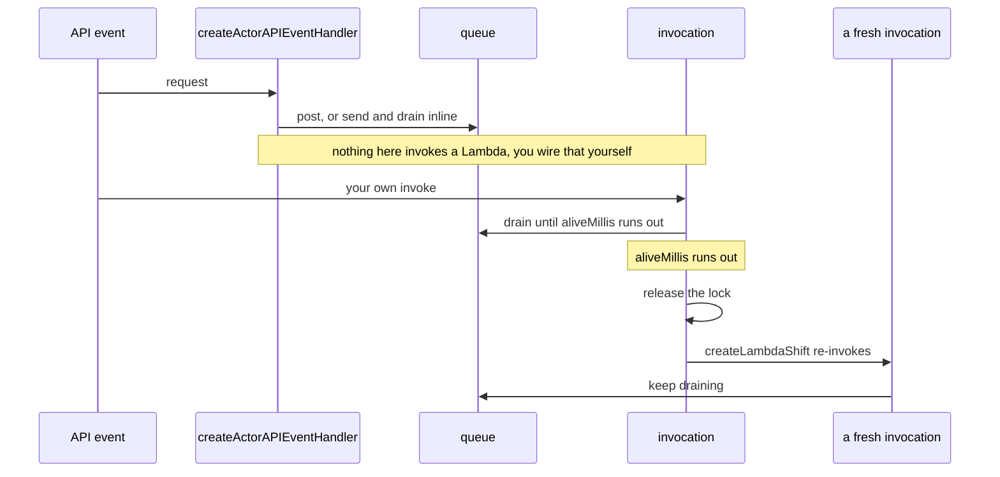

# Actor system

Serialised processing per key: a queue, an exclusive lock and an awaiter, with
in-memory and Redis implementations. [The game actor](game-actor.md) is one
consumer of it; nothing here knows what a game is, so a per-entity workload with
no gateway can use it as it stands.

```ts
import {
  AwaitPolicy,
  createInMemoryLock,
  createInMemoryQueue,
  eventLoop,
  send,
  tryToProcess,
} from "@yingyeothon/actor-system";
```

**Reference:** [`actor-system`](../packages/actor-system/README.md), [`actor-system-redis`](../packages/actor-system-redis/README.md), [`actor-system-lambda`](../packages/actor-system-lambda/README.md) — each carries its own `## Public API`, its
options and defaults, and its migration notes.

## The three pieces, and the three ways in



**`eventLoop` has no awaiter at all.** Only `tryToProcess` resolves one, so a
`post` or `send` with `AwaitPolicy.Act` or `Commit` against an `eventLoop`-driven
actor — which is what `handleActor` runs — waits out its timeout and is never
resolved. Use `Forget` there.

`enqueue` appends and resolves the message plus the queue depth after the push. `post` enqueues
and optionally waits for another processor. `send` enqueues and then tries to
process the queue in the calling thread. `AwaitPolicy` decides how long a sender
waits: `Forget` not at all, `Act` until its handler ran, `Commit` until the
whole pass finished. It is a **numeric** enum, and `Forget` is `0`.

Serialising work per key, with nothing but memory:

```ts
let total = 0;
const actor = {
  ...singleConsumer,
  id: "counter-1",
  queue: createInMemoryQueue(),
  lock: createInMemoryLock(),
  awaiter: createInMemoryAwaiter(),
  onMessage: ({ delta }: { delta: number }) => {
    total += delta;
  },
};

// Enqueue and drain in this thread, waiting until the message is committed.
await send(actor, { item: { delta: 1 }, awaitPolicy: AwaitPolicy.Commit });

// Or enqueue elsewhere and let a dedicated processor drain it.
await tryToProcess(actor, { aliveMillis: 10_000 });
```

Swap the three in-memory pieces for `createRedisSubsystem` and the same actor
runs across processes; nothing above changes.

## Two drains, and they are not interchangeable

| Entry point            | Drain                           | On a crash mid-batch                             |
| ---------------------- | ------------------------------- | ------------------------------------------------ |
| `tryToProcess`, single | peek, handle, pop               | **at-least-once**: still queued, handled again   |
| `tryToProcess`, bulk   | flush, then hand over the batch | **at-most-once**: the batch left the queue first |
| `eventLoop`            | flush, then hand over the batch | **at-most-once**: the batch left the queue first |

`lambda-gamebase` uses `eventLoop`, so a game that cannot lose input needs an
ack of its own above it, or `tryToProcess`.

## The lease, and why a short one is safe



Both entry points hold the lock for the whole call, not one drain cycle: actor
state lives in the owner's heap while a shift payload carries only an id, so
releasing between cycles would let ownership migrate to a process holding
different state.

**Pass `lockRenewIntervalMillis` whenever the lease is shorter than the work.**
There is no default here — `handleActor` picks a third of its own lease, but
that is its choice, not this package's.
Without a heartbeat the lease expires mid-run and a second invocation starts
draining the same queue.

Detecting the loss is only half of it. `eventLoop`'s `poll` rejects from the
moment ownership is lost, so the loser stops consuming the new owner's messages;
a heartbeat that only logged "lost the lock" would leave both owners running.

## The Redis layouts, and the `queue:` segment

This is the single most expensive detail in the repository to get wrong, because
nothing reports it.



`createRedisSubsystem` **appends** a `queue:` segment to the prefix it is given.
`createActorSubsystem` in `lambda-gamebase`, and `handleConnect`, pass
`queueKeyPrefix` straight through. The two reach the same key only when the
prefixes differ by exactly that segment — so a producer configured from the
wrong half pushes into a key nobody drains, and both sides look healthy.

Two options here are required rather than defaulted, and both for the same
reason — an unsafe default should not exist:

- **`createRedisQueue`'s `ttlSeconds`** is required and throws on a
  non-positive value. On a shared `allkeys-lru` Redis a key that never expires
  evicts someone else's first, and a queue abandoned by a dead consumer must
  disappear. It is re-applied on **every** push, because only a producer pushes,
  so only a producer can re-apply it.
- **`createRedisLock`'s `lockTimeout`** is required rather than defaulting to
  "no expiry": a lock that never expires deadlocks its actor forever when the
  holder crashes. Requiring the field is the enforcement; a doc comment is not.

## On Lambda



`createActorAPIEventHandler` only enqueues (`post`) or drains inline (`send`) —
**it never invokes a Lambda.** The single invoke in the package is the shift.

A shift happens **after** the release, so the successor can acquire. The drain
is bounded by `aliveMillis`, captured when the handler starts.

**This path is not reachable from `handleActor`.** A game is capped at one
invocation: the actor loop has no shift and no hand-off, so the game ends when
the Lambda times out. `createLambdaShift` belongs to the `tryToProcess` path,
for workloads that can resume from the queue alone.

## Read next

[The game actor](game-actor.md) for the game-shaped consumer of all this, or
[Redis and sockets](redis-and-sockets.md) for the client underneath the Redis
implementations.
