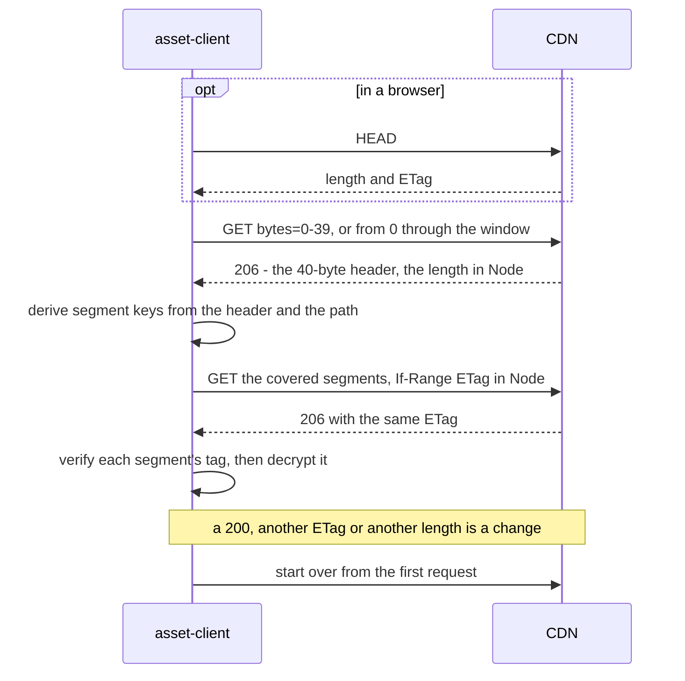

# Asset bundles

Files a game ships beside its code without shipping them in its build: a SQLite
database, music, a level pack, and the manifest that names them. This page owns
how a game lays out and reads a bundle with `asset-client`; creating bundles,
`yyt asset sync`, the key and the CDN's cache rules belong to the `service`
repository (`docs/decisions.md` _Live and encrypted asset bundles_ and
`docs/asset-encryption.md` there).

**Reference:** [`asset-client`](../packages/asset-client/README.md) carries the
options, the request count of every call, the browser rules, the file-sink
recipe and every error code.

## Bundle shapes

A bundle is created once, with `yyt asset create <name> --mode live` (or
`versioned`, the default) and optionally `--encrypted`. Neither choice can be
changed later, and together they decide how a game reads the bundle.

| Choice      | Values                  | What the client does with it                                                                             |
| ----------- | ----------------------- | -------------------------------------------------------------------------------------------------------- |
| `mode`      | `versioned`, `live`     | `baseUrl` ends in `/{bundleId}/{version}/` or in `/{bundleId}/`; your build picks the version to read    |
| `encrypted` | off, on (a `yak1.` key) | without `key` the client returns the bytes as served; with it, it verifies and decrypts them, same calls |

`yyt asset files <bundle>` prints each file's public URL, which is where the
bundle id and the CDN host of `baseUrl` come from, and
`yyt asset key show <bundle>` prints an encrypted bundle's key.

**The key is inside every copy of your app.** Encryption keeps the bundle from
someone who finds a CDN URL, which a plain bundle never did; it does not keep it
from your players, and a leaked key means a new bundle and an app release.

## The manifest pattern

Inside a live bundle each file is immutable (served for a year; its path only
ever accepts the same bytes again) or mutable (served `no-cache`, at most
`asset.mutableFileBytes`, 256 KiB by default and 4 MiB at most, meant for a
manifest). The usual layout is one mutable manifest naming immutable files by
content, uploaded with `yyt asset sync <bundle> <dir> --mutable manifest.json`.
A release then replaces the manifest and nothing else, and no CDN invalidation
is ever needed:

```ts
import { createAssetBundleClient } from "@yingyeothon/asset-client";

const bundle = createAssetBundleClient({
  baseUrl: "https://d.yyt.life/assets/bnd_123/", // dev: https://dev-d.yyt.life
  key: bundleKey, // omitted for a plain bundle
});

// the manifest revalidates on every read; the files it names never change
const manifest = await bundle.readJson<{ db: string }>("manifest.json");
const db = await bundle.read(manifest.db); // e.g. "data/songs-3f9a.db"
```

`sync` uploads the immutable files before the manifest, so a manifest never
names a file that is not there yet.

## A ranged read, and what happens when the file changes

`read` is one `GET` of the whole file. `readRange`, and any `download` of an
encrypted file, cannot trust one answer to describe the object the next answer
comes from, because a mutable file can be replaced between them. So the client
records the object's identity first and checks every later answer against it:



A window that starts in the first segment folds the header and the segments into
one request, so the fourth and fifth messages disappear. The segment keys
depend on the path, which is why a file served under another path fails its
first tag rather than decrypting to garbage. Starting over is bounded; the
package README gives the count and the error after it.

## Errors

Everything the CDN, the network or the ciphertext refuses is an
`AssetClientError` with a `code` and the HTTP `status`; a malformed `baseUrl`,
path or range is a `RangeError` before any request.

| `code`          | Status        | Why you would hit this                                                                                                                |
| --------------- | ------------- | ------------------------------------------------------------------------------------------------------------------------------------- |
| `bad_key`       | `0`           | the key was pasted with a character missing or added, or it is some other secret                                                      |
| `not_found`     | `403`, `404`  | a typo in the path or the bundle id, a file not synced yet, or a version that does not exist — the CDN says 403                       |
| `asset_corrupt` | any           | the wrong key, a `baseUrl` naming another version or a folder, a file `yyt asset sync` did not upload, or a manifest that is not JSON |
| `http`          | any other     | a proxy that ignores `Range`, a server error, or a file replaced on every attempt of one read                                         |
| `network`       | `0` or served | offline, or the connection dropped mid-body; a `download` can resume from what it already wrote                                       |

`asset_corrupt` is never worth retrying: the bytes will verify the same way the
next time. Check the key and the `baseUrl` first.

Next: [Key-value store](kvstore.md) is the other half of what a game reads from
the platform — small records that change while the game runs, rather than files
that change when you release.
