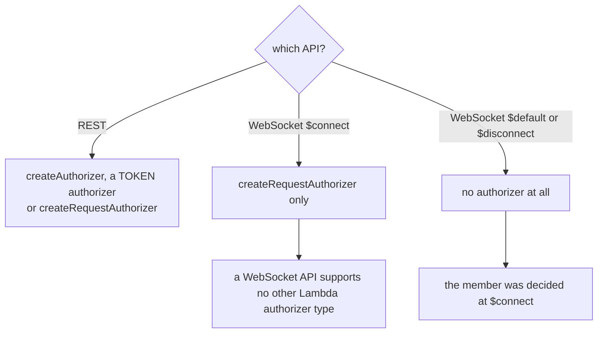
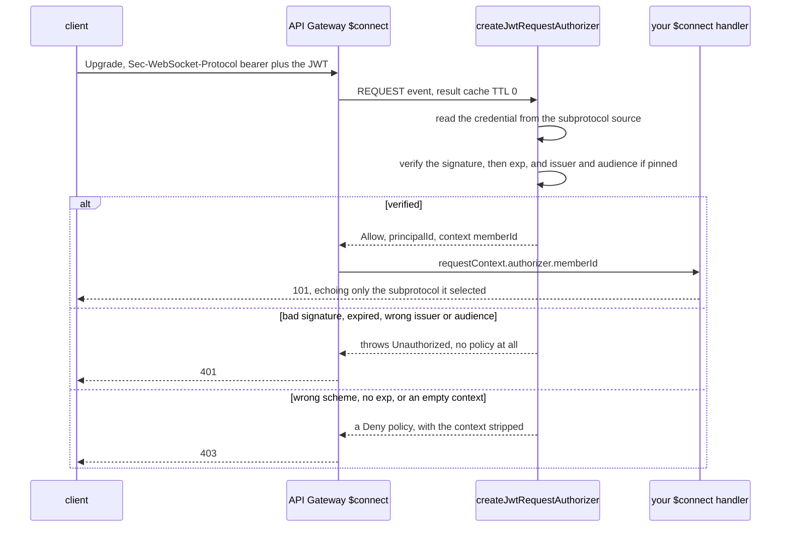

# Authentication

Every socket carries a **channel JWT**. This page is what the two authorizer
packages do with it on the way in, and what an authorizer can and cannot
promise. The token itself — how a player gets one, what its claims mean, how
long it lives — is settled by `docs/auth-game-contract.md` and
`services/auth/README.md` in the
[`service`](https://github.com/yingyeothon/service) repository.

```ts
import { createJwtRequestAuthorizer } from "@yingyeothon/lambda-authorizer-jwt";
```

**Reference:** [`lambda-authorizer`](../packages/lambda-authorizer/README.md), [`lambda-authorizer-jwt`](../packages/lambda-authorizer-jwt/README.md) — each carries its own `## Public API`, its
options and defaults, and its migration notes.

## TOKEN or REQUEST is decided by the API, not by preference



`createJwtAuthorizer` is the TOKEN one: it also _issues_, exchanging a `Basic`
login for a freshly signed JWT. `createJwtRequestAuthorizer` only verifies —
a handshake has no response body to hand a token back through — so keep the
login exchange behind a REST endpoint.

## `$connect`, end to end



**A refusal takes one of two routes, and most take the first.** Anything the
verification throws — a bad signature, an expired token, the wrong `issuer` or
`audience`, a missing credential — is caught and re-thrown as `Unauthorized`, so
API Gateway never receives a policy at all. Only three cases actually build a
`Deny`: a scheme that is not `Bearer`, a token with no `exp`, and a
`buildContext` that returned nothing.

Either way the client cannot tell the two apart. Every refusal reaches a browser
as a close before open, which is why `maxHandshakeFailures` exists to stop it
retrying a dead token forever.

**A browser cannot set headers on a WebSocket handshake.** The credential
travels as `new WebSocket(url, ["bearer", token])`, which arrives as
`Sec-WebSocket-Protocol: bearer, <token>` — and the server **must echo the
subprotocol it selected** or the browser aborts. That is what `handleConnect`'s
`selectSubprotocol` is for.

**That callback is handed the raw credential.** With the arrangement above,
`offered` is `["bearer", "<the JWT>"]`. Never log it.

Verifying on a WebSocket `$connect`:

```ts
export const handler = createJwtRequestAuthorizer({
  jwtSecret: process.env.JWT_SECRET_KEY!,
  // Pin both. A signature proves who minted the token, not who for.
  verifyOptions: { issuer: "yyt-auth/auth_0123", audience: "my-dungeon" },
});
```

Then read the verified identity in `$connect`, so the member id is never the
client's to choose:

```ts
export const connect = (event: APIGatewayProxyEvent) =>
  handleConnect({
    event,
    context,
    ...prefixes,
    queueTtlSeconds: 900,
    resolveMemberId: (connecting) => {
      const memberId: unknown =
        connecting.requestContext.authorizer?.["memberId"];
      return typeof memberId === "string" ? memberId : undefined; // fails closed
    },
    // A browser aborts unless the server echoes the subprotocol it selected.
    selectSubprotocol: (offered) =>
      offered.includes("bearer") ? "bearer" : undefined,
  });
```

## Where the credential is read from

`AuthorizationSource` is **data**, not a callback:
`{ from: "header", name? }`, `{ from: "subprotocol" }`, or
`{ from: "queryString", name }` — where `name` is **required**, because there is
no conventional parameter to default to. The space is closed and enumerable, so
it is inspectable and trivially testable, and it mirrors the vocabulary API
Gateway already uses. `parseAuthorization` turns what was read into `Basic`,
`Bearer` or `Unknown`.

Prefer the subprotocol. A query string is written to access logs.

## Verification, not decoding

- **Require an expiry.** A token with no `exp` is denied; a bearer credential
  that never expires makes every "the allow cannot outlive the credential"
  guarantee vacuous. `requireExpiry: false` opts out deliberately.
- **Pin `issuer` and `audience` — nothing pins them for you.** The signature is
  always verified; `issuer` and `audience` are checked only when you pass them
  in `verifyOptions`, and the default passes neither. A valid signature proves
  who minted a token, not who it was minted _for_, and **with a shared
  symmetric secret every holder can mint any identity** — so the secret is a
  signing capability, not a verification key.
- **An empty context is a refusal.** If `buildContext` returns `{}` the token is
  denied rather than allowed with no identity: an authorizer whose job is to
  establish who is calling must not say yes when it established nobody. The
  default, `memberIdFromSubject`, publishes `{ memberId: claims.sub }` —
  falling back to `claims.id`, which is what this package's own
  `buildJWTPayload` default issues — and nothing else. That value also becomes
  the `principalId`, which otherwise defaults to a constant, making every caller
  look like the same one.

## The context is narrow on purpose

It stays with the connection and reaches `$connect`, `$default` and
`$disconnect` as `event.requestContext.authorizer`. It carries only strings,
numbers and booleans, so claims must be flattened.

Keep it small, because **`$context.authorizer.*` can be configured into access
logs**: a token or an email placed there is a token or an email in the logs. A
verified bearer token is never echoed back into the context — the caller already
has it. The one exception is the `Basic` exchange, where the JWT the authorizer
just issued is the only way the caller receives it; on an API using that
exchange, keep the authorizer context out of access logs.

**Strip the context from a `Deny`.** A refused request reaches the access log
too, and the reason an authorizer refused is usually more sensitive than the
reason it allowed.

## Set the `$connect` cache TTL to 0

`$connect` runs once per connection, so caching buys nothing and lets an allow
outlive the credential's expiry.

It has a second effect worth knowing: **identity sources are enforced only when
caching is on.** With caching enabled, every declared source must be present and
non-empty or API Gateway answers 401 without invoking your function; with it off
the function is invoked regardless. The TTL-0 recommendation and "declare only
the source your clients actually send" are the same decision seen twice.

## What an authorizer cannot do

**It cannot revoke an established connection.** Once the handshake succeeds, no
policy touches that socket again. Ejecting a player mid-game is the
application's job, through `Transport.drop`.

And refusing a message type is not authentication. `handleMessages` refuses
`enter` and `leave` from clients so `$default` cannot rebind a connection to
another member — but identity itself comes from the verified principal, which is
why `handleConnect` takes `resolveMemberId`. A resolver that returns `undefined`
rejects: an identity seam whose failure mode is "fall back to what the client
said" is not a seam.

## Read next

[The game actor § Who the connection speaks for](game-actor.md#who-the-connection-speaks-for)
for the other half of this, and [Logging](logging.md) for what must never reach
a log line.
