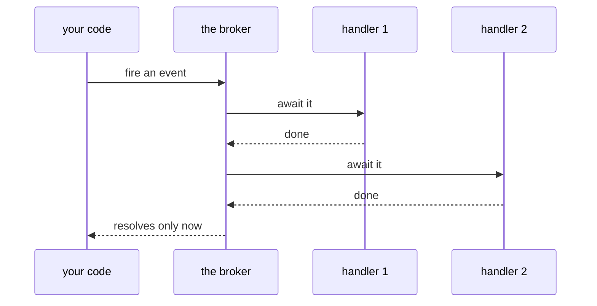
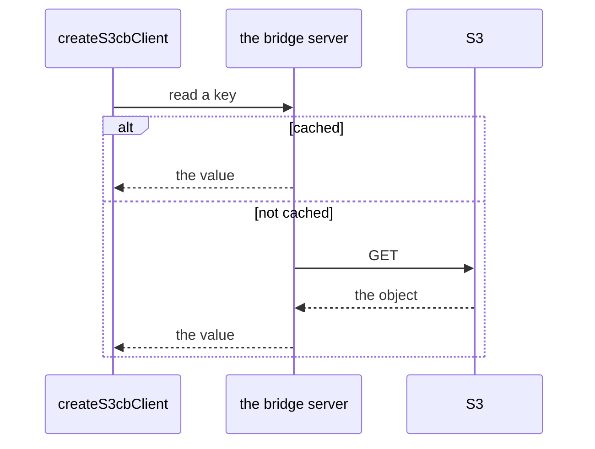

# Building blocks

Three small packages with no yyt in them at all. They appear on other packages'
public surfaces, so you will meet them whatever you build.

**Reference:** [`codec`](../packages/codec/README.md), [`event-broker`](../packages/event-broker/README.md), [`s3-cache-bridge-client`](../packages/s3-cache-bridge-client/README.md) — each carries its own `## Public API`, its
options and defaults, and its migration notes.

## `codec` — an encoder and a decoder, together


`Codec<B>` is a **pair**, not a serializer: whoever holds one can both write and
read the same representation. `jsonCodec` is the stateless `Codec<string>`
singleton every backend defaults to, which is why `repository-*` and
`actor-system-redis` all take a `codec` option — swapping it changes what lands
in the store without touching the code above.

Encoding `undefined` returns the literal string `"undefined"`; decoding
`undefined` throws, and decoding invalid JSON throws a `SyntaxError`.

```ts
const encoded = jsonCodec.encode({ a: 10, b: "hello" });
const decoded = jsonCodec.decode<{ a: number; b: string }>(encoded);
```

## `event-broker` — type-keyed, and awaited



Handlers run **in registration order**, and each async handler is awaited before
the next one runs. So firing an event is a sequencing point, not a
fire-and-forget: the promise resolves once every handler has finished.

It is independent of everything else here — nothing in tslib requires it.

## `s3-cache-bridge-client` — HTTP in front of S3



Read, write, delete and append cached objects, patch JSON documents in place,
take per-key locks, and trigger sync or invalidation — over plain HTTP with
optional basic auth, on the global `fetch`, with no runtime dependencies. It is
what [`logger-s3`](logging.md) flushes through.

## Read next

[Storage](storage.md), where `codec` shows up as an option on every backend.
