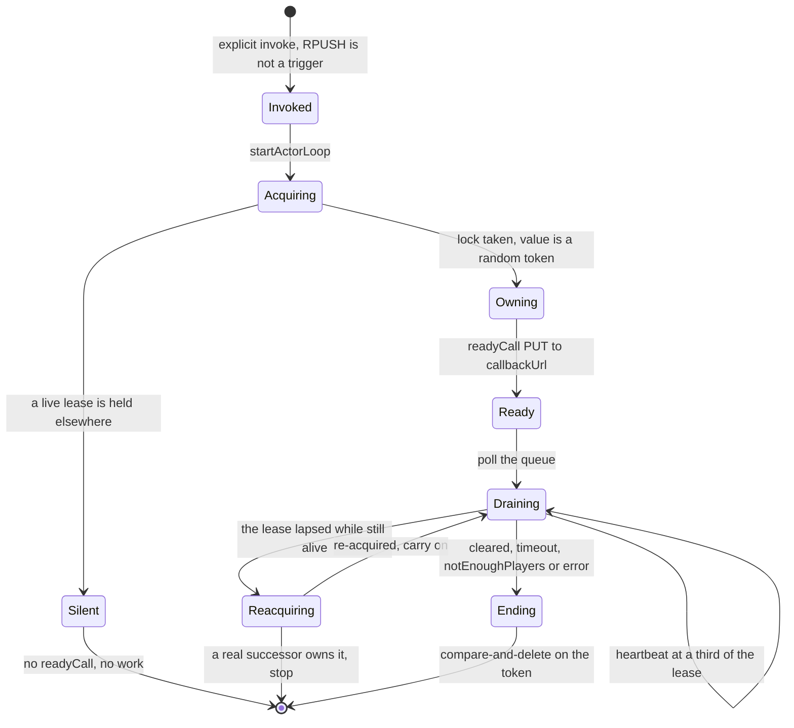
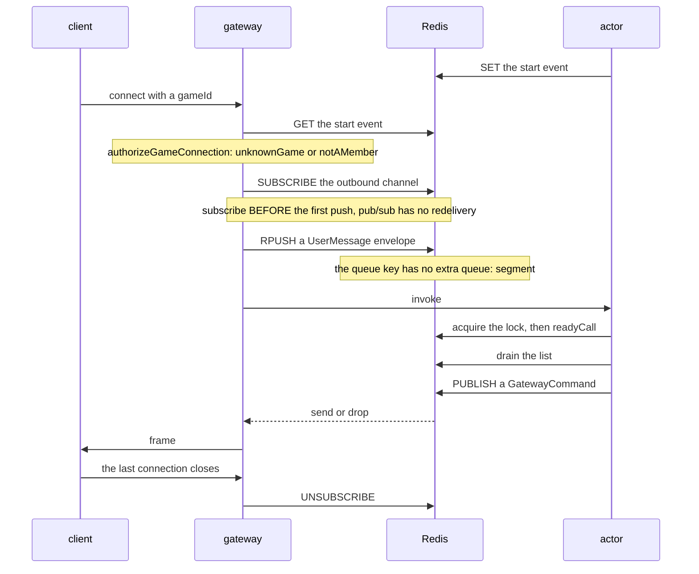
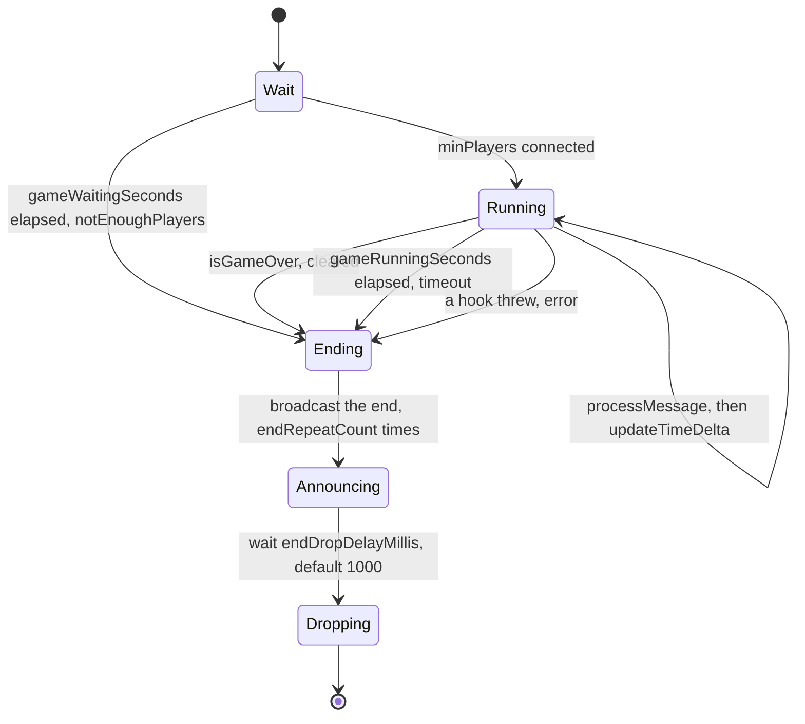

# The game actor

One game is one Lambda invocation, holding its own state in memory, draining a
queue and broadcasting frames. This page owns that lifecycle and the contract
between the actor and whatever terminates the sockets. The generic machinery
underneath it — the queue, the lock lease, the awaiter — is
[Actor system](actor-system.md).

Every snippet here assumes:

```ts
import { runGameAllTogether } from "@yingyeothon/gamebase-all-together";
import { broadcast, handleActor, reply } from "@yingyeothon/lambda-gamebase";
```

A whole game you can run right now, with no AWS and no Redis, is
[`examples/actor-game`](../examples/actor-game/README.md).

## The life of one invocation



Three of those edges are the ones worth reading twice.

**`readyCall` fires after the lock, not before.** It is what tells a lobby the
game is up. Fired before, a duplicate invocation announces a game it will never
run, and the lobby hands clients a `gameId` that nothing is playing.

**A lapsed lease is not a loss.** `lockTimeoutSeconds` defaults to 30 and is
heartbeated at a third of that, deliberately far shorter than the game: a crash
at t=30s should free the `gameId` in seconds, not hold it for the remaining
minutes. The lease is a deadline for a _successor_, so an actor that is still
alive when its renewal fails re-acquires and keeps playing. Only a failed
re-acquisition means somebody else took it. Without that distinction a store
outage longer than the lease ends every live session, which is how a safety
mechanism becomes the outage.

**The lock's value is a per-acquisition random token and its release is a Lua
compare-and-delete.** A bare `DEL` would delete whatever is there — including
the lock a _new_ owner took after this one's lease expired — and then two
actors simulate the same game.

## The three Redis keys

When something other than API Gateway terminates the sockets — the yyt gateway,
or one of your own — you use only the actor half of `lambda-gamebase`, and these
three keys are the whole interface. A gateway written in Go cannot import a
TypeScript type, so this is a contract rather than a summary of one.

| Key                        | Direction                   | Who writes                                  |
| -------------------------- | --------------------------- | ------------------------------------------- |
| `{eventKeyPrefix}{gameId}` | the game's start event      | the actor writes, the gateway reads         |
| `{queueKeyPrefix}{gameId}` | inbound, a Redis **list**   | the gateway `RPUSH`es, the actor drains     |
| `{channelPrefix}{gameId}`  | outbound, a pub/sub channel | the actor publishes, the gateway subscribes |



Every trap on that diagram fails silently. There is a runnable proof of each in
[`examples/gateway-contract`](../examples/gateway-contract/README.md).

**Subscribe before the first push.** Inbound is durable, so a gateway may push
before the actor is running; outbound is lossy, so a publish with no subscriber
is simply gone. Nothing bridges that asymmetry except order — and the order is
sufficient, because the actor learns connection ids only from `enter` and so
cannot publish before the first inbound message exists.

**The queue key has no `queue:` segment.** `createRedisSubsystem` appends one to
the prefix it is given; `createActorSubsystem` and `handleConnect` pass
`queueKeyPrefix` straight through. A gateway that copies the subsystem's layout
pushes into a key nobody reads.

**`RPUSH` is not a trigger.** Pushing does not start a Lambda; the actor is
invoked explicitly. `RPUSH` does answer with the list depth, which is how a
gateway learns for free that the actor stopped consuming.

## The inbound envelope

A pushed value is a JSON `UserMessage<T>`, not a bare payload:

```json
{
  "messageId": "6a1f…",
  "awaitPolicy": 0,
  "awaitTimeoutMillis": 0,
  "item": { "type": "move", "connectionId": "i-1:9f2…", "x": 3 }
}
```

`awaitPolicy` is a **numeric** enum and `Forget` is `0`, which is what a gateway
wants. **Push a bare payload and `poll()` returns an array of `undefined` items,
with no error anywhere.**

`item` is your own message, stamped with the connection it came from. `enter`
and `leave` are reserved: the actor decides which member a connection speaks for
from them, so a gateway synthesises them itself and refuses them from clients —
`isReservedRequestType` is exported for exactly that.

## The outbound command

```json
{ "op": "send", "connectionId": "i-1:9f2…", "message": { "type": "stage" } }
{ "op": "send", "connectionIds": ["i-1:9f2…", "i-1:3ab…"], "message": { } }
{ "op": "drop", "connectionId": "i-1:9f2…" }
```

**There are two `send` shapes and `op` does not tell them apart.** `reply` sends
to one connection, `broadcast` to many in a single command so the gateway does
the fan-out it is already positioned to do — at eight players and a fixed tick,
that is one publish per tick instead of eight. Branch on whether `connectionIds`
is present. A gateway reading `command.connectionId` alone gets `undefined` for
every broadcast and drops the frame.

## Wait, running, end

`runGameAllTogether` is a ready-made `gameMain` for games everyone plays
together. It decides **when** things happen; **what** reaches the clients is
yours, through hooks.



The tick policy is a choice, not a default to accept. `perMessage` calls
`updateTimeDelta` once per processed message — turn-based games want it, since
nothing should move unless somebody acts. `{ mode: "fixed", intervalMillis: 50 }`
runs whole steps whether or not messages arrived, with a constant delta; a
real-time game needs it, or monster AI, damage over time and cooldowns freeze
while the party stands still and then jump by seconds at once.

**The wait stage drains the queue looking for `enter` and `leave`, and discards
everything else.** A message sent before the game starts is gone, with no error.

## Ending so the party hears about it

`onGameEnd` runs while the connections are still open, which is why the result
goes out there and not after. Then two knobs matter, for two different reasons:

- **`endDropDelayMillis`** (default 1000) is the pause before the sockets close.
  API Gateway can lose a frame posted immediately before `DeleteConnection`,
  which used to swallow the result.
- **`endRepeatCount`** (default 1) must be **2 or more over a gateway
  transport**. Those frames are published exactly once and pub/sub has no
  redelivery, so a subscriber gap either shows the party no result or leaves
  their sockets open forever — and unlike a tick snapshot, nothing later heals
  it. Both operations are idempotent, so a repeat costs a frame and nothing
  else. Leave it at 1 for API Gateway, where each repeat is a `PostToConnection`
  against an already-closed connection.

Do **not** pair `dropUndeliveredConnections` with `createRedisPubSubTransport`.
Its boolean means "a gateway was subscribed", not "the client received it", so a
gateway restart would evict the whole party.

## Who the connection speaks for

By default `handleConnect` reads `memberId` from the client's `x-member-id`
header and only checks that it appears in the game's start event. **That is not
authentication** — anyone who knows another member's id can connect as that
member, and member ids are broadcast to every player by default.

Close it with `resolveMemberId`, reading the verified identity a REQUEST
authorizer put in the context. A resolver that returns `undefined` rejects the
connection, so the authenticated path fails closed. [Authentication](auth.md) is
the other half.

## What this does not do

- **A game is capped at one Lambda invocation.** There is no hand-off, so the
  game ends when the Lambda times out — 900 seconds is the hard ceiling.
- **Delivery to the actor is at-most-once.** The loop flushes the queue before
  the game acts on the batch, so a crash in between loses it silently. A game
  that cannot lose input needs an ack of its own.
- **Nothing snapshots actor state.** Redis holds the queue, the lock and the
  start event; game state lives in the actor's heap and is discarded when the
  invocation ends. Anything that must outlive the run goes to
  [Storage](storage.md).

## Read next

[Actor system](actor-system.md) for the lease and the queue underneath this, or
[Operations](operations.md) for the TTLs, the key prefixes and the concurrency
ceiling that a deploy has to respect.
