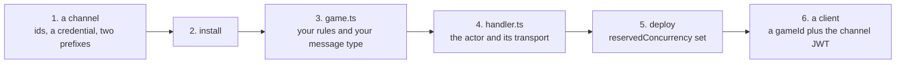

# Getting started

From an empty repository to a game running on a `q` channel. Each step hands the
next one a concrete string, and nothing here is assumed.



If you would rather read code first, run
[`examples/actor-game`](../examples/actor-game/README.md) — steps 3 and 4,
complete and runnable, with nothing to install and nothing to deploy.

## 1. Get a channel and its credential

A **channel** is what the platform provisions for your game: an id, an endpoint,
and a credential scoped to it. A **`q` channel** is the kind whose gateway
understands nothing and simply bridges frames to your actor — see
[The platform § The two channel kinds](platform.md#the-two-channel-kinds).

Someone provisions it once, in the yyt console or with the `yyt` CLI;
`cli/README.md` in the [`service`](https://github.com/yingyeothon/service)
repository is that recipe. If you have no console access, this is the step to
ask someone for — everything below needs its output.

| What you copy                   | Looks like                      | Used for                                        |
| ------------------------------- | ------------------------------- | ----------------------------------------------- |
| the `q` channel id              | `q_0123456789abcdef`            | the client's `channelId`                        |
| its `wsUrl`                     | `wss://gw.yyt.life/?channel=…`  | the client's `url` — **origin only**, see below |
| a Redis credential              | host, user, password            | your actor's own connection                     |
| the **inbound** key prefix      | `game:<stage>:<channelId>:`     | the actor's event, queue, lock and awaiter keys |
| the **outbound** channel prefix | `game:out:<stage>:<channelId>:` | the pub/sub channel the gateway subscribes to   |

`<stage>` here is the deployment stage the channel was issued for (`dev`,
`prod`) and is part of the ACL pattern. It is unrelated to the game loop's
`stage`, which is a different word this guide also uses.

**Copy the prefixes as one block; never retype them.** A prefix typed by hand
usually stays inside the credential's ACL pattern, so it does not fail at all —
it writes to a key nobody drains. See
[Operations § Key prefixes and the Redis ACL](operations.md#key-prefixes-and-the-redis-acl).

Nothing in tslib reads those two strings from the environment; they are plain
options. `REDIS_KEY_PREFIX` and `REDIS_OUT_PREFIX` below are names this page
chose, and you set them wherever you set the rest of your function's
environment. `gamebaseOptionsFromEnv()` does read a fixed set — see
[Operations § Configuration is injected, never read](operations.md#configuration-is-injected-never-read).

## 2. Install

```bash
npm install @yingyeothon/lambda-gamebase @yingyeothon/gamebase-all-together
npm install @aws-sdk/client-apigatewaymanagementapi @aws-sdk/client-lambda
```

The two AWS SDK clients are peer dependencies. Node >= 20; every package ships
dual ESM and CJS.

## 3. Write the rules, and the message type

Keep this file free of the framework — no imports, no IO, no clock. It is the
half you own, and the half that stays unit-testable.

```ts
// game.ts
export interface Raid {
  bossHp: number;
  damage: Record<string, number>;
}

/** Your own messages, plus the two the framework synthesises. */
export type Message =
  | { type: "attack"; connectionId: string; power?: number }
  | { type: "enter" | "leave"; connectionId: string; memberId: string };

export const createRaid = (hp: number): Raid => ({ bossHp: hp, damage: {} });

export function applyHit(raid: Raid, memberId: string, power = 1): number {
  const dealt = Math.min(Math.max(Math.floor(power), 1), 10); // clients lie
  raid.bossHp = Math.max(0, raid.bossHp - dealt);
  raid.damage[memberId] = (raid.damage[memberId] ?? 0) + dealt;
  return dealt;
}

export const isCleared = (raid: Raid) => raid.bossHp <= 0;
```

**`enter` and `leave` are reserved.** The actor decides which member a
connection speaks for from them, so a client may never send one; `handleMessages`
refuses them with a `400`.

## 4. Wire the actor

Two things here are easy to get wrong, so they are called out in the code:
the **type argument** (without it `message.power` does not exist), and the
**transport** (a `q` channel's gateway listens on Redis pub/sub, not on API
Gateway).

```ts
// handler.ts
import { runGameAllTogether } from "@yingyeothon/gamebase-all-together";
import {
  broadcast,
  createGamebaseContext,
  createRedisPubSubTransport,
  gamebaseOptionsFromEnv,
  handleActor,
  reply,
  type GameActorStartEvent,
} from "@yingyeothon/lambda-gamebase";
import { applyHit, createRaid, isCleared, type Message } from "./game.js";

// One per container: it owns the shared Redis connection.
const context = createGamebaseContext(gamebaseOptionsFromEnv());
const prefix = process.env.REDIS_KEY_PREFIX!; // the inbound block from step 1
const outPrefix = process.env.REDIS_OUT_PREFIX!; // the outbound one

export async function actor(event: GameActorStartEvent) {
  const raid = createRaid(100);

  // A q channel's gateway subscribes to Redis; it is not behind API Gateway.
  // Passing `{ context }` instead would post frames to WS_ENDPOINT, which
  // nothing is listening to — and it would fail silently.
  const transport = createRedisPubSubTransport({
    connection: context.getRedisConnection(),
    channelPrefix: outPrefix,
    gameId: event.gameId,
  });

  await handleActor<Message>({
    event,
    context,
    eventKeyPrefix: `${prefix}event:`,
    awaiterKeyPrefix: `${prefix}awaiter:`,
    queueKeyPrefix: `${prefix}queue:`,
    lockKeyPrefix: `${prefix}lock:`,
    lifetimeSeconds: 300,
    gameMain: (options) =>
      runGameAllTogether<Message>({
        ...options,
        network: { transport },
        gameWaitingSeconds: 20,
        gameRunningSeconds: 120,
        pollIntervalMillis: 100,
        tick: { mode: "perMessage" },
        // Published exactly once, and pub/sub has no redelivery.
        endRepeatCount: 2,
        isGameOver: () => isCleared(raid),
        processMessage: async ({ context: game, message }) => {
          if (message.type !== "attack") return;
          const user = game.connectedUsers[message.connectionId];
          if (!user) return;
          const dealt = applyHit(raid, user.memberId, message.power);
          await broadcast(
            Object.keys(game.connectedUsers),
            { type: "hit", payload: { memberId: user.memberId, dealt } },
            { transport },
          );
        },
        // Fires on a reconnect too, so it is the resynchronisation point.
        onMemberEntered: ({ connectionId }) =>
          reply(
            connectionId,
            { type: "snapshot", payload: raid },
            { transport },
          ),
        onGameEnd: ({ context: game, reason }) =>
          broadcast(
            Object.keys(game.connectedUsers),
            { type: "result", payload: { reason, damage: raid.damage } },
            { transport },
          ),
      }),
  });
}
```

### What allocates a run

Nobody can join a game that does not exist yet, and **the platform does not
create one for you**. Something of yours — an HTTP endpoint, usually called the
_entry API_ — decides a run exists, writes its start event, and invokes this
function:

```ts
import {
  saveActorStartEvent,
  type GameActorStartEvent,
} from "@yingyeothon/lambda-gamebase";

const event: GameActorStartEvent = {
  gameId: crypto.randomUUID(), // yours to allocate; a retry needs a NEW one
  members: [{ memberId: "u1", name: "Ari", email: "ari@example.test" }],
  callbackUrl, // optional: readyCall PUTs here once the lock is taken
};
await saveActorStartEvent({ event, set, eventKeyPrefix: `${prefix}event:` });
// then invoke the actor function with `event` as its payload
```

The gateway reads that start event to decide who may connect, so **a member not
listed in it is refused**. `RPUSH` is not a trigger — the invoke is explicit.
See [The game actor § The three Redis keys](game-actor.md#the-three-redis-keys).

`sample-dungeon` in the [`examples`](https://github.com/yingyeothon/examples) repository is a complete worked
version of this half, including its deployment.

## 5. Deploy, with the ceilings respected

Deployment itself is yours — Serverless, SAM, CDK, Terraform; tslib is a library
and has no opinion. Three settings are not optional:

- **`reservedConcurrency` on every function.** It is free; _provisioned_
  concurrency is what bills, and this is the only thing holding your fleet under
  the platform's database connection ceiling.
- **`maximumRetryAttempts: 0` on the actor.** A retried invocation replays the
  game from the start.
- **A timeout above `gameWaitingSeconds + gameRunningSeconds` plus a margin**,
  and under the 900-second Lambda ceiling.

The environment your functions need is the fixed set
`gamebaseOptionsFromEnv()` reads, plus the two prefixes from step 1 —
[Operations § Configuration is injected, never read](operations.md#configuration-is-injected-never-read)
lists them, and
[Operations § Sizing a run](operations.md#sizing-a-run) has the arithmetic.

## 6. Connect a client

Your entry API from step 4 gives the client two things: the `gameId` it
allocated, and the channel JWT the player signed in with
([Authentication](auth.md)).

```ts
import { createGatewayGameClient } from "@yingyeothon/gamebase-client";

const game = createGatewayGameClient({
  // The console shows wsUrl as `wss://gw.yyt.life/?channel=q_…`.
  // Pass the origin only; the SDK adds the query string itself.
  url: "wss://gw.yyt.life",
  channelId: "q_0123456789abcdef",
  gameId, // from your entry API; the caller must be in the start event
  token: channelJwt,
});

game.on("frame", (frame) => {
  // Every game-defined frame, verbatim — your own schema from step 3.
  console.log(frame);
});
game.on("finished", () => {
  /* close 1000: the game ended normally, show the result */
});
game.on("aborted", () => {
  /* close 4001: the actor died, and a retry needs a NEW gameId */
});

await game.connect();
game.send({ type: "attack", power: 3 });
```

`connect()` resolves when the socket opens, because a `q` channel has no `hello`
frame — so a connected socket is not yet a joined run. Wait for the actor's
first frame.

## 7. Keep going

- [The game actor](game-actor.md) — the lifecycle, and the contract that fails
  silently when a gateway gets it wrong.
- [Authentication](auth.md) — closing the identity gap that `resolveMemberId`
  leaves open by default.
- [Storage](storage.md) — anything that must outlive the run.
- [Troubleshooting](troubleshooting.md) — when a frame does not arrive.
