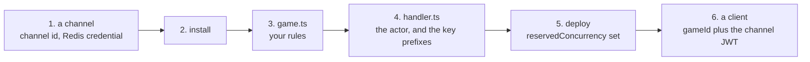

# Getting started

From an empty repository to a game running on a `q` channel. Each step hands the
next one a concrete string, and nothing here is assumed.



If you would rather read code first, run
[`examples/actor-game`](../examples/actor-game/README.md) — steps 3 and 4,
complete, with nothing to install and nothing to deploy.

## 1. Get a channel and its credential

Someone provisions this once, in the yyt console or with the `yyt` CLI;
`cli/README.md` in the [`service`](https://github.com/yingyeothon/service)
repository is that recipe. What you copy out of it:

| What               | Looks like                                                      | Used for                            |
| ------------------ | --------------------------------------------------------------- | ----------------------------------- |
| the `q` channel id | `q_0123456789abcdef`                                            | the client's socket URL             |
| its `wsUrl`        | `wss://gw.yyt.life/?channel=…`                                  | handed to clients by your entry API |
| a Redis credential | host, user, password                                            | your actor's own connection         |
| the key prefixes   | `game:<stage>:<channelId>:` and `game:out:<stage>:<channelId>:` | both sides of the bridge            |

**Copy the prefixes as one block.** A prefix retyped by hand usually stays
inside the credential's ACL pattern, so it does not fail — it writes to a key
nobody drains. See
[Operations § Key prefixes and the Redis ACL](operations.md#key-prefixes-and-the-redis-acl).

## 2. Install

```bash
npm install @yingyeothon/lambda-gamebase @yingyeothon/gamebase-all-together
npm install @aws-sdk/client-apigatewaymanagementapi @aws-sdk/client-lambda
```

The two AWS SDK clients are peer dependencies. Node >= 20; every package ships
dual ESM and CJS.

## 3. Write the rules, and nothing else

Keep this file free of the framework — no imports, no IO, no clock. It is the
half you own, and it is the half that stays unit-testable.

```ts
// game.ts
export interface Raid {
  bossHp: number;
  damage: Record<string, number>;
}

export const createRaid = (hp: number): Raid => ({ bossHp: hp, damage: {} });

export function applyHit(raid: Raid, memberId: string, power = 1): number {
  const dealt = Math.min(Math.max(Math.floor(power), 1), 10); // clients lie
  raid.bossHp = Math.max(0, raid.bossHp - dealt);
  raid.damage[memberId] = (raid.damage[memberId] ?? 0) + dealt;
  return dealt;
}

export const isCleared = (raid: Raid) => raid.bossHp <= 0;
```

## 4. Wire the actor

```ts
// handler.ts
import { runGameAllTogether } from "@yingyeothon/gamebase-all-together";
import {
  broadcast,
  createGamebaseContext,
  gamebaseOptionsFromEnv,
  handleActor,
  reply,
  type GameActorStartEvent,
} from "@yingyeothon/lambda-gamebase";
import { applyHit, createRaid, isCleared } from "./game.js";

// One per container: it owns the shared Redis connection.
const context = createGamebaseContext(gamebaseOptionsFromEnv());
const prefix = process.env.REDIS_KEY_PREFIX!; // the block you copied in step 1

export async function actor(event: GameActorStartEvent) {
  const raid = createRaid(100);
  await handleActor({
    event,
    context,
    eventKeyPrefix: `${prefix}event:`,
    awaiterKeyPrefix: `${prefix}awaiter:`,
    queueKeyPrefix: `${prefix}queue:`,
    lockKeyPrefix: `${prefix}lock:`,
    lifetimeSeconds: 300,
    gameMain: (options) =>
      runGameAllTogether({
        ...options,
        network: { context },
        gameWaitingSeconds: 20,
        gameRunningSeconds: 120,
        pollIntervalMillis: 100,
        tick: { mode: "perMessage" },
        isGameOver: () => isCleared(raid),
        processMessage: async ({ context: game, message }) => {
          if (message.type !== "attack") return;
          const user = game.connectedUsers[message.connectionId];
          if (!user) return;
          const dealt = applyHit(raid, user.memberId, message.power);
          await broadcast(
            Object.keys(game.connectedUsers),
            { type: "hit", payload: { memberId: user.memberId, dealt } },
            { context },
          );
        },
        // Fires on a reconnect too, so it is the resynchronisation point.
        onMemberEntered: ({ connectionId }) =>
          reply(connectionId, { type: "snapshot", payload: raid }, { context }),
        onGameEnd: ({ context: game, reason }) =>
          broadcast(
            Object.keys(game.connectedUsers),
            { type: "result", payload: { reason, damage: raid.damage } },
            { context },
          ),
      }),
  });
}
```

Something has to allocate a run before anyone can join it: write a
`GameActorStartEvent` listing who may play, then invoke this function.
**`RPUSH` is not a trigger** — see
[Game actor § The three Redis keys](game-actor.md#the-three-redis-keys).

## 5. Deploy, with the ceilings respected

Three settings that are not optional:

- **`reservedConcurrency` on every function.** It is free; _provisioned_
  concurrency is what bills, and this is the only thing holding your fleet under
  the platform's connection ceiling.
- **`maximumRetryAttempts: 0` on the actor.** A retried invocation replays the
  game from the start.
- **A timeout above `gameWaitingSeconds + gameRunningSeconds` plus a margin**,
  and under the 900-second Lambda ceiling.

[Operations § Sizing a run](operations.md#sizing-a-run) has the arithmetic.

## 6. Connect a client

```ts
import { createGatewayGameClient } from "@yingyeothon/gamebase-client";

const game = createGatewayGameClient({
  url: "wss://gw.yyt.life", // origin only, no query string
  channelId: "q_0123456789abcdef",
  gameId, // from your entry API; the caller must be in the start event
  token: channelJwt,
});

game.on("frame", applyFrame); // every game-defined frame, verbatim
game.on("finished", showResult); // close 1000: the game ended normally
game.on("aborted", backToLobby); // close 4001: retry needs a NEW gameId

await game.connect();
game.send({ type: "attack", power: 3 });
```

`connect()` resolves when the socket opens, because a `q` channel has no `hello`
frame — so a connected socket is not yet a joined run. Wait for the actor's
first frame.

## 7. Keep going

- [The game actor](game-actor.md) — the lifecycle, and the contract that fails
  silently when a gateway gets it wrong.
- [Authentication](auth.md) — closing the identity gap that
  `resolveMemberId` leaves open by default.
- [Storage](storage.md) — anything that must outlive the run.
- [Troubleshooting](troubleshooting.md) — when a frame does not arrive.
