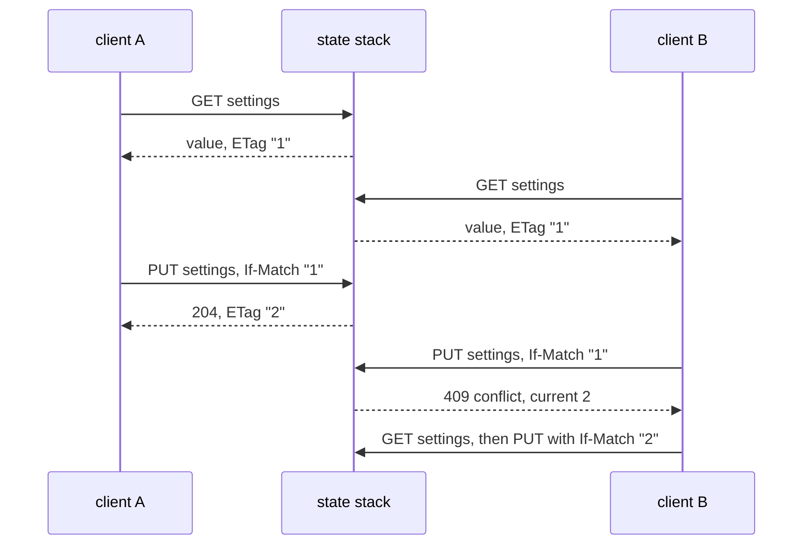

# Key-value store

Things a game keeps between runs without a database of its own: announcements,
a player's settings and progress, a public profile, an inbox, a counter. This
page owns how `kvstore-client` reaches the platform's key-value store from a
game; the store itself — its console, its caps, its encryption — belongs to the
`service` repository (`docs/kvstore.md` and `services/state/README.md` there).

**Reference:** [`kvstore-client`](../packages/kvstore-client/README.md) carries
the full option list, the local refusals and every error predicate.

## Principals and scopes

A collection is created once, in the console or with `yyt kv create`, with a
name, a `readScope`, a `writeScope`, optional encryption and two caps. A game
never creates one. It reaches the collection with a credential it already holds,
and that credential is the principal the server judges every request by.

| Principal | Credential                                              | Reaches                                                                                                    |
| --------- | ------------------------------------------------------- | ---------------------------------------------------------------------------------------------------------- |
| `owner`   | the channel JWT from the sign-in flow (a player)        | the shared namespace per scope; `/u/me`; other owners only to read, and only when `readScope` is `project` |
| `server`  | the auth channel's doc apiKey (`yds.…`), on your server | the shared namespace per scope; every owner's `/u/{ownerId}` namespace                                     |
| `team`    | a console session or `yyt_` token                       | the console and CLI only; the API refuses                                                                  |

The two scopes decide the rest. `team` on a scope means the API cannot do that
side at all; `project` means any principal of the project may; `user` means the
entry's owner may, and the server key may on anyone's behalf. `writeScope: user`
is what puts entries in an owner namespace, which is why the same client offers
both `collection.put(...)` and `collection.mine.put(...)` — **using the wrong one
is a `400` whose `reason` is `wrong_namespace`**, not a write to the wrong place.
The server key gets the same `400` from `mine`, because `me` names the owner of
a player token and a server has none.

The two collection shapes a game needs first, as they are created in the console:

| Collection      | `readScope` | `writeScope` | Who writes               | Read with                             |
| --------------- | ----------- | ------------ | ------------------------ | ------------------------------------- |
| `announcements` | `project`   | `team`       | the team, in the console | `collection("announcements").list()`  |
| `profile`       | `user`      | `user`       | each player, own entries | `collection("profile").mine.get(key)` |

A public profile is the third shape: `readScope: project`, `writeScope: user`,
so every player reads everyone's with `owner(theirId)` and writes only its own.

## The two cases

```ts
import { createKvStoreClient } from "@yingyeothon/kvstore-client";

const kv = createKvStoreClient({
  baseUrl: "https://doc.yyt.life",
  token: channelJwt,
});

// (1) announcements, newest first, values included
const { entries } = await kv
  .collection("announcements")
  .list<Notice>({ values: true, order: "desc" });

// (2) my own record
const mine = kv.collection("profile").mine;
const saved = await mine.get<Profile>("settings"); // undefined until first saved
await mine.put("settings", { ...saved, volume: 0.5 });
```

`baseUrl` is `https://doc.yyt.life` on prod and `https://doc-dev.yyt.life` on
dev; it has no default, because the stage is the same one the token was minted
for and a mismatch is a `401`. `token` is the channel JWT the gateway client
already holds ([The realtime client](realtime-client.md)) or, on your server,
the doc apiKey; it is sent as a header on every request and appears in no log
line or error message.

[`examples/kvstore-client`](../examples/kvstore-client/README.md) runs both
cases against an in-memory stand-in for the state stack, with no network and no
token.

## Versions and conditional writes

Every entry carries a version that starts at 1 and climbs on every write. The
safe way to update a record is to read it with `getEntry` and write it back
with `ifMatch: version`, as the sequence below shows: the write that arrives
second loses with a `409`, and its `currentVersion` says which version to reread.



`ifNoneMatch: true` creates only, and `delete` takes `ifMatch` too. The client
does not retry for you: a `409` is handed back, and what to merge is the game's
decision. For a plain counter use `incr(key, delta)` instead, which adds
atomically on the server and returns `{ value, version }`.

**A caller without the read right cannot use any of this.** A write-only inbox
(`readScope: team`, `writeScope: project`, say) gets a `403` on a conditional
header, an empty `{}` from `put`, and `204` on every write and delete — even of
a key that was never there — because whether the key existed and how often it
was written are facts about stored data. `incr` needs the read right for the
same reason. A reader's delete of an absent key is a `404` on the wire, which
the client folds into a normal return so that `delete` is idempotent for both.

## TTL

`ttl` on `put` and `incr` is in seconds, `1` … `31_622_400` (366 days).
Omitted, an update keeps the row's expiry; `0` clears it. `getEntry` reports
`expiresAt` as an absolute epoch second whenever the row has one, so a client
needs no clock-skew guess; **`put` and `incr` report it only when that call set
a `ttl`**, so a write that kept an existing expiry says nothing about it. An
expired entry is invisible to every read, but its version keeps climbing, so a
stale `ifMatch` cannot land on a key that was reborn.

## Errors

Everything the server or the network refuses arrives as one `KvStoreError`
with `status`, `code`, an optional `reason` and, on a lost condition,
`currentVersion`. The local refusals — key grammar, collection name, a value
over 16 KiB, a `ttl` or `limit` out of range — throw a `RangeError` or a
`TypeError` before any request is made, and the package README lists them.

| Status | `code` / `reason`                              | Why you would hit this                                                                                                                                  |
| ------ | ---------------------------------------------- | ------------------------------------------------------------------------------------------------------------------------------------------------------- |
| `401`  | `unauthorized`                                 | the token expired, or was minted for the other stage                                                                                                    |
| `403`  | `forbidden`                                    | a `team` scope, another owner's namespace under `readScope: user`, or a condition without the read right                                                |
| `404`  | `not_found`                                    | no such collection in this project, or no such entry — the same answer, so `get`'s `undefined` can mean either; `info()` tells them apart               |
| `400`  | `bad_request` / `wrong_namespace`              | `collection.put` where `mine.put` was meant, or the reverse; `mine` with the server key                                                                 |
| `409`  | `conflict`, `currentVersion`                   | a lost `ifMatch` or `ifNoneMatch`; reread and retry                                                                                                     |
| `409`  | `conflict` / `collection_full`, `owner_full`   | a cap was reached; `isKvFull` names both                                                                                                                |
| `409`  | `conflict` / `not_a_number`, `overflow`        | `incr` on something that is not an integer                                                                                                              |
| `413`  | `payload_too_large`                            | unreachable through this client, which refuses a body over `kvMaxValueBytes` (16384) locally; seen only with an injected `fetch` that rewrites the body |
| `503`  | `unavailable` / `kv_encryption_not_configured` | the stage's kv encryption key is missing; nothing a game can fix                                                                                        |
| `5xx`  | `http_<status>`                                | a gateway answer that is not the server's JSON shape                                                                                                    |
| `2xx`  | `malformed_response`                           | a success body that is not JSON, or a `200` without an `ETag`; the body is never quoted                                                                 |
| `0`    | `network`                                      | `fetch` rejected; the `cause` is attached                                                                                                               |

## In a browser

The state stack already answers CORS preflights for any origin with the headers
this client sends and exposes `ETag` and `X-KV-Expires-At`, so a browser build
needs nothing more. The token comes from the sign-in flow
([Authentication](auth.md)); **this package never persists it** — where a game
keeps a token between page loads is the game's decision, and a new token is a
new client.

Next: [Storage](storage.md) is the other side of the same question — what a
game's _actor_ keeps in its own Redis, S3 or DynamoDB, rather than what its
players keep on the platform.
