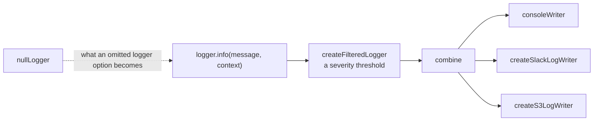
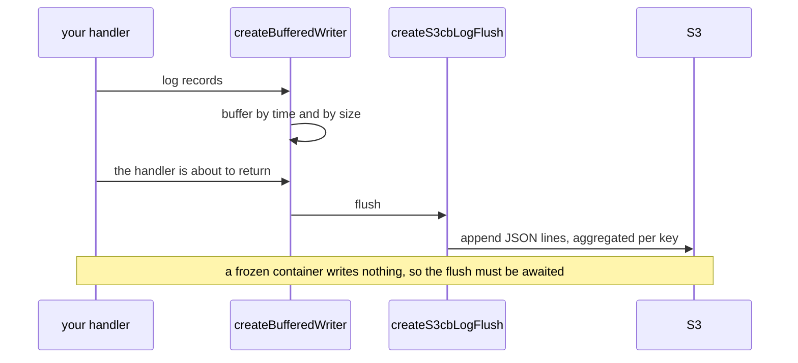

# Logging

One contract, `Logger` from `@yingyeothon/logger`, accepted everywhere as an
optional option and defaulting to `nullLogger`. This page is how to compose it
and — the part that matters — what must never reach a log line.

```ts
import {
  combine,
  consoleWriter,
  createConsoleLogger,
  createFilteredLogger,
} from "@yingyeothon/logger";
```

**Reference:** [`logger`](../packages/logger/README.md), [`logger-slack`](../packages/logger-slack/README.md), [`logger-s3`](../packages/logger-s3/README.md) — each carries its own
`## Public API`, its options and defaults, and its migration notes.

## Composition



Call style is **message first, structured context second**:
`logger.info("actor started", { actorId })`. Not the pino-style context-first
form, and not a pre-formatted string — a writer that ships to Slack or S3 needs
the fields separable.

Every package that logs takes `logger?: Logger` and defaults to `nullLogger`,
and nothing writes to the console because of an environment variable: a consumer
that wants output passes `createConsoleLogger("info")`.

**One shipped helper is louder than that by default.** `createLambdaS3Logger`
turns `withConsole` on, so every record it buffers is also printed with
`console[severity]` — convenient in CloudWatch, and a surprise if you assumed the
library never prints. Pass `withConsole: false` to silence it.

```ts
const logger = createFilteredLogger({
  severity: "info",
  writer: combine(consoleWriter, createSlackLogWriter({ webhookUrl })),
});

// Message first, structured context second.
logger.info("actor started", { gameId, memberCount: members.length });

// Every option bag that logs takes one, and defaults to nullLogger without it.
await handleActor({ ...actorOptions, logger, actorLogger: logger });
```

## What must never be logged

Every row here was a real leak, and `debug` is not a free pass — a consumer
plugs in a writer that persists indefinitely.

| Never                                                  | Because                                                                        | Log instead                     |
| ------------------------------------------------------ | ------------------------------------------------------------------------------ | ------------------------------- |
| A raw receive buffer                                   | it is whatever the peer just sent: a stored value, a credential, a payload     | its size                        |
| A whole request event                                  | `headers` carries `Authorization`, `Cookie`, `X-Api-Key`; the body carries PII | the path, the request id        |
| A game start event                                     | `GameStartMember` carries `name` and `email`                                   | `memberCount`                   |
| A game context                                         | it holds every member and every connection id                                  | counts, via `describeGame`      |
| A message payload                                      | a queue that logs its item puts game state in someone's log store              | its `type` and `messageId`      |
| A broadcast's response body                            | same, several times a second at a fixed tick                                   | counts, at `debug`              |
| An authorization header, an issued JWT, decoded claims | they are the credential, or enough to mint one                                 | presence, scheme, policy effect |
| A Redis password                                       | it is the credential                                                           | the host                        |
| A lock token                                           | it _is_ the proof of ownership                                                 | the actor id                    |

**The leak is usually one level up from the secret.** Logging a whole
`Authorized` prints the context; logging a finished policy prints the context;
logging a start event on a membership failure prints every member's name and
email. Log the decision, not the object that carried it.

Redact at the call site, not in the writer. The writer is the consumer's, and it
may well be a file that never rotates.

**Two shipped packages break the payload rule at `debug`, so set their severity
deliberately.** `createApiGatewayTransport` logs the outbound frame it is
delivering, and `@yingyeothon/actor-system-lambda`'s API handler logs the request
body and the parsed message. Both are useful while developing a game and both are
game payloads; a `debug`-level logger wired to a durable writer in production
will collect them.

## Slack

`createSlackLogWriter` batches every record onto a single promise chain posting
to the webhook, and exposes `flush()` so a serverless handler can await delivery
before the container freezes. `createSlackLogger` wraps it in a severity-filtered
`Logger`. With no `webhookUrl` it silently skips delivery rather than throwing,
so a missing secret degrades instead of taking the handler down.

## S3, and flushing before the freeze



`createLambdaS3Logger` is the variant that stamps each record with system,
handler and lambda identity. The buffering is what makes per-record S3 writes
affordable; awaiting the flush is what stops the buffer being thrown away when
the container freezes.

## Read next

[`@yingyeothon/logger`](../packages/logger/README.md) for the writer interface,
or [Operations](operations.md) for the rest of what a deploy has to get right.
