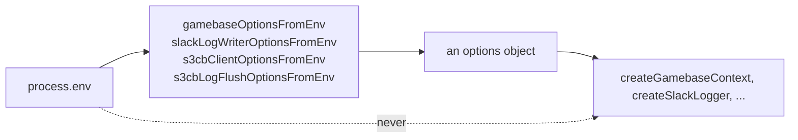
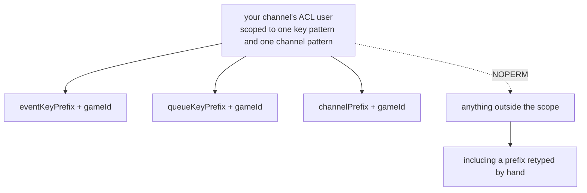
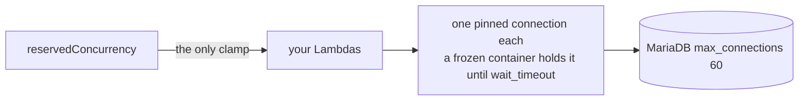
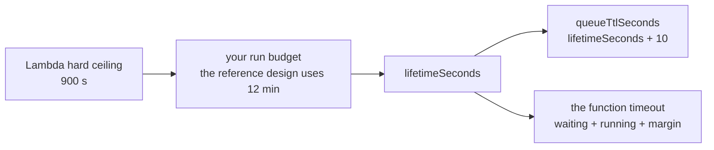

# Operations

What a deploy has to get right: configuration, key prefixes, every TTL, and the
two ceilings that decide whether a fleet stays up. Nothing here is about game
logic, and all of it has bitten somebody.

## Configuration is injected, never read

**Library code never reads `process.env` and never reaches for a global clock**,
and nothing prints because of an environment variable. (One helper,
`createLambdaS3Logger`, does print to the console by default — see
[Logging](logging.md#composition).) A package may export exactly one
`<name>OptionsFromEnv()` helper for callers who want env wiring, and only that
helper touches the environment. Calling it is your choice; the library's own
path is the options object.

That is not purity for its own sake. Those seams are the test seams, and they
are why [`examples/actor-game`](../examples/actor-game/README.md) can run a real
game loop with no AWS and no Redis.

`gamebaseOptionsFromEnv()` reads `REDIS_HOST`, `REDIS_PORT`, `REDIS_USER`,
`REDIS_PASSWORD`, `REDIS_TLS` (any non-empty value enables TLS), `WS_ENDPOINT`,
`GAME_ACTOR_LAMBDA_NAME` and `IS_OFFLINE`.

## Key prefixes and the Redis ACL

The console issues a credential scoped to your channel's key and pub/sub
patterns. A wrong prefix therefore fails **loudly** with `NOPERM` rather than
quietly reading another game's queue — which is the point of the scoping.

**Copy the prefixes as one block; never retype them.** A prefix typed by hand
usually stays _inside_ the ACL's pattern, so it does not fail at all: it writes
to a key nobody drains, and both sides look healthy. The console presents them
as a single copyable block for exactly this reason.

The same credential denies key enumeration — `KEYS`, and explicitly `SCAN`,
`RANDOMKEY` and `DBSIZE`, since Redis does not filter `SCAN` by pattern. So you
cannot go looking for the key you actually wrote, which is the other half of why
the TTL rule below is absolute.

The prefixes are configuration in three places — the yyt service, tslib, and
your own code — and **a mismatch is a silent no-op, not an error**.

## Every TTL

| Setting                             | Where                                                                         | Default                              | Why it exists                                                                                             |
| ----------------------------------- | ----------------------------------------------------------------------------- | ------------------------------------ | --------------------------------------------------------------------------------------------------------- |
| `queueTtlSeconds`                   | `handleConnect`, `handleDisconnect`, `handleMessages`, `createActorSubsystem` | **required**                         | only a producer pushes, so only a producer can re-apply it; a queue abandoned by a dead actor must expire |
| `queueTtlSeconds` on `handleActor`  | the actor's own subsystem                                                     | `lifetimeSeconds + 10`               | inert unless `gameMain` pushes, since the actor only drains                                               |
| `ttlSeconds` on `createRedisQueue`  | the queue itself                                                              | **required**, throws on non-positive | `EXPIRE` takes whole seconds; a fraction would floor to 0 and delete the key after every push             |
| `lockTimeout` on `createRedisLock`  | the lease                                                                     | **required**                         | a lock that never expires deadlocks its actor forever when the holder crashes                             |
| `lockTimeoutSeconds`                | `handleActor`                                                                 | 30, heartbeated at a third           | short so a crash frees the `gameId` in seconds, not for the rest of the game                              |
| `defaultConnectionMappingTtlMillis` | the `connectionId` to `gameId` map                                            | 900000                               | refreshed on every inbound message, so it bounds idle time, not session length                            |
| `expiresInMillis`                   | `repository-redis`, the document factories                                    | **required in effect**               | `set()` throws without it                                                                                 |

**"No TTL" is not an option anywhere.** The instance is shared and runs
`allkeys-lru`, so a key that never expires evicts someone else's first. Where
tslib can enforce it, it does — by making the option required rather than by
documenting a default, because a default that is unsafe should not exist.

## The concurrency ceiling

**Keep `reservedConcurrency` set on every function** — platform stacks and any
example you copy. It is free; it is _provisioned_ concurrency that bills. It is
the only thing holding a fleet under the database's connection ceiling, because
each container pins one connection and a frozen container keeps it.

It throttles silently past its number, so raise it with your party size and
player count rather than removing it.

## Sizing a run

The Lambda timeout must exceed `gameWaitingSeconds + gameRunningSeconds` plus a
margin. The start-event TTL is a _different_ number — `lifetimeSeconds + 10`,
from `handleActor`'s own option — so keep `lifetimeSeconds` at or above the sum
of the two stage budgets, or the start event can expire under a game that is
still being played. Set `maximumRetryAttempts` to
0 on the actor: a retried invocation would replay the game from the start.

## Never log

The short version, because it is an operational property and not only a coding
one: no credential, no request event, no connection-id list, and no payload.
Two shipped packages do log a payload at `debug`, so a production logger's
severity is a real decision — [Logging](logging.md#what-must-never-be-logged)
has the full list, the exceptions, and what to log instead.

## Read next

[Logging](logging.md), or [Troubleshooting](troubleshooting.md) when something
is already wrong.
