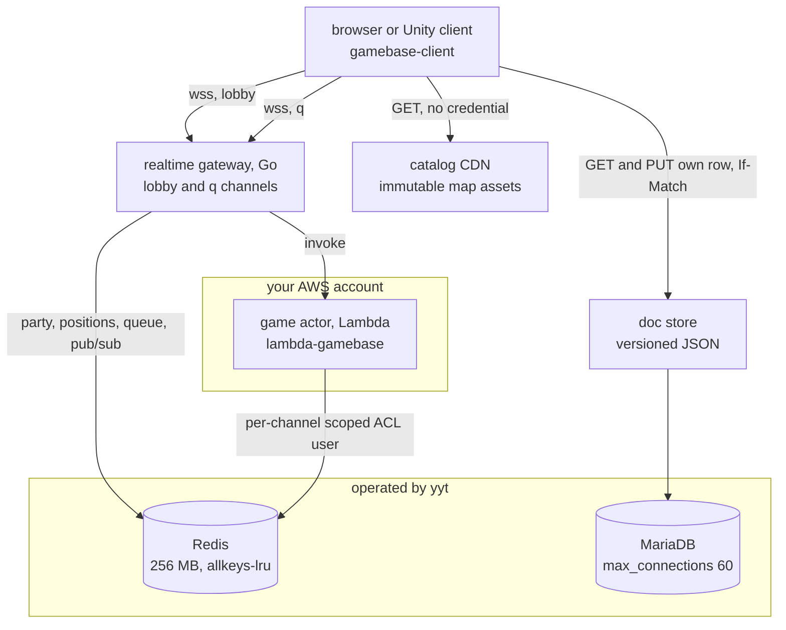
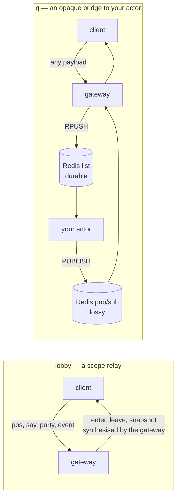
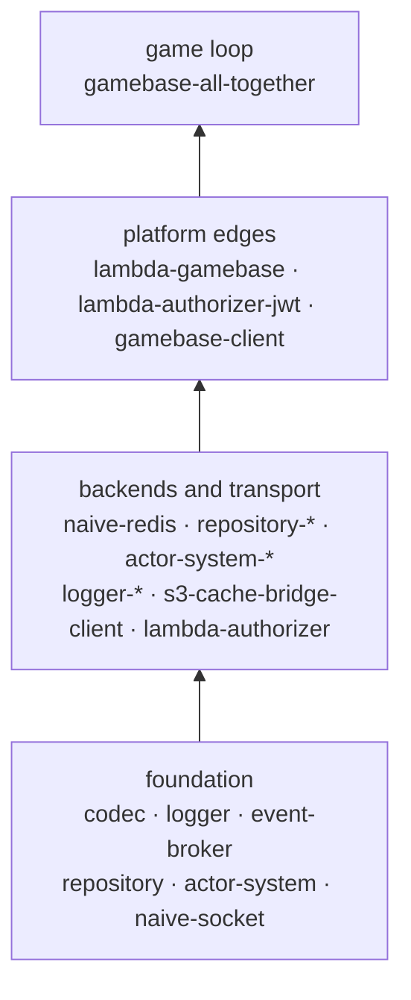

# The yyt platform, and where tslib sits

yyt is a platform for building a multiplayer game by writing **only game
logic**, in your own AWS account. This page is the map: what yyt runs, what you
run, and which pieces of tslib you end up using. It states the shape and defers
every detail of the wire to the `service` repository, which owns it.

## The whole picture

The one box you write is at the bottom.

Two consequences run through everything below. **The platform generalises
storage shapes and transport scopes, never game rules** — it never learns what a
"character" or an "item" is. And the client ships with no content: it
receives its map, its capability set and its protocol from the server, which is
what makes one client SDK work across games.

## The words this guide uses

Six of them come from the platform rather than from tslib, and every later page
spends them freely.

| Term          | Means                                                                            |
| ------------- | -------------------------------------------------------------------------------- |
| **channel**   | What you provision per game: an id, an endpoint, and a credential scoped to it   |
| **member**    | One player of one run, named in its start event by a `memberId`. Not an account  |
| **zone**      | A named area of a map. The lobby relays positions and chat within one            |
| **party**     | A group a player belongs to, and therefore a relay scope the gateway understands |
| **entry API** | An endpoint of _yours_ that allocates a run and hands a client its `gameId`      |
| **tick**      | One pass of a loop: the gateway's position flush, or your game's simulation step |

Three more are tslib's own and are defined where they are used: an **actor**
([The game actor](game-actor.md)), the **lease** on its lock and the **awaiter**
that resolves a waiting sender ([Actor system](actor-system.md)).

**`stage` means two unrelated things**, which is worth knowing before you meet
the second. A deployment stage (`dev`, `prod`) appears in your Redis key
prefixes; a game stage is `wait`, `running` or `end`.

## The two channel kinds

A channel is what you provision in the console, and its kind decides how much
the gateway understands.

On a `lobby` channel the gateway knows scopes, not semantics: it routes to a
zone, a party or a user, and never interprets a payload. It also synthesises the
`enter`, `leave` and `snapshot` frames, which is the part clients must not
reimplement — without them a player who walks away freezes on every screen.

On a `q` channel the gateway understands nothing. It carries frames between
the player and a `@yingyeothon/lambda-gamebase` actor running in your account,
and reads none of them.

**Note the asymmetry in that second diagram, because it is deliberate and it
shapes your code.** Inbound is a durable Redis list: discrete, non-idempotent
events that must not be lost. Outbound is pub/sub: self-contained frames where
the next tick heals a gap. It is why `endRepeatCount` must be 2 or more over a
gateway transport — an end frame is not a snapshot, and nothing later heals it.

## The three storage shapes

Every game datum belongs to exactly one. Game-specific schema lives _inside_ a
value and is never interpreted by the platform.

| Shape         | Backing        | Example                          | Written by               | The rule that bites                               |
| ------------- | -------------- | -------------------------------- | ------------------------ | ------------------------------------------------- |
| **asset**     | S3 + CDN       | a map, with NPCs inlined         | an editor or upload      | immutable; a new version is a new URL             |
| **doc**       | versioned JSON | a character sheet, an inventory  | a server, never a client | every write is conditional on the version it read |
| **ephemeral** | Redis          | party roster, retained positions | gateway or your actor    | **every key carries a TTL, with no exceptions**   |

The TTL rule is not advice. The Redis instance is shared and runs
`allkeys-lru`, and the participant credential is scoped so that key enumeration
is denied — so a key written without a TTL can never be found again and will
evict someone else's state. tslib enforces it where it can:
`createRedisQueue`'s `ttlSeconds` is required, and `repository-redis` refuses a
TTL-less `set()` outright.

The conditional-write rule is the same kind of thing seen from the other side:
two dungeon results landing on one inventory is the failure it exists to
prevent. [Storage](storage.md) is how tslib does it.

## Where tslib fits

Only `gamebase-client` names the platform in its source; `lambda-gamebase` and
`gamebase-all-together` are shaped by it without depending on it. Everything
else is a general library that a game happens to need.

That is roles, not dependencies — the [root README](../README.md) has the exact
edge list, and it is the only place that does.

The half of the platform you replace is a `gameMain`: rules, in your own
language, over messages you defined. Everything around it — the lock that stops
two invocations simulating one game, the queue, the fan-out, the reconnect —
belongs to the packages below it.

## What the `service` repository owns

tslib follows the platform; it never defines it. These are the normative
documents, all public, in
[`yingyeothon/service`](https://github.com/yingyeothon/service):

| Document                           | What it settles                                                        |
| ---------------------------------- | ---------------------------------------------------------------------- |
| `gateway/README.md`                | **The wire spec.** Frame tables both directions, refusals, close codes |
| `docs/realtime-gateway-design.md`  | The two channel kinds, and what the gateway does on your behalf        |
| `docs/auth-game-contract.md`       | The channel JWT's claims, lifetime and reuse rules                     |
| `services/auth/README.md`          | The sign-in endpoints and the token they issue                         |
| `services/state/README.md`         | The doc store: versioned JSON, mandatory `If-Match`                    |
| `services/console/README.md`       | Channels, secrets, and the Redis prefixes it prints as one block       |
| `services/match/README.md`         | The matchmaking socket, one source of a `gameId`                       |
| `cli/README.md`                    | The `yyt` CLI: provisioning channels and publishing map assets         |
| `sample-dungeon` (`examples` repo) | A whole game on this stack: auth, match, callback, actor               |

The Unity half of the client SDK is
[`csharplib`](https://github.com/yingyeothon/csharplib), whose `docs/` is this
same guide from the client side.

When this page and the gateway README disagree, the gateway README is right.

## Read next

[The game actor](game-actor.md), which is the box you write.
