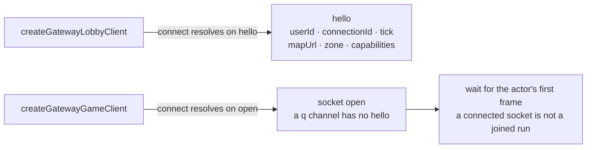
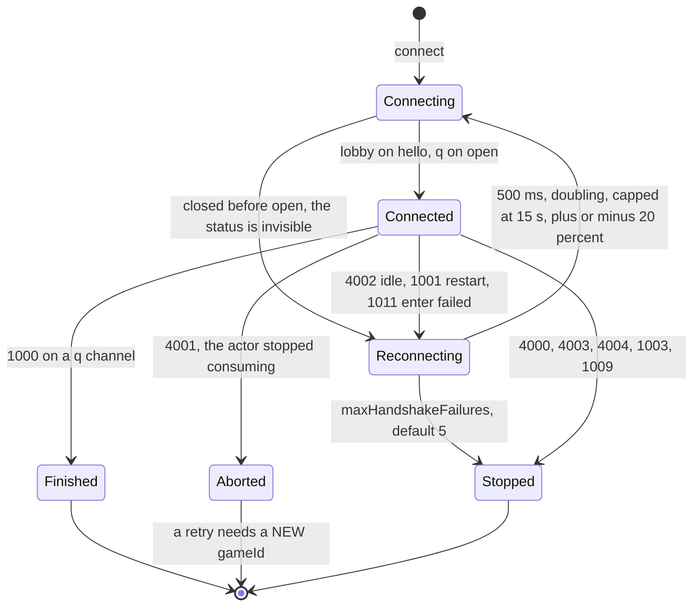
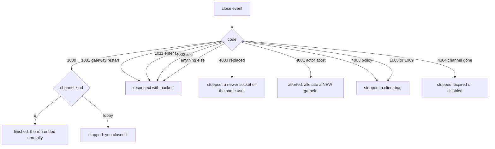

# The realtime client

`@yingyeothon/gamebase-client` is the browser half: typed frames, the bearer
handshake, reconnect with backoff, a ghost-free peer map, and the distinction
between a run that _finished_ and one that was _aborted_. It runs in browsers,
on Node 22 as is, and on Node 20 with an injected `WebSocket`, and it does not
depend on `lambda-gamebase`.

The wire spec is `gateway/README.md` in the
[`service`](https://github.com/yingyeothon/service) repository. This page is
what the TypeScript surface does with it.

Every snippet assumes:

```ts
import {
  classifyClose,
  createGatewayGameClient,
  createGatewayLobbyClient,
} from "@yingyeothon/gamebase-client";
```

Both clients, driven against a fake socket with no network, are
[`examples/gateway-client`](../examples/gateway-client/README.md).

## Two clients, and when `connect()` resolves



`hello` is the only delivery path for the channel's capabilities and its map
pointer, so nothing is meaningfully connected before it. **A client that needs a
rebuild to change maps has misunderstood the platform**: the map URL arrives in
that frame, and a new map is a config edit.

On a `q` channel the gateway pushes `enter` to your actor _after_ the upgrade,
which is why a failure there arrives as a close and not as a refused handshake.

## The connection state machine



**A browser cannot see why a handshake was refused.** A 401, 403, 404 and 410
all surface identically as a close before open, so retrying forever would hammer
a dead token invisibly. `maxHandshakeFailures` (default 5) ends the session
instead, and the counter resets on every successful open.

## Close codes



`classifyClose(code, kind)` is that tree as a function, and `GatewayCloseCode`
holds the `4000`–`4004` constants.

**This is the distinction the whole client exists to make.** `1000` means the
game ended and dropped you — show the result. `4001` means the actor stopped
consuming its queue: say so, return to the lobby, and **allocate a new
`gameId`**. Neither reconnects, and a retry after an abort with the same
`gameId` is refused, because the gateway deleted the queue key.

## The lobby

`peers` is a `PeerMap` fed by the gateway's synthesised frames, and it is the
part clients must not reimplement — without `enter`, `leave` and `snapshot`, a
player who walks away freezes on every screen.

Four behaviours are deliberate:

- **Your own entry is filtered out** of every frame. The wire batch includes
  you; the map does not.
- **A snapshot replaces everything**, whatever zone it names. That is how a zone
  change starts.
- **`pos` updates known peers only**, so a stray position cannot conjure a peer
  the map never saw enter.
- **Frames for another zone are ignored**, so a late `pos` from the zone you
  left cannot resurrect a peer that already left.

Senders throw locally when `hello.capabilities` disables them, or before `hello`
has arrived. That is on purpose: a sender that silently did nothing would look
like a server problem.

## Two wire details that silently drop a frame

Both come from the same cause — the SDK's types mirror the gateway's **Go**
structs, including the JSON tags — and both were found by a frame not arriving
rather than by review.

- **`dir` is an opaque string of at most 16 bytes** (`"n"`, `"left"`), not a
  number. Go parses `pos` with a string field, so a numeric `dir` makes the
  **whole frame** a `bad_message` and the position is dropped. `pos()` throws
  locally on one that is too long. Omit it if your game has no facing.
- **A `pos` frame carries its own `zone`**, not only a zone per peer. Frames for
  another zone are ignored, so one without it never reaches the peer map.

The party roster is marshalled with Go's `omitempty`, so `leaderId`, `invited`
and `max` are simply absent on the wire when empty. The client fills them in as
`""`, `[]` and `0` before the frame reaches you, so `roster.invited.length`
needs no guard.

## Read next

[Authentication](auth.md) for the token every socket carries, or
[Troubleshooting](troubleshooting.md) when a frame is not arriving.
