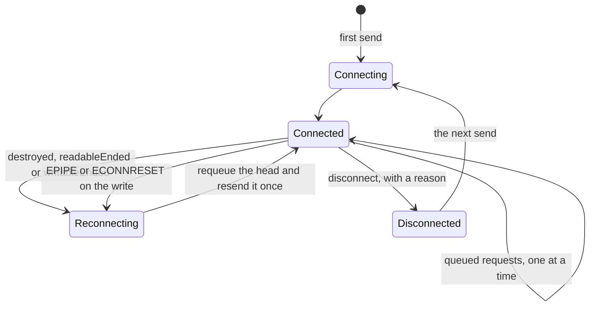
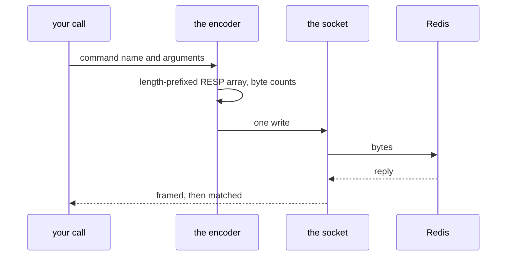

# Redis and sockets

`naive-socket` and `naive-redis` are the floor everything Redis-backed stands
on: a TCP client and a small RESP implementation, written to stay tiny in a
serverless bundle rather than to be complete. This page is what they guarantee
and the two failure modes they exist to survive.

```ts
import { createRedisConnection, redisGet } from "@yingyeothon/naive-redis";
```

## The socket, and the frozen container



**A frozen Lambda container resumes with the peer's FIN already on the socket
but not yet dispatched**, so the invocation's first `send` still sees a
connection that looks `Connected`. That is the bug this state machine exists
for: the client checks `destroyed` / `readableEnded` / `writableEnded` before
writing and reconnects at once; and when those flags are still clear and the
kernel answers the write with `EPIPE` or `ECONNRESET`, the head request is
requeued and resent **once**, because nothing of it reached the peer.

It was found on a dev stage right after the auth fix below: the same store
restart then failed with `writeAfterFIN` from a start-event save.

`disconnect(reason?)` passes the cause to the pending requests. A bare
`DeadSocket` hides why the caller's command died.

## Sending a command



**User data is never interpolated into a command string.** Every command goes
through one escaping choke-point. The inline form is safe only for arguments
free of whitespace, quotes, backslashes and control characters — a `\r\n` inside
a key or a value would inject arbitrary Redis commands, and _both_ quote
characters break it: Redis's inline parser treats `'` as a delimiter anywhere in
a token, so one form is answered with "unbalanced quotes" and another merges two
arguments into one **with no error at all**.

Bulk lengths are **byte** counts, not string lengths, or a multi-byte UTF-8
argument desynchronises the stream.

A reply matcher must consume the **whole** reply, not the shape you expected. A
one-line matcher pointed at a command whose reply may be a bulk string _or_ an
array leaves the tail in the buffer, and the next command on that connection
resolves with a fragment of this one — silently. Frame first, then reject the
shape you cannot use.

## When authentication fails

A connection that can be poisoned must reset itself rather than report forever.
The client drops the socket when `AUTH` fails or times out, and when any reply
is `-NOAUTH` or `-WRONGPASS`, so the next command reconnects and authenticates
again; a command that hit `-NOAUTH` is retried once.

Before this, a Redis restart left every warm Lambda container answering
`-NOAUTH` until it was recycled.

**`AUTH` itself is excluded from that recovery path.** Including it would make a
wrong password reconnect recursively.

## Pub/sub

Subscribing needs its own connection, because the server pushes messages with no
request to attribute them to. `createRedisSubscriber` owns that socket and
`parsePushFrame` decodes what arrives on it.

That is the outbound half of the [game actor](game-actor.md)'s bridge, and the
reason the subscribe must happen before the first inbound push.

## The simple layer

`createRedisSimple` and `redisSimpleWork` open a connection per operation and
JSON-encode values; `redisSimpleCache` memoises an async function into Redis
with `peek`, `refresh` and `clear`. Convenient for a script or a cold path — but
a game loop wants one long-lived connection, which is what `GamebaseContext`
holds.

## Read next

[Actor system](actor-system.md), which is the first thing built on top of this,
or [Operations](operations.md) for the ACL that scopes what these commands may
touch.
