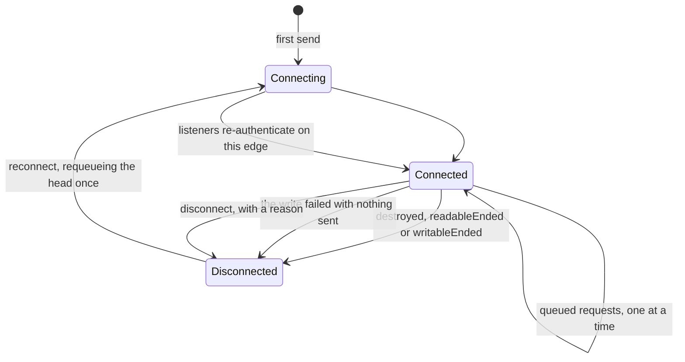
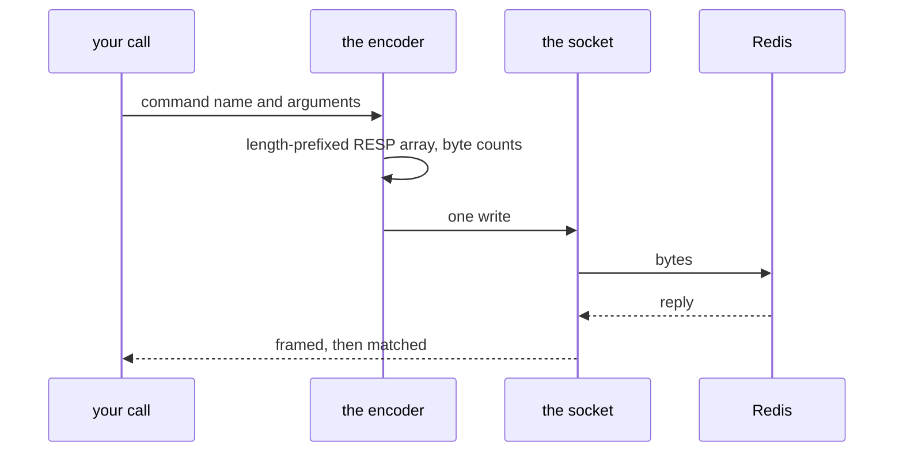

# Redis and sockets

`naive-socket` and `naive-redis` are the floor everything Redis-backed stands
on: a TCP client and a small RESP implementation, written to stay tiny in a
serverless bundle rather than to be complete. This page is what they guarantee
and the two failure modes they exist to survive.

```ts
import { createRedisConnection, redisGet } from "@yingyeothon/naive-redis";
```

**Reference:** [`naive-socket`](../packages/naive-socket/README.md), [`naive-redis`](../packages/naive-redis/README.md) — each carries its own `## Public API`, its
options and defaults, and its migration notes.

```ts
const connection = createRedisConnection({
  host: process.env.REDIS_HOST!,
  port: 6379,
  password: process.env.REDIS_PASSWORD,
  timeoutMillis: 1000,
});

await redisSet(connection, "greeting", "hello", { expirationMillis: 60_000 });
const value = await redisGet(connection, "greeting");
connection.socket.disconnect();
```

One connection is meant to be long-lived and shared — that is what
`GamebaseContext` holds for an actor Lambda.

## The socket, and the frozen container



**A frozen Lambda container resumes with the peer's FIN already on the socket
but not yet dispatched**, so the invocation's first `send` still sees a
connection that looks `Connected`. That is the bug this state machine exists
for: the client checks `destroyed` / `readableEnded` / `writableEnded` before
writing and reconnects at once; and when those flags are still clear and the
write fails with an error that proves nothing was sent — `EPIPE`, `ECONNRESET`,
`ERR_STREAM_WRITE_AFTER_END` or `ERR_STREAM_DESTROYED` — the head request is
requeued and resent **once**.

**There is no `Reconnecting` state.** `ConnectionState` is exactly `Connecting`,
`Connected` and `Disconnected`; both recovery paths disconnect and then connect,
so a listener observes the pair. That transition is what
`createRedisConnection` hangs its re-`AUTH` on.

It was found on a dev stage right after the auth fix below: the same store
restart then failed with `writeAfterFIN` from a start-event save.

`disconnect(reason?)` passes the cause to the pending requests. A bare
`DeadSocket` hides why the caller's command died.

## Sending a command



**There are two wire forms, and the inline one is the common path.** When every
argument is free of whitespace, quotes, backslashes and control characters, and
the whole command fits the inline limit, it goes out as plain text —
`SET key value`. Anything else falls back to the length-prefixed RESP array,
where bulk lengths are **byte** counts, not string lengths, or a multi-byte
UTF-8 argument desynchronises the stream.

**User data is never interpolated unescaped** — which is a narrower claim than
it looks, because there are two escaping paths rather than one. A command built
as a whole array goes through the serializer; the single-key helpers
(`redisGet`, `redisDel`, `redisRpush` and the rest) build their line directly
and escape the key with `quoteArg`. Both matter: a `\r\n` inside a key or a
value would inject arbitrary Redis commands, and _both_ quote characters break
the inline form — Redis's inline parser treats `'` as a delimiter anywhere in a
token, so one shape is answered with "unbalanced quotes" and another merges two
arguments into one **with no error at all**. A new command uses one of the two
paths, never a raw template string.

A reply matcher must consume the **whole** reply, not the shape you expected. A
one-line matcher pointed at a command whose reply may be a bulk string _or_ an
array leaves the tail in the buffer, and the next command on that connection
resolves with a fragment of this one — silently. Frame first, then reject the
shape you cannot use.

## When authentication fails

A connection that can be poisoned must reset itself rather than report forever.
The client drops the socket when `AUTH` fails or times out, and when any reply
is `-NOAUTH` or `-WRONGPASS`, so the next command reconnects and authenticates
again.

**The automatic retry happens only on a connection that has credentials.** With
no password there is nothing to re-authenticate with, so the socket is still
dropped but the error reaches the caller unretried.

Before this, a Redis restart left every warm Lambda container answering
`-NOAUTH` until it was recycled.

**`AUTH` itself is excluded from that recovery path.** Including it would make a
wrong password reconnect recursively.

## Pub/sub

Subscribing needs its own connection, because the server pushes messages with no
request to attribute them to. `createRedisSubscriber` owns that socket and
`parsePushFrame` decodes what arrives on it.

That is the outbound half of the [game actor](game-actor.md)'s bridge, and the
reason the subscribe must happen before the first inbound push.

## The simple layer

`createRedisSimple` opens a connection per operation and JSON-encodes values;
`redisSimpleCache` memoises an async function into Redis with `peek`, `refresh`
and `clear`. `redisSimpleWork` is lower level than either: it opens **one**
connection, hands it to your callback raw, and closes it after — no encoding. Convenient for a script or a cold path — but
a game loop wants one long-lived connection, which is what `GamebaseContext`
holds.

## Read next

[Actor system](actor-system.md), which is the first thing built on top of this,
or [Operations](operations.md) for the ACL that scopes what these commands may
touch.
