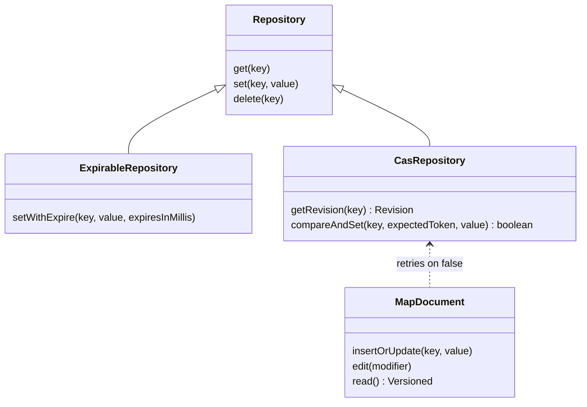
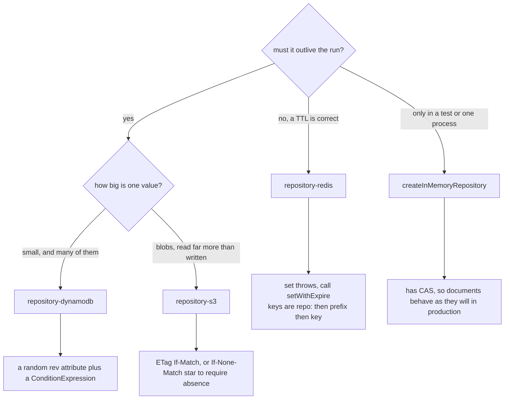
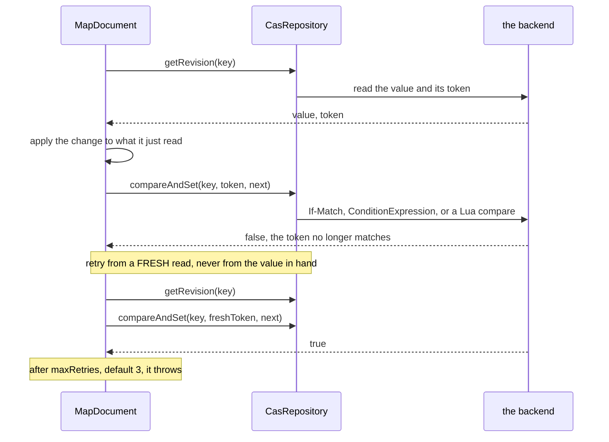

# Storage

The actor keeps nothing: game state lives in its heap and is discarded when the
invocation ends. Anything that must outlive a run goes through
`@yingyeothon/repository`, which is one small interface with four backends and
one rule that matters more than the rest.

```ts
import {
  createInMemoryRepository,
  createMapDocument,
  isCasRepository,
} from "@yingyeothon/repository";
```

A runnable race between two writers is
[`examples/repository-cas`](../examples/repository-cas/README.md).

**Reference:** [`repository`](../packages/repository/README.md), [`repository-redis`](../packages/repository-redis/README.md), [`repository-s3`](../packages/repository-s3/README.md), [`repository-dynamodb`](../packages/repository-dynamodb/README.md) — each carries its own `## Public API`, its
options and defaults, and its migration notes.

## Three interfaces



`isCasRepository` and `isExpirableRepository` are the runtime probes, because a
`Repository` variable does not tell you which extensions its backend has.

`createRepositoryFromKV` builds all three from primitive string get/set/delete
operations — supply `setWithExpire` and the result is expirable, supply
`getRevision` **and** `compareAndSet` and it is a `CasRepository`. That is how
every backend below is written.

Reading, writing, and editing a document:

```ts
const repository = createInMemoryRepository();

await repository.setWithExpire("session", { token: "…" }, 60_000);
const session = await repository.get<{ token: string }>("session");

// A conditional write, by hand.
const revision = await repository.getRevision<number>("score");
const won = await repository.compareAndSet("score", revision?.token, 42);

// Or let a document do the read-modify-write, and the retry, for you.
const scores = createMapDocument<number>({
  repository,
  key: "scores",
  expiresInMillis: 60_000, // required by repository-redis
});
await scores.insertOrUpdate("alice", 10);
const { version, content } = await scores.read();
```

## Choosing a backend



The in-memory implementation is a `CasRepository` on purpose: a test that ran
against a store without conditional writes would prove the _wrong_ semantics.

## Revisions and compare-and-set

A read-modify-write on a shared key needs a conditional write, not a version
field the writer trusts by itself.



`compareAndSet(key, expectedToken, value)` writes only while the key still holds
that revision; `undefined` means "the key must not exist". It resolves `false`
without writing rather than throwing, because losing a race is normal.

**The token is whatever the backend can check atomically, never something the
caller computes.**

| Backend   | Token                               | Enforced by                     |
| --------- | ----------------------------------- | ------------------------------- |
| S3        | the object's ETag                   | `If-Match` / `If-None-Match: *` |
| DynamoDB  | a random `rev` attribute            | a `ConditionExpression`         |
| Redis     | `redis.sha1hex` of the stored bytes | one Lua script                  |
| in-memory | a SHA-1 of the serialized value     | the same comparison             |

Comparing a serialized payload from JavaScript instead would tie the check to
codec determinism, which is not a property anyone promised.

**Without CAS, documents are last-writer-wins.** `ListDocument` and
`MapDocument` use conditional writes when the repository has them and retry from
a fresh read up to `maxRetries` (default 3) before throwing
`Concurrent modification`. On a backend without them, the last writer simply
wins — there is no silent fallback that looks like a guarantee, so serialize
writers yourself there. An actor lock does.

## Redis refuses a write with no TTL

`repository-redis`'s `set()` throws, and nothing is sent to Redis. Use
`setWithExpire`, or pass `expiresInMillis` to `compareAndSet` and to the
document factories.

Two details the throw hides: `set(key, undefined)` is the one call that does not
throw — it deletes, which is the same thing `delete` does — and the key layout is
`repo:` plus the optional prefix plus the key, so with no prefix it is
`repo:<key>` rather than `repo::<key>`.

This is the same rule as everywhere else on the platform: the instance is shared
and runs `allkeys-lru`, and the participant credential denies key enumeration —
so a key written without a TTL can never be found again and will evict someone
else's state. See [Operations](operations.md) for the full TTL list.

## Read next

[Operations](operations.md) for every TTL and the Redis ACL, or
[The game actor](game-actor.md) for why the actor itself persists nothing.
