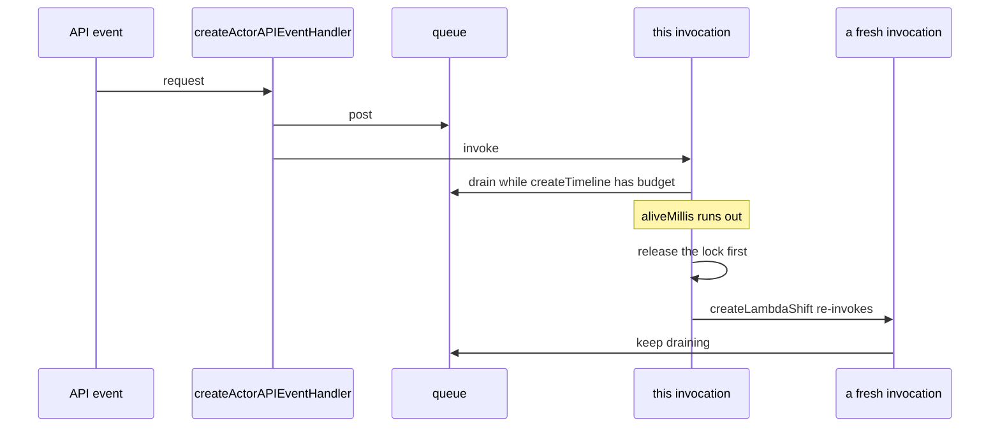

# @yingyeothon/actor-system-lambda

AWS Lambda glue for [`@yingyeothon/actor-system`](../actor-system): an API Gateway proxy handler that turns HTTP requests into actor messages, a Lambda handler that processes an actor's queue within the invocation's lifetime, and a shift function that hands remaining work to a fresh asynchronous Lambda invocation when the current one runs out of time.

When the invocation runs out of budget it releases first, then hands the rest to a fresh one.



## Install

```bash
npm install @yingyeothon/actor-system-lambda @aws-sdk/client-lambda
```

`@aws-sdk/client-lambda` is a peer dependency, used by `createLambdaShift`.

## Usage

ESM:

```ts
import {
  createActorAPIEventHandler,
  createActorLambdaEventHandler,
  createLambdaShift,
  createTimeline,
} from "@yingyeothon/actor-system-lambda";
import { singleConsumer } from "@yingyeothon/actor-system";

// Shared actor options: queue/lock/awaiter come from your own
// subsystem (for example @yingyeothon/actor-system-redis).
const newActorEnv = (actorId: string) => ({
  ...singleConsumer,
  ...actorSubsys,
  id: actorId,
  onMessage: (message: { delta: number }) => applyDelta(message.delta),
  shift: createLambdaShift({ functionName: "my-actor-worker" }),
});

// API Gateway entrypoint: enqueue the request body as an actor message
// and process the queue inline ("send") or leave it to a worker ("post").
export const api = createActorAPIEventHandler({
  newActorEnv: (apiPath) => newActorEnv(apiPath.slice(1)),
  policy: { type: "send" },
});

// Worker Lambda entrypoint: drain the actor's queue while this
// invocation is alive, then shift the rest to the next invocation.
// Pass a timeline to observe the remaining invocation lifetime.
const timeline = createTimeline();
export const worker = createActorLambdaEventHandler({
  newActorEnv: ({ actorId }) => newActorEnv(actorId),
  timeline,
});

// User code can check the remaining invocation lifetime at any point.
if (timeline.over) {
  // wrap up quickly
}
```

CJS:

```js
const {
  createActorLambdaEventHandler,
} = require("@yingyeothon/actor-system-lambda");

exports.handler = createActorLambdaEventHandler({ newActorEnv });
```

## Public API

- `createActorAPIEventHandler({ newActorEnv, parseMessage?, logger?, policy })` — builds an `APIGatewayProxyHandler` that parses the request body (default `JSON.parse`) into a message for the actor returned by `newActorEnv(apiPath, event)`. `policy.type: "send"` processes the queue inline (default options: 5s `aliveMillis`, one-shot, shiftable); `policy.type: "post"` only enqueues. Returns `200 OK`; throws on missing actor options, an empty body, or a falsy parsed message.
- `createActorLambdaEventHandler({ newActorEnv, logger?, processOptions?, timeline? })` — builds a `Handler<LambdaPayload, void>` that resets its `timeline` (default lifetime 870s, or `processOptions.aliveMillis`) and runs `tryToProcess` on the options from `newActorEnv(event)`; by default a shiftable one-shot bounded by the remaining lifetime. `timeline` defaults to a fresh timeline private to the handler; pass your own to observe the remaining lifetime.
- `createLambdaShift({ functionName, functionVersion?, buildPayload?, client? })` — returns an `ActorShift` that invokes `functionName` with `InvocationType: "Event"` and payload `buildPayload(actorId)` (default `{ actorId }`, qualifier default `$LATEST`).
- `createTimeline(timeoutMillis?)` — creates a `Timeline` that starts now (default timeout 5s).
- `Timeline` — tracks elapsed/remaining lifetime: `reset(timeoutMillis?)`, `epochMillis`, `timeoutMillis`, `passedMillis`, `remainMillis`, `over` (type)
- `ActorLambdaEvent` — `{ actorId: string }`, the default worker invocation payload (type)
- `ActorAPIEventHandlerOptions`, `ActorLambdaEventHandlerOptions`, `LambdaShiftOptions` — options shapes of the factories above (types)

Every factory accepts an optional `logger?: Logger` (see `@yingyeothon/logger`) and defaults to `nullLogger`; the API and Lambda handlers fall back to the actor options' own `logger` when none is given.

## Migrating from the legacy package

- The npm package was renamed: `@yingyeothon/actor-system-aws-lambda-support` → `@yingyeothon/actor-system-lambda`.
- Factory renames (they return handlers/functions rather than performing the work themselves):
  - `handleActorAPIEvent` → `createActorAPIEventHandler`
  - `handleActorLambdaEvent` → `createActorLambdaEventHandler`
  - `shiftToNextLambda` → `createLambdaShift`
- Options type renames: `ActorAPIEventHandlerArguments` → `ActorAPIEventHandlerOptions`, `ActorLambdaHandlerArguments` → `ActorLambdaEventHandlerOptions`, `ShiftToNextLambdaArguments` → `LambdaShiftOptions`.
- `Timeline` is now an interface created with `createTimeline()`; the mutable `globalTimeline` singleton was removed. To watch the remaining lifetime, create a timeline and pass it as `ActorLambdaEventHandlerOptions.timeline` (the handler still resets it at the start of every invocation).
- The `logger` option is now a `Logger` from `@yingyeothon/logger` (with `warn` and `severity`), defaulting to `nullLogger`.
- The package ships dual ESM/CJS with types; deep imports (`.../lib/handle/...`) are no longer supported — import everything from the package root.
- `createLambdaShift` accepts an optional `client: LambdaClient`; by default one client is created per `createLambdaShift` call and reused across shifts (the legacy version created a new client on every shift).
- `createActorLambdaEventHandler` validates the actor options before touching them and stringifies the event in its `No actor env` error message.
