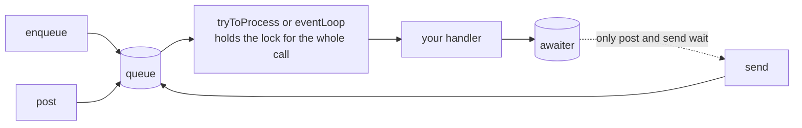

# @yingyeothon/actor-system

Lightweight actor system built on three pluggable abstractions — a per-actor message queue, a per-actor lock, and an awaiter that lets senders wait for their message's completion. Any backing store (in-memory, Redis, DynamoDB, ...) can drive it by implementing a handful of small interfaces; in-memory implementations are included.

Three pluggable pieces, and three ways in that differ only in how long the caller waits.



## Install

```bash
npm install @yingyeothon/actor-system
```

## Usage

ESM:

```ts
import {
  AwaitPolicy,
  createInMemoryAwaiter,
  createInMemoryLock,
  createInMemoryQueue,
  send,
  singleConsumer,
  tryToProcess,
} from "@yingyeothon/actor-system";

interface AdderMessage {
  delta: number;
}

let value = 0;
const env = {
  ...singleConsumer,
  id: "adder",
  queue: createInMemoryQueue(),
  lock: createInMemoryLock(),
  awaiter: createInMemoryAwaiter(),
  onMessage: ({ delta }: AdderMessage) => {
    value += delta;
  },
};

// Enqueue a message and process the queue in this thread,
// waiting until this message has been committed.
await send(env, { item: { delta: 1 }, awaitPolicy: AwaitPolicy.Commit });

// Or only enqueue (post) and let a dedicated processor drain the queue.
await tryToProcess(env, { aliveMillis: 10_000, shiftable: true });
```

CJS:

```js
const {
  eventLoop,
  createInMemoryLock,
  createInMemoryQueue,
} = require("@yingyeothon/actor-system");

eventLoop({
  id: "loop-1",
  queue: createInMemoryQueue(),
  lock: createInMemoryLock(),
  loop: async (poll) => {
    for (const item of await poll()) {
      console.log(item);
    }
  },
}).then((processed) => console.log({ processed }));
```

Concepts:

- `enqueue` appends a message to an actor's queue; `post` enqueues and optionally waits for another processor to complete it; `send` enqueues and then tries to process the queue in the calling thread.
- `AwaitPolicy` selects how long a sender waits: `Forget` (not at all), `Act` (until its handler ran), or `Commit` (until the whole processing pass, including `onCommit`, finished).
- `tryToProcess` acquires the actor's lock and drains the queue, either message-by-message (`singleConsumer` + `onMessage`) or all-at-once (`bulkConsumer` + `onMessages`). With `aliveMillis`/`shiftable` it cooperates with limited-lifetime containers such as AWS Lambda by invoking `shift` when time runs out.
- `eventLoop` hands the lock plus a `poll` drain function to a user-supplied loop.
- Every options object accepts an optional `logger?: Logger` from `@yingyeothon/logger`, defaulting to `nullLogger`.

### Delivery semantics: pick deliberately

The two entry points differ, and neither is a superset of the other:

| entry point    | drain                                   | on a crash mid-batch                                                                 |
| -------------- | --------------------------------------- | ------------------------------------------------------------------------------------ |
| `tryToProcess` | peek → handle → pop                     | **at-least-once**: the message is still queued and is handled again                  |
| `eventLoop`    | flush, then hand the batch to your loop | **at-most-once**: the batch left the queue before your loop acted on it, and is gone |

A game that cannot lose input needs an ack of its own above `eventLoop`, or
`tryToProcess`.

### Lock ownership

Both entry points hold the actor's lock for the whole call — `tryToProcess`
across every drain cycle, not just one. Actor state lives in the owner's heap
while a shift payload carries only an `actorId`, so releasing between cycles
would let ownership migrate to a process holding different state. Two
consequences:

- A competing invocation that asked to stay alive (`aliveMillis`, no
  `oneShot`) waits at `idleIntervalMillis` until the owner finishes or its
  own time runs out; a one-shot call gives up on the first miss.
- Pass `lockRenewIntervalMillis` whenever the lease is shorter than
  `aliveMillis`. The lock no longer re-stamps itself between cycles, so
  without a heartbeat it expires mid-run and a second invocation starts
  draining the same queue.
- A `shift` happens **after** the release, so the successor can acquire.

Both entry points take `lockRenewIntervalMillis`, which heartbeats the lease
through `lock.renew` while work runs. That is what lets a lease be short (so
a crashed actor frees itself in seconds) without expiring under a long game.

An expired lease is not by itself a loss. The lease is a deadline for a
_successor_ — it exists so a crashed actor frees its id quickly — so a
holder whose renewal comes back false re-acquires and carries on. That is
what makes a short lease safe: a failover or a network gap longer than the
lease costs a live session nothing, because nobody took anything from it.

Only a re-acquisition that **fails** means another process owns the actor,
and that is acted on rather than logged: `eventLoop`'s `poll` rejects from
that moment (so this loop cannot consume the new owner's messages) and calls
the optional `onLockLost`; `tryToProcess` stops its drain loop and returns
what it had already processed. A renewal that merely failed to reach the
lock store is neither — the next beat tries again.

## Public API

- `enqueue(env, input)` — queue a message, filling in `messageId` (random UUID), `awaitPolicy` (`Forget`), and `awaitTimeoutMillis` (0); resolves with the message plus the `queueDepth` after the push, so a producer can notice that nobody is consuming without a second round trip
- `post(env, input)` — enqueue and await completion according to the message's `AwaitPolicy`
- `send(env, input, options?)` — enqueue, try to process in this thread, and await completion
- `tryToProcess(env, options?)` — lock and drain the actor's queue; returns the `AwaiterMeta[]` of processed messages
- `eventLoop(env)` — lock the actor and run a user loop with a queue-draining `poll`; `false` if the lock was held. `onAcquired` runs once, after the lock is taken, which is the only point that means "this invocation owns the actor"; `lockRenewIntervalMillis` heartbeats the lease
- `createInMemoryQueue()` — in-process queue implementation
- `createInMemoryLock()` — in-process lock implementation
- `createInMemoryAwaiter()` — in-process awaiter implementation
- `AwaitPolicy` — `Forget` | `Act` | `Commit` enum
- `singleConsumer` — spreadable consume-type marker for message-by-message processing
- `bulkConsumer` — spreadable consume-type marker for all-at-once processing
- Message types: `AwaiterMeta`, `UserMessage`, `UserMessageItem`, `UserMessageMeta`, `EnqueuedMessage`
- System interface types: `QueueProducer`, `QueueSingleConsumer`, `QueueBulkConsumer`, `QueueLength`, `LockAcquire`, `LockRelease`, `LockRenew`, `AwaiterWait`, `AwaiterResolve`, `ActorShift`, `InMemoryQueue`, `InMemoryLock`, `InMemoryAwaiter`
- Options types: `ActorProperty`, `ActorLogger`, `ActorErrorHandler`, `ActorSingleMessageHandler`, `ActorMessageBulkConsumer`, `ActorEnqueueOptions`, `ActorPostOptions`, `ActorSendOptions`, `ActorProcessOptions`, `ActorLoopOptions`, `ActorSingleOptions`, `ActorBulkOptions`, `ActorEventLoopOptions`, `TryToProcessOptions` — `logger` fields take `Logger` from `@yingyeothon/logger`

## Behavior changes

- **`QueueProducer.push` resolves `number`, not `void`.** It is the queue
  depth after the push, which a Redis `RPUSH` returns for free and which is
  the cheapest way for a producer to notice that nobody is consuming. Any
  custom `QueueProducer` implementation must be updated.
- **The lock is held across drain cycles** and `shift` happens after the
  release — see Lock ownership above.

## Migrating from the legacy package

- Everything is exported from the package root as named exports; deep imports such as `@yingyeothon/actor-system/lib/queue/producer` are gone — import the same names from the root instead.
- The package no longer depends on `uuid` (uses `crypto.randomUUID()`).
- Logging is unified on `@yingyeothon/logger`: the package-local `ActorSystemLogger` type is gone — use `Logger` (or `LogWriter`) from `@yingyeothon/logger` — and `noopLogger` is replaced by `nullLogger` from the same package.
- Classes became factories: `new InMemoryQueue()` → `createInMemoryQueue()`, `new InMemoryLock()` → `createInMemoryLock()`, `new InMemoryAwaiter()` → `createInMemoryAwaiter()`. The class names remain as interface types describing the returned objects.
- `*Environment` (and `*Env`) type names became `*Options`: `ActorEnqueueEnvironment` → `ActorEnqueueOptions`, `ActorPostEnvironment` → `ActorPostOptions`, `ActorSendEnvironment` → `ActorSendOptions`, `ActorProcessEnvironment` → `ActorProcessOptions`, `ActorLoopEnvironment` → `ActorLoopOptions`, `ActorEventLoopEnvironment` → `ActorEventLoopOptions`, `ActorSingleEnv` → `ActorSingleOptions`, `ActorBulkEnv` → `ActorBulkOptions`. The former `ActorProcessOptions` (the `oneShot`/`aliveMillis`/`shiftable` flags of `tryToProcess`) is now `TryToProcessOptions`.
- The misspelled `ActroEventLoopEnvironment` type is now `ActorEventLoopOptions`.
