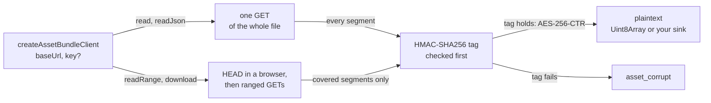

# @yingyeothon/asset-client

Reader for yyt asset bundles on the CDN (`https://d.yyt.life/assets/{bundleId}/`, `https://dev-d.yyt.life` on dev). A bundle is created with `yyt asset create` and filled with `yyt asset sync`; this client only reads it: a whole file, a JSON manifest, a byte range, or a resumable download into storage the caller provides. With the bundle's key it reads an encrypted bundle, whose files the CDN serves as `yyt-enc v1` ciphertext, and verifies every 64 KiB segment before releasing a byte of it; without a key it reads a plain bundle through the same calls. It uses WebCrypto and the global `fetch`, runs in browsers and on Node >= 20, and depends on nothing beyond `@yingyeothon/logger`. The format is specified in `docs/asset-encryption.md` of the service repository, and [the guide page](../../docs/assets.md) covers bundle shapes, the manifest pattern and the order of a ranged read.

Every read maps a path to one URL below `baseUrl`; a keyed client decrypts what comes back, segment by segment, and refuses anything whose tag fails.



## Install

```bash
npm install @yingyeothon/asset-client
```

## Usage

ESM:

```ts
import {
  createAssetBundleClient,
  isAssetClientError,
} from "@yingyeothon/asset-client";

const bundle = createAssetBundleClient({
  baseUrl: "https://d.yyt.life/assets/bnd_123/", // a live bundle; add "v3/" for a version
  key: bundleKey, // "yak1.…" from `yyt asset key show <bundle>`; omit for a plain bundle
});

// a mutable manifest; "no-store" also keeps it out of the browser cache
const manifest = await bundle.readJson<Manifest>("manifest.json", {
  cache: "no-store",
});

// one file whole, or only the segments a range covers
const db = await bundle.read("data/songs.db");
const intro = await bundle.readRange("music/intro.ogg", {
  start: 0,
  end: 65_536,
});

try {
  await bundle.read("data/missing.db");
} catch (error) {
  if (isAssetClientError(error) && error.code === "not_found")
    showUpdatePrompt();
  else throw error;
}
```

CJS:

```js
const { createAssetBundleClient } = require("@yingyeothon/asset-client");
```

## Base URL and paths

`baseUrl` is `https://{cdn}/assets/{bundleId}/` for a live bundle and `https://{cdn}/assets/{bundleId}/{version}/` for one version of a versioned bundle; the trailing slash is optional, and `yyt asset files <bundle>` prints every file's public URL. A file's associated data — what its ciphertext is bound to — is its object key below the bundle: `{path}` in a live bundle and `{version}/{path}` in a versioned one. The client derives it from `baseUrl` and `path`, and a keyed client refuses a `baseUrl` that has neither shape with a `RangeError` at create time.

**`baseUrl` is the bundle or the version, never a folder inside it.** `…/assets/bnd_123/music/` has the shape of version `music` of a versioned bundle, so every read of a live bundle through it fails as `asset_corrupt`; put the folder in `path` instead. The same bytes served under another path, version or bundle fail the same way, exactly like a wrong key.

A `path` is segments separated by `/`, with no leading slash, no empty, `.` or `..` segment, no backslash, no control character and no lone UTF-16 surrogate. Each segment is percent-encoded into the URL and bound as raw UTF-8, so a non-ASCII path works as the CLI uploaded it.

## The key

`key` is the text `yak1.` + 43 base64url characters, exactly as `yyt asset key show <bundle>` prints it, or its 32 raw bytes. A text that is not canonical — another prefix, padding, `+` or `/`, or a last character outside `AEIMQUYcgkosw048` that would decode to the same bytes — is refused with `bad_key`, so a lenient and a strict decoder can never disagree on what a key is. The key is copied at create time, imported into WebCrypto as a non-extractable key, and the copy is zeroed as soon as the import settles. `close()` drops the imported key: a read in flight stops at its next segment and every later read rejects. The client object holds no enumerable reference to the key, so logging or `JSON.stringify`-ing the client cannot print it. Why the key protects less than it seems is in [Asset bundles § Bundle shapes](../../docs/assets.md#bundle-shapes).

**Omitting `key` for an encrypted bundle is not an error.** The client then reads a plain bundle and returns the ciphertext as it was served; only `readJson` notices, as `asset_corrupt`.

In a browser, WebCrypto exists only in a secure context. On a plain `http://` page `crypto.subtle` is missing, and a keyed `createAssetBundleClient` throws at once rather than on the first read.

## Reads

What each call of a keyed client puts on the wire, and what it holds:

| Call                              | `corsSafe: false`              | `corsSafe: true`                       | Holds in memory                  |
| --------------------------------- | ------------------------------ | -------------------------------------- | -------------------------------- |
| `read(path)` / `readJson(path)`   | one `GET`                      | one `GET`                              | the file twice: cipher and plain |
| `readRange` starting in segment 0 | one ranged `GET`               | `HEAD`, one ranged `GET`               | the covered segments             |
| `readRange` starting after it     | header `GET`, one ranged `GET` | `HEAD`, header `GET`, one ranged `GET` | the covered segments             |
| `download` from the start         | one ranged `GET` (`bytes=0-`)  | `HEAD`, one ranged `GET`               | one 64 KiB segment               |
| `download` resumed past segment 0 | header `GET`, one ranged `GET` | `HEAD`, header `GET`, one ranged `GET` | one 64 KiB segment               |

A plain bundle makes one request per call: a `GET` for `read` and a fresh `download`, one ranged `GET` for `readRange` and a resumed `download`.

`readRange(path, { start, end })` takes plaintext offsets, `end` exclusive and optional (to the end of the file), and clamps like `Uint8Array.slice`. An empty window (`end <= start`) returns at once without a request. A window that is empty only after clamping — past the end of the file — still fetches and verifies the last segment, because the length the host states is not authenticated until that segment's tag holds. A plain bundle's `readRange` slices the whole file if the host ignores `Range`.

Every read takes `cache`, the fetch cache mode, passed through only when given. A mutable file is served `no-cache`, so the default already revalidates it; `no-store` also keeps it out of the browser cache.

## Downloads and resume

`download(path, { sink, resume?, onProgress? })` writes plaintext into a caller-supplied `AssetSink`: `write(chunk)` gets the next bytes in order and is awaited before the next piece, and `reset()` means everything written so far must go, because the object is not the one those bytes came from. In a keyed client each chunk is one verified segment (the first chunk of a resume is the rest of its segment), so nothing reaches the sink before its tag verified. The library never touches a file system itself and exports nothing Node-only; a file sink is this recipe:

```ts
import { open, rename, stat } from "node:fs/promises";

const part = `${destination}.part`; // only ever holds verified plaintext
const offset = await stat(part).then(
  (s) => s.size,
  () => 0,
);
const file = await open(part, offset > 0 ? "r+" : "w");
let position = offset;
try {
  await bundle.download("music/intro.ogg", {
    sink: {
      async write(chunk) {
        await file.write(chunk, 0, chunk.length, position);
        position += chunk.length;
      },
      async reset() {
        await file.truncate(0);
        position = 0;
      },
    },
    // savedEtag: what onProgress reported last time, kept next to the .part file
    ...(offset > 0 && savedEtag ? { resume: { offset, etag: savedEtag } } : {}),
    onProgress: ({ written, total, etag }) =>
      saveProgress(written, total, etag),
  });
} finally {
  await file.close();
}
await rename(part, destination); // only after the last segment verified
```

`resume: { offset, etag }` continues from the segment holding `offset`, so it re-fetches at most one segment, and only while the object still has that `ETag`; any other object — or an answer that names no `ETag` where `If-Range` could not vouch for it — calls `reset()` and starts from byte 0. A keyed resume that was already complete still verifies the last segment and writes nothing. A plain resume at the end of the file finishes without a reset when the host answers `416` with the length under a matching `If-Range`; in a browser, which can read neither, it starts over.

`onProgress({ written, total, etag })` fires after every piece, and once for a download that wrote nothing. A plain file whose length the client cannot trust reports no `total`: a compressed body, and in a browser any whole-file answer, since `Content-Encoding` is invisible there. Whatever the sink or `onProgress` throws ends the download, releases the connection and reaches the caller unchanged — that is also how to cancel one.

## Browsers and `corsSafe`

The yyt CDN answers `access-control-allow-origin: *`, exposes only `ETag` and `Content-Length` to scripts, and answers a CORS preflight (`OPTIONS`) with 403. A script in a browser therefore cannot read `Content-Range`, and a request carrying `If-Range` never leaves the browser. With `corsSafe: true` the client sends no header but `Range` (CORS-safelisted for a single `bytes=` range by the Fetch standard), learns the length and the `ETag` from a `HEAD`, and compares each `206`'s `ETag` with it. A browser that still preflights `Range` makes the ranged `fetch` reject right after its `HEAD` succeeded; the client then logs `asset ranged request refused; reading the whole file` at `warn` and reads that file with one plain `GET`, dropping the segments before the window unreleased, so the result is the same at the cost of the transfer. `corsSafe` defaults to `true` when there is a `document` or a `WorkerGlobalScope` and `false` elsewhere; set it yourself for anything in between (a WebView bridge, a test double).

With `corsSafe: false` the client does what the `yyt` CLI does: it reads the total length from `Content-Range` and sends `If-Range` with the first answer's strong `ETag`, and a `206` without a numeric total is an `http` error.

## When the object changes under a read

A mutable file can be replaced between two requests of one read. A `200` to a request that carried `If-Range`, another `ETag`, another total length, or — without `If-Range` — a `206` that names no `ETag` means exactly that, and the read starts over from the length and the header, up to three restarts (four attempts); a fourth change is an `http` error. **A `200` to a ranged request that carried no `If-Range` and names the same object means the host ignores `Range`**, which an encrypted read cannot work around: `http`, at once. A host that sends no `ETag` at all is still read, but only the tags then tell two objects apart, so a change mid-read fails as `asset_corrupt` instead of starting over.

## Errors

Every failure the CDN, the network or the ciphertext causes is an `AssetClientError`: `status` (HTTP, `0` when there was no answer to report) and `code`. Its `message` is `asset <code> (<status>)`, sometimes with a fixed phrase after a colon, and never a key, a URL, a path or a byte of plaintext, so it can be logged as is.

| `code`          | When                                                                                                                           |
| --------------- | ------------------------------------------------------------------------------------------------------------------------------ |
| `bad_key`       | the key is not the canonical `yak1.` text or 32 bytes (thrown by `createAssetBundleClient`), or WebCrypto refused to import it |
| `not_found`     | `403` or `404`. **A missing object answers `403` on the yyt CDN**, so the two are one case                                     |
| `asset_corrupt` | a length no ciphertext has, a failed tag, a wrong key, path or version, or `readJson` on bytes that are not UTF-8 JSON         |
| `http`          | any other status, a host that ignores `Range`, a `206` that is not the range asked for, an object that kept changing           |
| `network`       | `fetch` rejected (attached as `cause`), or a body failed, ended early or ran past its stated length                            |

`readJson` never attaches `JSON.parse`'s `SyntaxError` as `cause`, because its message quotes the plaintext. kvstore-client spells an unrecognised status `http_<status>`; here it is `http` with the status in `status`, the vocabulary the C# and Dart clients planned in `csharplib` and `flutterlib` are to share.

Local misuse — a malformed `baseUrl` or path, a negative or fractional offset, a malformed `resume` — is a `RangeError` before any request. The one `RangeError` that comes after requests is a `resume.offset` past the end of the file, raised once the last segment verified, so that a truncated file cannot be blamed on the caller. A plain `Error` is thrown for a missing `fetch` or WebCrypto at create time and for a read of a closed client.

## Security

Log lines are `asset request` at `debug` with `{ kind, path, status, range? }`, where `kind` is `whole`, `head`, `header`, `segments` or `range`; `asset request failed` at `warn` with `{ kind, path }` when `fetch` rejects; `asset ranged request refused; reading the whole file` at `warn` with `{ path }`; and `asset changed during a read; starting over` at `info` with `{ path, restart }`. None carries the key or a byte of the body, and a URL here never carries a credential: the bundle is public ciphertext. `verify` runs before `decrypt` on every segment, and WebCrypto's HMAC verification compares in constant time in Node, Chromium, Firefox and WebKit. Every response body the client does not read to the end is cancelled, on success and on failure, so a refused answer never keeps its connection.

## What this does not do

No upload, no encryption, no listing: `yyt asset sync` is the only encryptor, and the console owns the bundle's file list. No cache of its own beyond the fetch `cache` mode, no retry of a `network` failure (resume instead), no `AbortSignal` (throw from the sink), no key rotation.

## Public API

- `createAssetBundleClient(options)` — `AssetBundleClient`: `read(path, options?)`, `readJson(path, options?)`, `readRange(path, options)`, `download(path, options)`, `close()`. `AssetBundleClientOptions`: `baseUrl`, `key?` (text or 32 bytes), `corsSafe?`, `fetch?` defaulting to the global, `logger?` defaulting to `nullLogger`.
- Read options: `AssetReadOptions` (`cache?` as `AssetCacheMode`), `AssetRangeOptions` (`start`, `end?`, `cache?`), `AssetDownloadOptions` (`sink` as `AssetSink`, `resume?` as `AssetResume`: `offset`, `etag`; `onProgress?` with `AssetDownloadProgress`: `written`, `total?`, `etag?`; `cache?`) → `AssetDownloadResult` (`bytes`, `etag?`).
- `AssetClientError`, `AssetClientErrorCode` and the duck-typed `isAssetClientError`.
- Transport types for an injected `fetch`: `AssetFetchLike`, `AssetFetchRequest`, `AssetFetchResponse`, `AssetStreamReader`.

## Migrating from the legacy package

New package; there is no legacy counterpart. The C# and Dart clients planned in `csharplib` and `flutterlib` are to follow the same shape and vocabulary.
