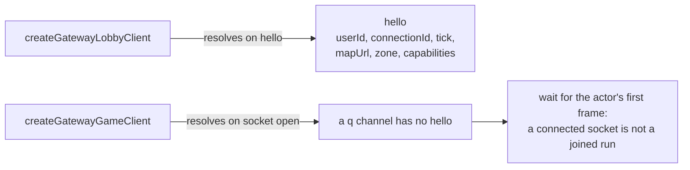

# @yingyeothon/gamebase-client

Client SDK for the yyt WebSocket gateway. It speaks the gateway's two channel kinds — the **lobby** (positions, chat, parties, game events) and the **dungeon `q` bridge** to a `@yingyeothon/lambda-gamebase` actor — with typed frames, the bearer-subprotocol handshake, reconnect with backoff, a ghost-free peer map, and the distinction between a run that was _aborted_ and one that _finished_. It runs in browsers, on Node >= 22 as is, and on Node 20 with an injected `WebSocket`, with no dependency beyond `@yingyeothon/codec` and `@yingyeothon/logger`; it does not depend on `lambda-gamebase`. The normative wire spec is the gateway's own README in the service repository.

The two clients differ in what `connect()` waits for, and that difference is the channel kind.



## Install

```bash
npm install @yingyeothon/gamebase-client
```

## Usage

ESM, lobby:

```ts
import { createGatewayLobbyClient } from "@yingyeothon/gamebase-client";

const lobby = createGatewayLobbyClient({
  url: "wss://gw.yyt.life",
  channelId: "ch_lobby",
  token: channelJwt, // rides in the subprotocol list, never logged
});

lobby.on("peerEnter", (peer) => spawn(peer));
lobby.on("peerMove", (peers) => peers.forEach(move));
lobby.on("peerLeave", (userId) => despawn(userId));
lobby.on("say", (frame) => showChat(frame.from, frame.text));
lobby.on("connected", () => lobby.pos({ zone: startZone, x, y, dir: "n" })); // also after a reconnect

const hello = await lobby.connect(); // resolves on the gateway's `hello`
const map = await lobby.map(); // fetches hello.mapUrl once, no credentials
if (lobby.capabilities?.party === false) hidePartyUi();
lobby.say({ scope: "zone", text: "hi" });
```

ESM, dungeon:

```ts
import { createGatewayGameClient } from "@yingyeothon/gamebase-client";

const game = createGatewayGameClient({
  url: "wss://gw.yyt.life",
  channelId: "q_dungeon",
  gameId, // from the game's entry API; the caller must be in its start event
  token: channelJwt,
});
game.on("frame", (frame) => applySnapshot(frame)); // every game-defined frame, verbatim
game.on("finished", () => showResult()); // close 1000: the game dropped you
game.on("aborted", () => backToLobby("server stopped responding")); // close 4001: retry needs a new gameId
await game.connect(); // open + bearer echoed; the game answers with its own snapshot
game.send({ type: "attack", power: 3 });
```

CJS:

```js
const { createGatewayLobbyClient } = require("@yingyeothon/gamebase-client");
```

## Reconnect policy

| Close code             | Lobby                  | Dungeon (`q`)                   |
| ---------------------- | ---------------------- | ------------------------------- |
| `4000` replaced        | `stopped`              | `stopped`                       |
| `4001` actor abort     | `stopped`              | `aborted` — new `gameId` needed |
| `4002` idle            | reconnect              | reconnect                       |
| `4003` policy          | `stopped` (client bug) | `stopped` (client bug)          |
| `4004` channel gone    | `stopped`              | `stopped`                       |
| `1000` normal          | `stopped`              | `finished`                      |
| `1001` gateway restart | reconnect              | reconnect                       |
| `1003` / `1009`        | `stopped` (client bug) | `stopped` (client bug)          |
| `1011` enter failed    | reconnect              | reconnect                       |
| anything else          | reconnect              | reconnect                       |

Reconnects use exponential backoff (500 ms, ×2, cap 15 s, ±20 % jitter) until `backoff.maxAttempts` is exhausted, which ends in `stopped`. A browser cannot see why a handshake was refused (401/403/404/410 all surface as a close before open), so `maxHandshakeFailures` consecutive closes-before-open (default 5) also end in `stopped` instead of retrying a dead token forever; the counter resets on every successful open. `disconnected` fires before every reconnect or stop with `willReconnect` set. On the lobby, `connected` fires again with the new `hello` and the peer map is empty until the game re-sends `pos` and the gateway answers with a `snapshot`; a `party` frame that follows `hello` after a gateway restart updates `partyId` and `roster`. On `q`, a reconnect is a fresh `enter` and the game is expected to reply with a snapshot.

## Wire details worth knowing

- `dir` is the game's own facing token, an opaque **string** of at most 16 bytes (`"n"`, `"left"`, …). The gateway parses `pos` with a string field, so a numeric `dir` makes the whole frame a `bad_message` and the position is dropped; `pos()` throws locally on a longer one. Omit it if the game has no facing.
- The `party` roster is marshalled with Go `omitempty`: `leaderId`, `invited`, and `max` are missing on the wire when empty (always after leave/dissolve, `invited` whenever nobody is pending). The lobby client fills them in as `""`, `[]`, and `0` (and a missing `members` as `[]`) before the frame reaches `roster`, a `party` handler, or the `frame` event, so `roster.invited.length` needs no guard.

## Browser and Node

The SDK uses only the WHATWG `WebSocket` and `fetch` globals through its own structural types, so its `.d.ts` pulls in neither the DOM lib nor `undici-types`. Browsers and Node >= 22 need nothing; on Node 20 pass an implementation through the `WebSocket` option (and `fetch` for `map()`).

## Public API

- `createGatewayLobbyClient(options)` — `GatewayLobbyClient`: `connect()` (resolves with `Hello`), `close()`, `state`, `hello`, `capabilities`, `partyId`, `roster`, `peers` (a `PeerMap`), `map()`, senders `pos`, `say`, `event`, `party.create/invite/accept/decline/leave/list`, `ping`, `send`, and `on(type, handler)` for `connected`, `disconnected`, `reconnecting`, `stopped`, `snapshot`, `peerEnter`, `peerLeave`, `peerMove`, `say`, `event`, `party`, `partyInvite`, `partyDeclined`, `pong`, `error`, `protocolError`, `frame`. Senders throw locally when `hello.capabilities` disables them or before `hello`.
- `createGatewayGameClient(options)` — `GatewayGameClient`: `connect()`, `close()`, `state`, `send(frame)` (refuses the reserved `enter`/`leave` types), and `on` for `connected`, `frame`, `error`, `disconnected`, `reconnecting`, `aborted`, `finished`, `stopped`, `protocolError`.
- `createPeerMap({ selfUserId })` — the reducer behind `peers`: `apply(frame)`, `get`, `all`, `zone`, `reset`. `snapshot` replaces everything, `pos` updates known peers only and drops self, frames for another zone are ignored.
- `createMapFetcher({ fetch?, logger? })` / `fetchMap(url, options?)` — credential-free GET of an immutable map asset, cached per URL, JSON-parsed with a text fallback.
- `createBackoff(options)` — `next()` / `reset()` / `attempts`.
- `classifyClose(code, kind)` — the table above as a function; `GatewayCloseCode` — the `4000`–`4004` constants.
- `buildGatewayUrl(url, channelId, gameId?)` — the `?channel=…&gameId=…` form the gateway expects.
- `reservedGameFrameTypes` — `["enter", "leave"]`.
- Types: wire — `Hello`, `Capabilities`, `Peer`, `Direction`, `SayScope`, `ErrorFrame`, `GatewayErrorCode`, `LobbyClientFrame` (`PosFrame`, `SayFrame`, `EventFrame`, `PartyCreateFrame`, `PartyInviteRequestFrame`, `PartyAcceptFrame`, `PartyDeclineFrame`, `PartyLeaveFrame`, `PartyListFrame`, `PingFrame`), `LobbyServerFrame` (`SnapshotFrame`, `EnterFrame`, `LeaveFrame`, `PosBroadcastFrame`, `SayBroadcastFrame`, `EventBroadcastFrame`, `PartyFrame`, `PartyMember`, `PartyInviteFrame`, `PartyDeclinedFrame`, `PongFrame`), `GameClientFrame`, `GameServerFrame`; transport — `WebSocketLike`, `WebSocketConstructor`, `WebSocketMessageEventLike`, `WebSocketCloseEventLike`, `FetchLike`, `FetchResponseLike`; events — `EventHandler`, `Unsubscribe`, `GatewayClientState`, `DisconnectedEvent`, `ReconnectingEvent`, `StoppedEvent`, `ProtocolErrorEvent`, `GameEndedEvent`; close codes — `GatewayChannelKind`, `CloseDisposition`, `CloseDispositionKind`; backoff — `Backoff`, `BackoffOptions`; peers — `PeerMap`, `PeerMapOptions`, `PeerMapFrame`, `PeerChange`; map — `MapFetcher`, `MapFetcherOptions`; clients — `GatewayClientBaseOptions`, `GatewayLobbyClientOptions`, `GatewayLobbyClient`, `GatewayLobbyClientEvents`, `PartyCommands`, `GatewayGameClientOptions`, `GatewayGameClient`, `GatewayGameClientEvents`.

## Migrating from the legacy package

New package; there is no legacy counterpart. Games that hand-rolled the lobby protocol against the gateway README replace their socket code with `createGatewayLobbyClient` and their `enter`/`leave`/`pos` bookkeeping with `peers`.
