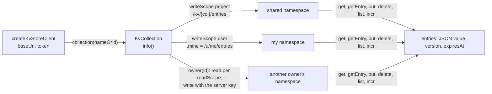

# @yingyeothon/kvstore-client

Game client for the yyt key-value store served by the state stack (`https://doc.yyt.life/kv/*`, `https://doc-dev.yyt.life` on dev). A **collection** is created once in the console or with `yyt kv`; this client only reads and writes its entries, using the channel JWT the game already holds — or, on the game's own server, the auth channel's doc apiKey. It makes two cases trivial: **read the announcements** the team publishes, and **save and load the player's own record**. Values are JSON, every entry carries a version, writes can be conditional, counters increment atomically, and entries may expire. It runs in browsers and on Node >= 20 with no dependency beyond `@yingyeothon/logger`; the normative wire contract is `services/state/README.md` in the service repository, and [the guide page](../../docs/kvstore.md) explains the principals and scopes behind it.

One client, one credential; a collection has one shared namespace or one namespace per owner, and the scopes the console gave it decide which.



## Install

```bash
npm install @yingyeothon/kvstore-client
```

## Usage

ESM:

```ts
import { createKvStoreClient, isKvConflict } from "@yingyeothon/kvstore-client";

const kv = createKvStoreClient({
  baseUrl: "https://doc.yyt.life", // an HTTP origin, hence not `url` as in gamebase-client
  token: channelJwt, // from the sign-in flow; sent as a header, never logged
});

// (1) announcements: a collection with readScope=project, writeScope=team
const { entries } = await kv
  .collection("announcements")
  .list<Notice>({ values: true, order: "desc" });

// (2) my record: a collection with readScope=user, writeScope=user
const mine = kv.collection("profile").mine; // /kv/profile/u/me/entries
const saved = await mine.getEntry<Profile>("settings"); // undefined when absent
try {
  await mine.put(
    "settings",
    { ...saved?.value, volume: 0.5 },
    { ifMatch: saved?.version }, // lose, rather than overwrite, a newer save
  );
} catch (error) {
  if (isKvConflict(error)) reloadAndRetry(error.currentVersion);
  else throw error;
}

// a counter, atomically
const { value } = await mine.incr("logins", 1);
```

**`collection("profile").put(...)` compiles and is always a `400`** on a `writeScope: user` collection: the collection itself is the shared namespace, and a per-player collection has none. Use `mine` (or `owner(id)` with the server key); the error's `reason` is `wrong_namespace`.

CJS:

```js
const { createKvStoreClient } = require("@yingyeothon/kvstore-client");
```

## Collections, namespaces and scopes

`collection(nameOrId)` takes the `kv_` id or the **name** the console shows; the server resolves a name within the project the token belongs to, and `info()` returns both (`id`, `name`) with `readScope`, `writeScope`, `encrypted`, `maxEntries` and `maxEntriesPerOwner`. Every entry lives in a namespace, and the collection's `writeScope` decides which: `project` means one shared namespace (`/kv/{col}/entries`, the collection itself), `user` means one namespace per owner (`/kv/{col}/u/{ownerId}/entries`, `mine` for the caller's own, `owner(id)` for another's). A collection whose two scopes are both `team` refuses the API outright (`403`), because nothing a game holds may touch it.

What each credential reaches, on a `writeScope: user` collection:

| Token                        | `mine`                      | `owner(id)` read                          | `owner(id)` write |
| ---------------------------- | --------------------------- | ----------------------------------------- | ----------------- |
| channel JWT (a player)       | own entries                 | `readScope: project` yes, `user` is `403` | `403`             |
| doc apiKey (the game server) | `400` (`me` names a player) | every owner                               | every owner       |

The shared namespace of a `writeScope: project` collection follows `readScope`/`writeScope` for both credentials.

## Versions, conditions and TTL

Every entry has a `version` that starts at 1 and climbs on every write, expired or not. `getEntry` returns it; `put` takes `ifMatch: version` to write only over that version or `ifNoneMatch: true` to create only, and `delete` takes `ifMatch`. A lost condition is a `409` whose `currentVersion` is the live version (`null` when the key is absent). Only a caller with the read right sees any of this: a write-only caller gets `{}` from `put` and a `403` on any conditional header — [Key-value store § Versions and conditional writes](../../docs/kvstore.md#versions-and-conditional-writes) says why.

`ttl` on `put` and `incr` is in seconds, `1` … `31_622_400` (366 days, `kvTtlMaxSeconds`); omitted keeps the row's expiry, `0` clears it. `getEntry` reports `expiresAt` (an absolute epoch second) whenever the row has one; `put` and `incr` report it **only when that call passed a non-zero `ttl`**, so a `put` that kept an existing expiry says nothing about it.

`incr(key, delta)` is the one operation performed on a value: an atomic add of a safe integer to a stored integer, `{ value, version }` back. It needs the read right and takes no condition; a non-numeric value or an overflow is a `409` with `reason` `not_a_number` or `overflow`.

`delete` resolves whether or not the key existed: the server answers a reader's delete of an absent key with `404` and a write-only caller's with `204`, and the client folds the first into the second. A lost `ifMatch` on a delete is still a `409`.

## Local refusals

The client refuses locally, before any request, what the server would refuse, so a bug is found on the developer's machine and a path segment is never encoded:

| Input                   | Rule                                                                                                                                    |
| ----------------------- | --------------------------------------------------------------------------------------------------------------------------------------- |
| collection name         | `^[A-Za-z0-9][A-Za-z0-9._-]{0,63}$` (`kvCollectionNamePattern`), and not id-shaped                                                      |
| key, non-empty `prefix` | `^[A-Za-z0-9][A-Za-z0-9._:-]{0,127}$` (`kvKeyPattern`)                                                                                  |
| owner id                | `me`, 32 lowercase hex, or `[a-z]{1,8}:[A-Za-z0-9_-]{1,48}` (`kvOwnerIdPattern`)                                                        |
| value                   | JSON-serialisable (`undefined` is not, nor a top-level `NaN`), at most `kvMaxValueBytes` (16384) UTF-8 bytes of `JSON.stringify(value)` |
| `ttl`                   | `0` or an integer `1` … `kvTtlMaxSeconds`                                                                                               |
| `limit`                 | an integer `1` … `kvListLimitMax` (100) — the server would clamp, the client refuses                                                    |
| `ifMatch`               | an integer `>= 1`; create with `ifNoneMatch: true`, never both                                                                          |
| `incr` delta            | a safe integer                                                                                                                          |
| `token`                 | printable ASCII, no whitespace or control characters                                                                                    |
| `baseUrl`               | `http(s)://host[/prefix]`, no userinfo, query or fragment                                                                               |

These throw `RangeError` or `TypeError`. The last two exist because `fetch` itself rejects a malformed header value or URL with a message that quotes it — the credential, or the collection and key. Everything else — scopes, caps, encryption, an unknown collection — is the server's answer and arrives as a `KvStoreError`.

## Errors

Every refusal by the server or the network is a `KvStoreError`: `status` (HTTP, `0` when the request never got an answer), `code` (the server's `error.code`; `http_<status>` when the body was not the server's JSON shape, as from a gateway 502; `network` or `malformed_response` when minted here), `reason` (`error.details.reason` when present) and `currentVersion` (on a lost compare-and-set). Its `message` is `kv <code> (<status>)` and nothing else — no key, no value, no URL, no token — so it can be logged as is; a `network` error carries the `fetch` rejection as `cause`, a `malformed_response` deliberately carries nothing (a `SyntaxError` quotes the body, which may be a stored value).

`get`/`getEntry` turn a `404` into `undefined` and `delete` resolves on it; every other method surfaces it. **An unknown collection is the same `404`** (a name of another project, a typo, a deleted collection — the server keeps them indistinguishable on purpose), so `undefined` from a fresh install can also mean the collection name is wrong: call `info()` once at startup if that matters.

| Predicate          | True when                                                                            |
| ------------------ | ------------------------------------------------------------------------------------ |
| `isKvStoreError`   | any of the below; duck-typed on `name`, `status`, `code`, so it holds across realms  |
| `isKvUnauthorized` | `401`: the token is missing, expired, or minted for another stage                    |
| `isKvForbidden`    | `403`: a scope refuses this principal, or a conditional write without the read right |
| `isKvConflict`     | `409`: a lost condition, a full collection or owner, `not_a_number`, `overflow`      |
| `isKvFull`         | `409` with `reason` `collection_full` or `owner_full`                                |

## Security

The token is copied into a closure at create time and travels only as `Authorization: Bearer`; a new token is a new client. Log lines are `kv request` with `{ method, route, status, chars }` where `route` is one of `meta`, `entries`, `entry`, `incr` — never the collection, the key, the value, the URL or the token — and `kv request failed` with `{ method, route }` on a network failure. The package keeps no cache and never persists the token; see [Key-value store § In a browser](../../docs/kvstore.md#in-a-browser) for what a browser build needs (nothing).

## What this does not do

No collection administration (create, rename, caps: the console and `yyt kv` own those), no cache, no retry, no token refresh. A `409` is returned to the caller, who knows what to reread; a `401` means the sign-in flow must run again.

## Public API

- `createKvStoreClient(options)` — `KvStoreClient`: `collection(nameOrId)`; `KvStoreClientOptions` (`baseUrl`, `token`, `fetch?` defaulting to the global, `logger?` defaulting to `nullLogger`).
- `KvCollection` — `ref`, `info()` (`KvCollectionInfo`: `id`, `name`, `readScope`, `writeScope` as `KvScope`, `encrypted`, `maxEntries`, `maxEntriesPerOwner`), `mine`, `owner(ownerId)`, and the whole `KvNamespace` for the shared namespace.
- `KvNamespace` — `get`, `getEntry` (`KvEntry`: `value`, `version`, `expiresAt?`), `put` (`KvPutOptions`: `ttl?`, `ifMatch?`, `ifNoneMatch?` → `KvWriteResult`: `created?`, `version?`, absent for a write-only caller; `expiresAt?`, only when this call set a `ttl`), `delete` (`KvDeleteOptions`: `ifMatch?`), `list` (`KvListOptions`: `prefix?`, `cursor?`, `limit?` 1 … 100 with server default 50, `order?` `asc` (default) or `desc`, `values?` → `KvPage`: `entries` of `KvListEntry`, `nextCursor?`), `incr` (`KvIncrOptions`: `ttl?` → `KvIncrResult`: `value`, `version`, `expiresAt?`).
- `KvStoreError` and the predicates `isKvStoreError`, `isKvUnauthorized`, `isKvForbidden`, `isKvConflict`, `isKvFull`.
- The server's limits, for callers who validate first: `kvKeyPattern`, `kvCollectionNamePattern`, `kvOwnerIdPattern`, `kvMaxValueBytes` (16384), `kvTtlMaxSeconds` (31622400), `kvListLimitMax` (100).
- Transport types for an injected `fetch`: `KvFetchLike`, `KvFetchRequest`, `KvFetchResponse`.

## Migrating from the legacy package

New package; there is no legacy counterpart. The C# and Dart clients in `csharplib` and `flutterlib` follow the same shape.
