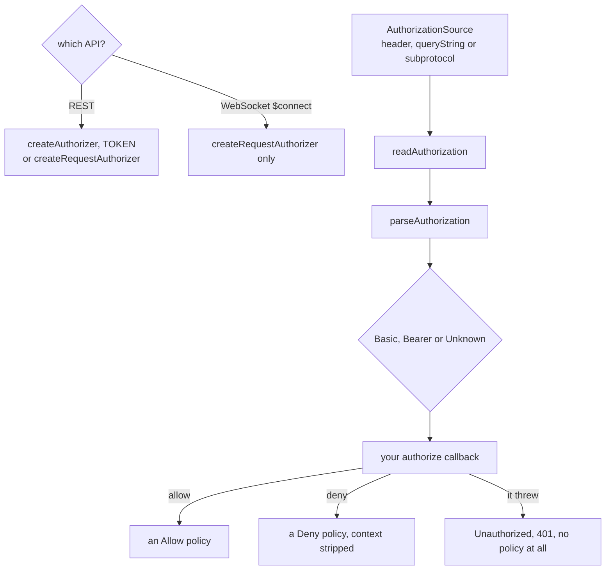

# @yingyeothon/lambda-authorizer

Helpers for AWS API Gateway custom authorizers: they parse a credential into `Basic`, `Bearer`, or `Unknown`, delegate the allow/deny decision to your `authorize` callback, and build the IAM policy document (`execute-api:Invoke` on the event's `methodArn`) that API Gateway expects. Errors thrown while authorizing are logged and turned into an `Unauthorized` error (HTTP 401) by default, or handed to your custom `onError` callback.

Two authorizer types ship here, and which one you may use is decided by the API, not by preference:

| API           | Authorizer                      | Factory                                        |
| ------------- | ------------------------------- | ---------------------------------------------- |
| REST          | `TOKEN` or `REQUEST`            | `createAuthorizer` / `createRequestAuthorizer` |
| **WebSocket** | `REQUEST` only, `$connect` only | `createRequestAuthorizer`                      |

A WebSocket API does not support `TOKEN` authorizers at all, so `createAuthorizer` cannot be attached to `$connect`.

Which authorizer you may use is decided by the API, not by preference.



## Install

```bash
npm install @yingyeothon/lambda-authorizer
```

## Usage

ESM:

```ts
import { createAuthorizer } from "@yingyeothon/lambda-authorizer";

export const handler = createAuthorizer({
  authorize: async (authorization) => {
    if (authorization.type === "Basic") {
      const { id, password } = authorization.credential;
      return { allow: id === "admin" && password === "secret" };
    }
    if (authorization.type === "Bearer") {
      return { allow: await isValidToken(authorization.token) };
    }
    return { allow: false };
  },
});
```

CJS:

```js
const { createAuthorizer } = require("@yingyeothon/lambda-authorizer");

exports.handler = createAuthorizer({
  authorize: async (authorization) => ({
    allow: authorization.type === "Bearer" && authorization.token === "ok",
  }),
});
```

### REQUEST authorizers and WebSocket handshakes

A `REQUEST` authorizer receives the whole request instead of a single `authorizationToken`, so the credential's location has to be configured. `sources` are tried in order:

```ts
import { createRequestAuthorizer } from "@yingyeothon/lambda-authorizer";

export const handler = createRequestAuthorizer({
  authorize: async (authorization) => ({
    allow:
      authorization.type === "Bearer" &&
      (await isValidToken(authorization.token)),
  }),
  sources: [{ from: "subprotocol" }],
});
```

| Source                           | Reads                                                                 | Produces                  |
| -------------------------------- | --------------------------------------------------------------------- | ------------------------- |
| `{ from: "header", name? }`      | the named header, case-insensitively (default `authorization`)        | the header value verbatim |
| `{ from: "subprotocol", name? }` | the entry after `name` in `Sec-WebSocket-Protocol` (default `bearer`) | `Bearer <token>`          |
| `{ from: "queryString", name }`  | the named query string parameter                                      | `Bearer <value>`          |

`defaultAuthorizationSources` is `[{ from: "header" }, { from: "subprotocol" }]`. A query string is never read unless you ask for it, because query strings are written to API Gateway access logs.

The subprotocol source exists because a browser cannot set headers on a WebSocket handshake. `new WebSocket(url, ["bearer", token])` sends `Sec-WebSocket-Protocol: bearer, <token>`, which keeps the token out of the URL. The marker (`bearer`) is required so a genuine subprotocol name is never mistaken for a credential, and **your `$connect` integration must echo the selected subprotocol back** or the browser aborts the handshake — see `handleConnect`'s `selectSubprotocol` in [`@yingyeothon/lambda-gamebase`](../lambda-gamebase).

Set the authorizer's result cache TTL to **0**. `$connect` runs once per connection, so caching buys nothing and lets an allow outlive the credential's expiry.

That also decides how identity sources behave. With caching **off**, API Gateway passes every request straight to your function and does not check identity sources at all — `sources` alone decides what is read. With caching **on**, API Gateway requires _every_ declared identity source to be present and non-empty and answers `401` without invoking your function otherwise, and the declared sources become the cache key in order. So if you do enable caching, declare exactly the one source your clients actually send: declaring both a header and a subprotocol would reject every browser handshake, since a browser can only send the subprotocol.

### Context

Values returned in `context` from `authorize` are passed through to the policy's `context`, so downstream integrations can read them. On a WebSocket API that context stays with the connection and reaches `$connect`, `$default`, and `$disconnect` alike as `event.requestContext.authorizer`.

API Gateway only carries string, number, and boolean values there, so flatten claims into the few fields the integration needs. Keep it narrow: `$context.authorizer.*` can be configured into access logs, so a token or an email placed in the context is a token or an email in your logs.

A `Deny` never carries a context, even when `authorize` returned one — a refused request reaches the access log too. Set `principalId` on `Authorized` when your authorizer can name its caller; it defaults to `"user"`, so an integration reading `$context.authorizer.principalId` would otherwise see every caller as the same one.

This package logs the parsed scheme, whether a credential was present, the policy effect, and the `methodArn`. It never logs the credential itself, the parsed credential, or the context. The default error handler logs a failure's `Error.name` and nothing more, because the message comes from whatever threw — your `authorize` callback included; pass `onError` if you want the whole error.

## Public API

- `createAuthorizer(options)` — builds an `APIGatewayTokenAuthorizerHandler` from `AuthorizerOptions`. REST APIs only.
- `createRequestAuthorizer(options)` — builds an `APIGatewayRequestAuthorizerHandler` from `RequestAuthorizerOptions`. The only type a WebSocket API accepts.
- `parseAuthorization(token)` — parses a raw `Authorization` header value into an `Authorization`.
- `readAuthorization(event, sources?)` — returns the first `<scheme> <credential>` string the sources yield, or `undefined`.
- `defaultAuthorizationSources` — `[{ from: "header" }, { from: "subprotocol" }]`.
- `AuthorizerOptions` (type) — `{ authorize, onError?, logger? }`.
- `RequestAuthorizerOptions` (type) — `{ authorize, sources?, onError?, logger? }`.
- `AuthorizationSource` (type) — `{ from: "header"; name? } | { from: "queryString"; name } | { from: "subprotocol"; name? }`.
- `Authorizer` (type) — `(authorization: Authorization) => Promise<Authorized>`.
- `Authorized` (type) — `{ allow: boolean; context?: APIGatewayAuthorizerResultContext; principalId?: string }`.
- `Authorization` (type) — union of the three shapes below.
- `BasicAuthorization` (type) — `{ type: "Basic"; credential: BasicCredential }`.
- `BasicCredential` (type) — `{ id: string; password: string }`.
- `BearerAuthorization` (type) — `{ type: "Bearer"; token: string }`.
- `UnknownAuthorization` (type) — `{ type: "Unknown"; scheme: string; credential: string }`.

## Migrating from the legacy package

- The npm package was renamed: `@yingyeothon/aws-lambda-custom-authorizer` → `@yingyeothon/lambda-authorizer`.
- `buildAuthorizer` → `createAuthorizer`, and its options type `AuthorizerArguments` → `AuthorizerOptions`. `parseAuthorization` keeps its name.
- The default export is gone: use the named export `createAuthorizer`.
- Interface names dropped the `I` prefix: `IBasicCredential` → `BasicCredential`, `IAuthorized` → `Authorized`, `IHandlerArguments` → `AuthorizerOptions`.
- Types now come from current `@types/aws-lambda`: the handler is an `APIGatewayTokenAuthorizerHandler` and the result an `APIGatewayAuthorizerResult` (the deprecated `CustomAuthorizerHandler`/`CustomAuthorizerResult` aliases are no longer used). The generated policy document shape is unchanged.
- `parseAuthorization` is now exported for direct use.
- `createRequestAuthorizer` and the `AuthorizationSource` list are new; the legacy package only built TOKEN authorizers and so could not be used with a WebSocket API.
- `parseAuthorization` now matches the scheme case-insensitively, as RFC 7235 requires, and normalizes it: `bearer x` parses as `{ type: "Bearer" }`. An `Unknown` scheme still reports the spelling the client sent.
- A `Deny` policy no longer carries the context `authorize` returned, and `Authorized.principalId` lets an authorizer name its caller instead of the hardcoded `"user"`.
- The default error handler logs `{ name }` rather than the whole `Error`.
