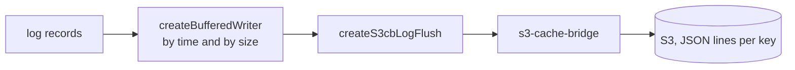

# @yingyeothon/logger-s3

Buffered log writer that flushes structured JSON log records into S3 through an [s3-cache-bridge](https://github.com/yingyeothon/s3-cache-bridge) server. Records are buffered in memory, auto-flushed by time or buffer size, aggregated per S3 key, and appended as JSON lines — with a Lambda-flavored variant that stamps each record with system/handler/lambda identity.

Buffered, aggregated per key, and appended as JSON lines; the flush has to be awaited or a frozen container writes nothing.



## Install

```bash
npm install @yingyeothon/logger-s3
```

## Usage

ESM:

```ts
import { createS3Logger } from "@yingyeothon/logger-s3";

const { logger, flush } = createS3Logger({
  apiUrl: "https://s3cb.example.com/",
  apiId: "id",
  apiPassword: "password",
  asKey: (date, severity) => `logging/myapp/${severity}`,
  severity: "info",
  autoFlushIntervalMillis: 10_000,
  autoFlushMaxBufferSize: 1024,
  withConsole: true,
});

logger.info("hello", { requestId: "r-1" });
logger.error("boom", new Error("bad")); // Errors are serialized with serialize-error.
await flush(); // Appends buffered records to S3, one JSON line per record.
```

Lambda variant (CJS shown):

```js
const {
  createLambdaS3Logger,
  s3cbLogFlushOptionsFromEnv,
} = require("@yingyeothon/logger-s3");

const { logger, flush, updateSystemId } = createLambdaS3Logger({
  systemName: "HelloWorld",
  handlerName: "testHandler",
  lambdaId: context.awsRequestId,
  logKeyPrefix: "logging",
  // Explicit opt-in: reads S3CB_URL / S3CB_ID / S3CB_PASSWORD.
  ...s3cbLogFlushOptionsFromEnv(),
});

logger.info("started");
updateSystemId("game-1234"); // Applies to all records still in the buffer.
await flush(); // Call before the Lambda handler returns.
```

Record format — default serializer (`serializeAsJSON`), one line per record:

```json
{
  "level": "info",
  "timestamp": "2026-08-20T00:00:00.000Z",
  "args": ["hello", { "requestId": "r-1" }]
}
```

Lambda serializer:

```json
{
  "timestamp": "...",
  "level": "info",
  "systemName": "HelloWorld",
  "systemId": "game-1234",
  "handlerName": "testHandler",
  "lambdaId": "...",
  "args": ["started"]
}
```

Records sharing the same key are concatenated and sent as a single `append` call per flush.

## Public API

- `createS3Logger(options)` — buffered S3 logger; returns `{ logger, flush }` (`S3Logger`)
- `createLambdaS3Logger(options)` — Lambda-flavored logger; returns `{ logger, flush, updateSystemId }` (`LambdaS3Logger`)
- `createS3LogWriter(options)` — the underlying `LogWriter` (`debug`/`info`/`warn`/`error`) plus `flush` (`S3LogWriter`)
- `createBufferedWriter(options)` — in-memory buffering with auto-flush by interval/size (`BufferedWriterOptions`, `BufferedWriter`)
- `createS3cbLogFlush(options)` — returns a flush function that appends aggregated records via s3-cache-bridge (`S3cbLogFlushOptions`, `LogFlush`)
- `s3cbLogFlushOptionsFromEnv()` — reads `S3CB_URL`, `S3CB_ID`, `S3CB_PASSWORD` and returns connection options; the only place these variables are read, and only when you call it
- `serializeAsJSON` — default record serializer
- Types: `S3Logger`, `S3LoggerOptions`, `LambdaS3Logger`, `LambdaS3LoggerOptions`, `S3LogWriter`, `S3LogWriterOptions`, `BufferedWriterOptions`, `BufferedWriter`, `S3cbLogFlushOptions`, `LogFlush`, `LogSerializer`, `LogTuple`, `WritableLogSeverity`

## Migrating from the legacy package

- Named exports only: the default export `getS3Logger` is now `import { createS3Logger }`, and `LambdaS3Logger` (function) is now `createLambdaS3Logger`; the `ILambdaS3Logger` interface is renamed to `LambdaS3Logger`.
- Deep imports (`@yingyeothon/logger-s3/lib/...`) are no longer supported — import everything from the package root.
- Factory renames: `getS3Logger` → `createS3Logger`, `getLambdaS3Logger` → `createLambdaS3Logger`, `getS3LogWriter` → `createS3LogWriter`, `buffered` → `createBufferedWriter`, `s3cbLogFlush` → `createS3cbLogFlush` (it returns a `LogFlush` function, so it keeps the factory prefix).
- Options type renames: `S3LoggerEnv` → `S3LoggerOptions`, `LambdaS3LoggerEnv` → `LambdaS3LoggerOptions`, `S3LogWriterEnv` → `S3LogWriterOptions`, `BufferedEnv` → `BufferedWriterOptions`, `S3cbLogFlushEnv` (formerly `S3CBLogFlushEnv`) → `S3cbLogFlushOptions`.
- `S3cbLogFlushOptions` accepts an optional `client: S3cbClient` to inject a preconfigured or fake s3-cache-bridge client; `apiUrl` is only required when no client is given.
- Environment variable defaults are removed: `createS3cbLogFlush` (and everything built on it) no longer reads `S3CB_URL`, `S3CB_ID`, `S3CB_PASSWORD` implicitly. Opt in explicitly with `...s3cbLogFlushOptionsFromEnv()` in your options.
- The `DEBUG` environment variable no longer enables internal diagnostics; pass the explicit `debug: true` option instead.
- The writer now implements the full `LogWriter` contract including `warn`.
- Record format and flush semantics (aggregation per key, chained sequential flushes, auto-flush triggers) are unchanged.
