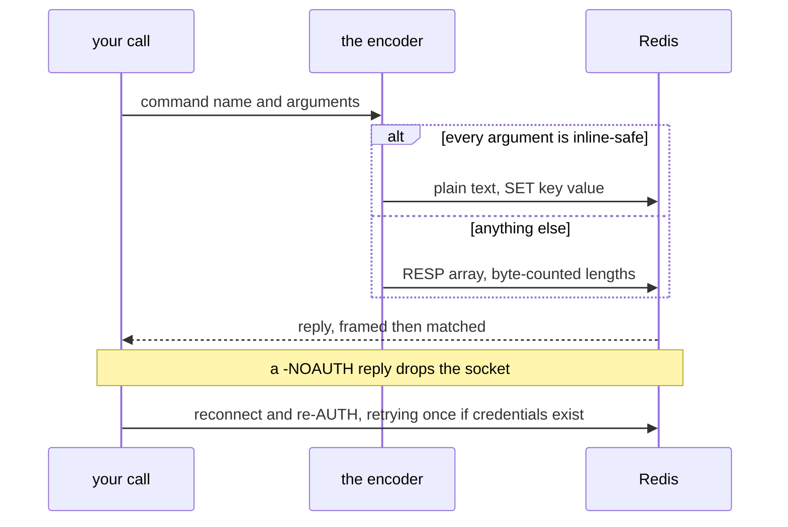

# @yingyeothon/naive-redis

Minimal Redis client built on [`@yingyeothon/naive-socket`](../naive-socket): strings, lists, sets, INCR, pub/sub, and a "simple" layer that opens a connection per operation and adds JSON-encoded caching helpers. It speaks a small subset of the RESP protocol directly, so it stays tiny enough for serverless bundles.

An all-inline command goes out as plain text; anything else falls back to a length-prefixed RESP array, and a poisoned connection resets itself.



## Install

```bash
npm install @yingyeothon/naive-redis
```

## Usage

ESM:

```ts
import {
  createRedisConnection,
  redisGet,
  redisSet,
  redisDel,
  redisRpush,
  redisLpop,
} from "@yingyeothon/naive-redis";

const connection = createRedisConnection({
  host: "localhost",
  port: 6379,
  password: "optional-password",
  timeoutMillis: 5000,
});

await redisSet(connection, "greeting", "hello", { expirationMillis: 60_000 });
console.log(await redisGet(connection, "greeting")); // "hello"
await redisRpush(connection, "queue", "job-1", "job-2");
console.log(await redisLpop(connection, "queue")); // "job-1"
await redisDel(connection, "greeting", "queue");

connection.socket.disconnect();
```

CJS:

```js
const { redisSimpleWork, redisGet } = require("@yingyeothon/naive-redis");

redisSimpleWork({ host: "localhost" }, async (connection) => {
  return await redisGet(connection, "greeting");
}).then(console.log);
```

The simple layer manages connections for you and (de)serializes values as JSON:

```ts
import { createRedisSimple, redisSimpleCache } from "@yingyeothon/naive-redis";

const simple = createRedisSimple({ config: { host: "localhost" } });
await simple.set("stuff", { a: 100, b: "world" });
console.log(await simple.get<{ a: number; b: string }>("stuff"));
await simple.del("stuff");

// Cache an async function's result in Redis.
const cachedAnswer = redisSimpleCache(async (q: string) => q.length, {
  config: { host: "localhost" },
  cacheKey: (q) => `answer:${q}`,
  expirationMillis: 60_000,
});
console.log(await cachedAnswer("universe")); // computed, then cached
console.log(await cachedAnswer.peek("universe")); // read without computing
await cachedAnswer.refresh("universe"); // recompute and store
await cachedAnswer.clear("universe"); // drop the cached entry
```

### Pub/sub

Publishing uses an ordinary connection; subscribing needs its own, because
the server pushes messages with no request to attribute them to.

```ts
import {
  createRedisConnection,
  createRedisSubscriber,
  redisPublish,
} from "@yingyeothon/naive-redis";

const subscriber = createRedisSubscriber({
  host: "localhost",
  onMessage: ({ channel, message }) => console.log(channel, message),
});
await subscriber.subscribe("room:1"); // resolves once Redis confirms it

const publisher = createRedisConnection({ host: "localhost" });
await redisPublish(publisher, "room:1", "hello"); // → 1 subscriber

subscriber.disconnect();
```

A payload may contain any UTF-8 text, including `\r\n` and multi-byte
characters: bulk lengths are resolved as byte counts. Channel patterns
(`PSUBSCRIBE`) are not supported.

### TLS

The transport is cleartext by default. Across an untrusted network — a Lambda
in AWS reaching a self-hosted Redis, for example — set `tls`:

```ts
const connection = createRedisConnection({
  host: "redis.example.com",
  port: 6380,
  password: "…",
  tls: true, // or { ca } for a private CA
});
```

## Public API

- `createRedisConnection(options)` — create a `RedisConnection`; authenticates automatically when `password` is set (`AUTH <username> <password>` when `username` — a Redis 6 ACL user — is set too). `timeoutMillis` (default 5000) is how long one command may take to be answered once it reaches the wire; it is not a budget for the wait behind a reconnect. That `AUTH` waits up to `authTimeoutMillis` (default `max(timeoutMillis, 5000)`, since it also pays for the handshake after a reconnect). When it fails or times out, or when any command is answered with `-NOAUTH`/`-WRONGPASS`, the socket is dropped so the next command reconnects and authenticates again — a Redis restart never leaves a warm process stuck on an unauthenticated socket. A command that hit `-NOAUTH`/`-WRONGPASS` is retried once on the new connection. `tls` wraps the connection in TLS; **unset means cleartext**, so `AUTH` and every command are readable on the wire
- `redisAuth(connection, password, { username?, timeoutMillis? })` — send `AUTH` explicitly
- `redisSend({ connection, commands, match, transform, urgent?, timeoutMillis? })` — low-level RESP exchange for commands not covered below
- `redisGet(connection, key)` — read a string value (`null` when missing)
- `redisSet(connection, key, value, options?)` — write a string value; `RedisSetOptions`: `expirationMillis`, `onlySet: "nx" | "xx"`
- `redisDel(connection, ...keys)` — delete keys
- `redisExists(connection, key)` — key existence check
- `redisIncr(connection, key)` — atomic increment
- `redisExpire(connection, key, seconds)` — set a key's TTL, replacing any existing one; false when the key does not exist
- `redisEval(connection, script, options?)` — run a Lua script; `RedisEvalOptions`: `keys` (also supplies `NUMKEYS`), `args`. **Integer replies only** — it exists for compare-and-delete style scripts, so a script returning a string or an array is a protocol error here
- `redisPublish(connection, channel, message)` — publish to a channel; resolves with the number of subscribers that received it
- `createRedisSubscriber(options)` — a connection dedicated to subscriber mode: `subscribe(channel)`, `unsubscribe(channel)`, `disconnect()`. Both commands resolve only once Redis confirms them, so a message published right after `subscribe` cannot be missed. Its own `timeoutMillis` (default 5000, the same reasoning as the connection's) budgets that `AUTH` and every subscribe confirmation. It re-authenticates and re-subscribes after a reconnect; when that fails it drops the socket and tries again on a fresh connection rather than sitting on one the server will answer `-NOAUTH` forever, and reports the gap through `onReconnected({ channels, restored })` — nothing published during it is redelivered, which the next snapshot heals but a one-shot command does not
- `parsePushFrame(buffer)` — reads one complete reply from a subscriber stream; `incompletePushFrame` (`-1`) means "wait for more"
- `redisRpush(connection, key, ...values)` — append to a list
- `redisLpop(connection, key)` — pop the head of a list
- `redisLrange(connection, key, start, stop)` — read a list range
- `redisLlen(connection, key)` — list length
- `redisLindex(connection, key, index)` — read one list element
- `redisLtrim(connection, key, start, stop)` — trim a list to a range
- `redisSadd(connection, key, ...members)` — add set members
- `redisSrem(connection, key, ...members)` — remove set members
- `redisSmembers(connection, key)` — read all set members
- `createRedisSimple(options)` — returns a `RedisSimple` (`get`/`set`/`del`/`cache` with a shared `keyPrefix` and codec)
- `redisSimpleWork(options, work)` — connect, run `work`, always disconnect
- `redisSimpleCache(fn, options)` — cache an async function's result in Redis (with `peek`/`refresh`/`clear` friends)
- Types: `RedisAuthOptions`, `RedisConnection`, `RedisConnectionOptions`, `RedisEvalOptions`, `RedisSendOptions`, `RedisSetOptions`, `RedisSimple`, `RedisSimpleFn`, `RedisSimpleCacheFriends`, `RedisSimpleCacheOptions`, `RedisSimpleOptions`, `RedisSubscriber`, `RedisSubscriberOptions`, `PushFrame`, `PushFrameResult`

## Migrating from the legacy package

The legacy package exposed one default export per deep-imported module (for example `import get from "@yingyeothon/naive-redis/lib/get"`); everything is now a named export from the package root with a `redis` prefix:

- `lib/connection` (default) → `createRedisConnection`
- `lib/get`, `lib/set`, `lib/del`, ... (defaults) → `redisGet`, `redisSet`, `redisDel`, ...
- `lib/simple` (default `RedisSimple` class) → `createRedisSimple` (with `RedisSimple` remaining as the returned interface)
- `lib/simple/work`, `lib/simple/cache` → `redisSimpleWork`, `redisSimpleCache`
- `redisConnect` (previous named-export API) → `createRedisConnection`
- `RedisConfig` (type) → `RedisConnectionOptions`

Function parameters, return types, and RESP behavior are otherwise unchanged.

## Behavior changes

- **`timeoutMillis` defaults to 5000, not 1000**, for both `createRedisConnection` and `createRedisSubscriber`. 1000 was not a budget for a round trip that can carry a whole actor queue back on a store one hop away and under load, and a command queued behind a reconnect's `AUTH` — which is budgeted at `max(timeoutMillis, 5000)` — was structurally certain to lose that race. Pass the old value explicitly if you relied on it.
- **A subscriber whose `AUTH` or subscription replay fails no longer keeps the socket.** It used to stay connected and unauthenticated for the life of the process, answering nothing and telling no one: an in-flight `subscribe()` waited out its confirmation timeout, and on the first connection `onReconnected` was never called at all. The socket is now dropped and reconnected on `connectionRetryInterval`, and every pending confirmation is rejected with the real cause — `subscribe()` reports `-ERR invalid password` rather than `Timeout`.
  - **A rejected `subscribe()` still leaves the channel in the replay set**, so it takes effect once a connection authenticates. The rejection means "not subscribed _yet_", not "give up"; watch `onReconnected({ restored })` for when it lands, and call `unsubscribe` if you no longer want it.
  - A refused credential therefore retries indefinitely, paced by `connectionRetryInterval` and logged each time. `disconnect()` is what stops it, and a **negative** `connectionRetryInterval` disables auto-reconnect entirely — with it there is no recovery loop at all.
- Together with `@yingyeothon/naive-socket`, a command's budget now starts when it reaches the wire rather than when it is queued. Its worst case is therefore twice `timeoutMillis`; size a lock lease against that number.
