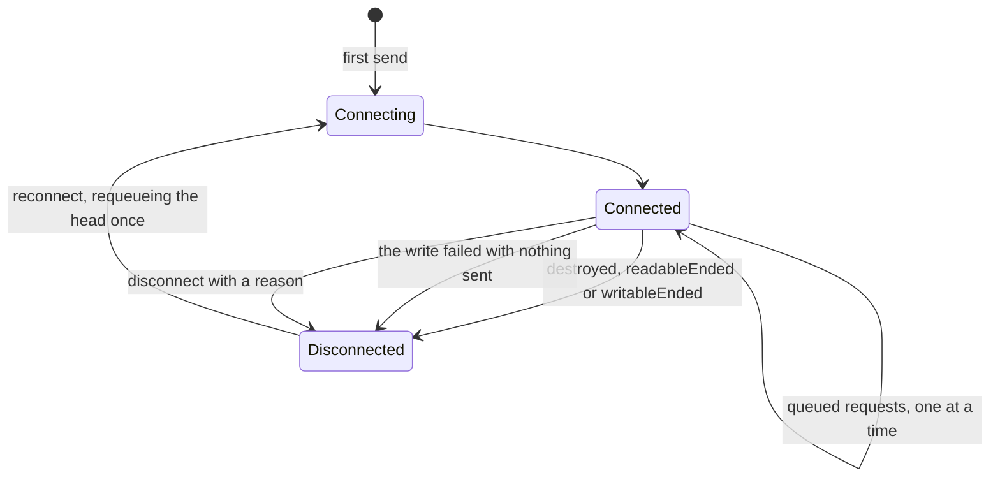

# @yingyeothon/naive-socket

Minimal TCP socket client over `node:net` (with an opt-in `node:tls` path) and a serialized request queue, per-request timeouts, pluggable response matching (regex, fixed length, or a custom function), and automatic reconnection. Useful for talking to simple line- or length-based text protocols (for example Redis) without pulling in a full client library.

The edge that matters is the one out of `Connected`: a resumed container looks connected while the stream has already ended.



## Install

```bash
npm install @yingyeothon/naive-socket
```

## Usage

ESM:

```ts
import { createNaiveSocket, withMatch } from "@yingyeothon/naive-socket";

const socket = createNaiveSocket({
  host: "localhost",
  port: 6379,
  connectionRetryInterval: 5000, // negative value disables auto-reconnect
});

// Consume everything received so far (default fulfill).
const pong = await socket.send({ message: "PING\r\n" });

// Wait until the response matches; the first capture group is consumed.
const ok = await socket.send({
  message: 'SET "greeting" "hello"\r\n',
  fulfill: /^(\+OK\r\n)$/,
  timeoutMillis: 1000,
});

// Consume a fixed number of characters.
const fixed = await socket.send({
  message: 'GET "greeting"\r\n',
  fulfill: "$5\r\nhello\r\n".length,
});

// Or scan the buffer with a custom matcher.
const custom = await socket.send({
  message: "SMEMBERS my-set\r\n",
  fulfill: withMatch((m) => m.capture("\r\n").capture("\r\n")),
  urgent: true, // jump to the front of the queue
});

socket.disconnect();
```

Server-push protocols (Redis pub/sub, for example) deliver data that no
request asked for. Pass `onUnsolicitedData` to consume it, and send the
command that starts the stream with `expectResponse: false` so it does not
wait for a response of its own:

```ts
const subscriber = createNaiveSocket({
  host: "localhost",
  port: 6379,
  // Return how many characters were consumed; `<= 0` waits for more.
  onUnsolicitedData: (buffer) => {
    const end = buffer.indexOf("\r\n");
    if (end < 0) {
      return -1;
    }
    console.log(buffer.slice(0, end));
    return end + 2;
  },
});

// Its reply arrives on the push stream, not as this request's response.
await subscriber.send({ message: "SUBSCRIBE room\r\n", expectResponse: false });
```

Setting `onUnsolicitedData` also keeps the socket reconnecting while the
request queue is empty, which a subscriber's is by design.

CJS:

```js
const { createNaiveSocket } = require("@yingyeothon/naive-socket");
const socket = createNaiveSocket({ host: "localhost", port: 6379 });
socket
  .send({ message: "PING\r\n", timeoutMillis: 500 })
  .then(console.log)
  .finally(() => socket.disconnect());
```

Requests are written one at a time: the next queued message is sent only after the previous response is fulfilled. A `fulfill` result `<= 0` means "wait for more data"; a positive result consumes that many characters from the head of the receive buffer and resolves the request with them, leaving the remainder for the next request.

### TLS

**The connection is cleartext unless you ask for TLS.** Every byte — a Redis
`AUTH <user> <password>` included — is readable on the wire, which is fine
inside a VPC and not fine across the internet. Pass `tls` to wrap it:

```ts
const socket = createNaiveSocket({
  host: "redis.example.com",
  port: 6380,
  tls: true, // Node's defaults, with `host` as the SNI server name
});

// Or with a private CA:
const pinned = createNaiveSocket({
  host: "redis.example.com",
  port: 6380,
  tls: { ca: readFileSync("ca.pem") },
});
```

`tls` is handed to `tls.connect` as is, so anything it accepts works. Do not
set `rejectUnauthorized: false` outside tests: it turns TLS into obfuscation.

## Public API

- `createNaiveSocket(options)` — create a `NaiveSocket` client
- `NaiveSocket` — the client; `send(request)` returns `Promise<string>`, `disconnect(reason?)` rejects all pending requests with `reason` (default `Error("DeadSocket")`); the next `send` reconnects (type)
- `NaiveSocketOptions` — `{ host, port, connectionRetryInterval?, logger?, onConnectionStateChanged?, onUnsolicitedData?, tls? }`; `logger` is a `Logger` from `@yingyeothon/logger` and defaults to `nullLogger`, and `tls` is unset (cleartext) by default (type)
- `SendRequest` — `{ message, fulfill?, timeoutMillis?, urgent?, expectResponse? }` (type)
- `Fulfill` — `((buffer: string) => number) | RegExp | number` (type)
- `UnsolicitedDataConsumer` — `(buffer: string) => number`, the `onUnsolicitedData` callback (type)
- `TlsOptions` — `tls.connect` options minus `host`/`port`, the object form of `options.tls` (type)
- `ConnectionState` — `Connecting | Connected | Disconnected` (enum)
- `ConnectionStateListener` — callback for `onConnectionStateChanged` (type)
- `createTextMatch(buffer)` — create a `TextMatch` scanner over a buffer
- `TextMatch` — cursor-based text scanner: `capture(endMark)`, `values()`, `evaluate()` (type)
- `withMatch(chain)` — lifts a `TextMatch` chain into a `fulfill` function
- `TextMatchChain` — `(m: TextMatch) => TextMatch` (type)

## Migrating from the legacy package

- All exports are named now: `import NaiveSocket from "naive-socket"` becomes `import { createNaiveSocket } from "@yingyeothon/naive-socket"`, and `import TextMatch, { withMatch } from "naive-socket/lib/match"` becomes `import { createTextMatch, withMatch } from "@yingyeothon/naive-socket"` — deep imports are no longer supported.
- The exported classes are gone: `new NaiveSocket(options)` becomes `createNaiveSocket(options)` and `new TextMatch(buffer)` becomes `createTextMatch(buffer)`; `NaiveSocket` and `TextMatch` remain as interface types.
- The package-local `Logger` interface was removed; pass a `Logger` from `@yingyeothon/logger` as `options.logger`. The default is `nullLogger` (silent) — the old behavior of logging warnings/errors to the console and info logs when the `DEBUG` environment variable was set is gone.
- The package ships dual ESM/CJS with bundled types; runtime behavior of `send`, `disconnect`, fulfill strategies, timeouts, urgent ordering, and auto-reconnect is unchanged.
