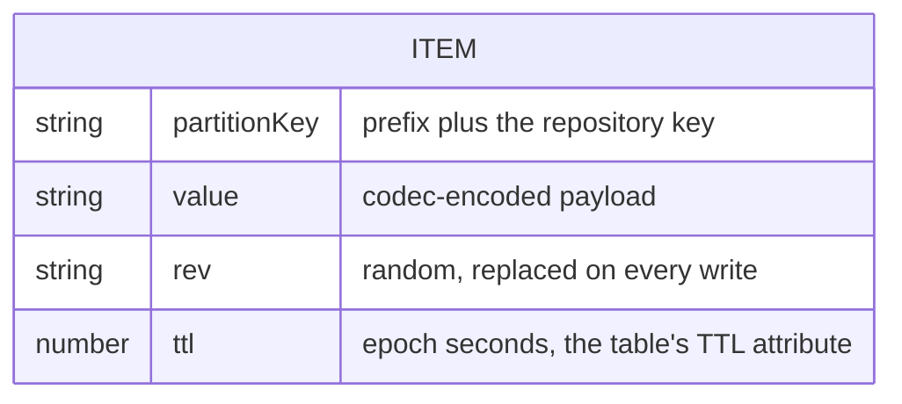

# @yingyeothon/repository-dynamodb

DynamoDB-backed implementation of the `@yingyeothon/repository` abstractions: an `ExpirableRepository` + `CasRepository` that stores each value as one item (partition key = optional prefix + repository key), encodes values with a pluggable `Codec` (JSON by default), expires items through the table's TTL attribute, and does conditional writes with a per-item revision token. It composes with `createListDocument`/`createMapDocument` from `@yingyeothon/repository` for versioned documents.

One item per value: the payload, a random revision attribute, and the table's TTL attribute.



## Install

```bash
npm install @yingyeothon/repository-dynamodb @aws-sdk/client-dynamodb @aws-sdk/lib-dynamodb
```

`@aws-sdk/client-dynamodb` and `@aws-sdk/lib-dynamodb` are peer dependencies.

## Usage

ESM:

```ts
import { createMapDocument } from "@yingyeothon/repository";
import { createDynamoRepository } from "@yingyeothon/repository-dynamodb";

const repo = createDynamoRepository({
  tableName: "my-table",
  prefix: "app-state/", // optional; prepended verbatim to every key
});

await repo.set("hello", { value: 42 }); // no TTL: the item lives until deleted
await repo.setWithExpire("session", "token", 60_000); // TTL in 60 seconds
const stored = await repo.get<{ value: number }>("hello"); // { value: 42 }
await repo.get("missing"); // undefined
await repo.set("hello", undefined); // same as repo.delete("hello")
await repo.delete("hello");

// Conditional writes: a token from getRevision guards compareAndSet
const rev = await repo.getRevision<string>("session");
await repo.compareAndSet("session", rev?.token, "rotated", {
  expiresInMillis: 60_000,
});

// Versioned documents from @yingyeothon/repository:
const mapDoc = createMapDocument<string>({ repository: repo, key: "map-doc" });
await mapDoc.insertOrUpdate("key", "value");

// Derive a repository that shares the client/codec but uses another prefix:
const nested = repo.withPrefix("app-state/nested/");
```

CJS:

```js
const { createDynamoRepository } = require("@yingyeothon/repository-dynamodb");
const { DynamoDBClient } = require("@aws-sdk/client-dynamodb");
const { DynamoDBDocumentClient } = require("@aws-sdk/lib-dynamodb");

const repo = createDynamoRepository({
  tableName: "my-table",
  // optional; defaults to DynamoDBDocumentClient.from(new DynamoDBClient())
  client: DynamoDBDocumentClient.from(
    new DynamoDBClient({ region: "ap-northeast-2" }),
  ),
});
```

## Table requirements

- Partition key: a string attribute named by `keyAttribute` (default `pk`); no sort key.
- TTL enabled on the attribute named by `ttlAttribute` (default `ttl`), in epoch seconds. Only items written with `setWithExpire` or `compareAndSet(..., { expiresInMillis })` carry it; plain `set` — and a `compareAndSet` or document without `expiresInMillis` — stores the item without a TTL (and drops an existing one), which is fine here because a dedicated table has no shared-LRU eviction risk (unlike `@yingyeothon/repository-redis`, which requires a TTL on every key).
- IAM: `dynamodb:GetItem`, `dynamodb:PutItem`, `dynamodb:DeleteItem` on the table.

Each item holds `value` (the encoded value), `rev` (a random revision id renewed on every write), and optionally the TTL attribute.

Notes:

- DynamoDB deletes expired items lazily (typically within 48 hours). Reads compare the TTL attribute with the current time themselves, so an expired item is reported as `undefined` immediately, and `compareAndSet(key, undefined, ...)` can recreate it while a token read before the expiry is rejected.
- A conditional write that fails (`compareAndSet` resolving `false`) still consumes one write capacity unit.

## Public API

- `createDynamoRepository(options: DynamoRepositoryOptions): DynamoRepository` — `ExpirableRepository & CasRepository` backed by a DynamoDB table:
  - `get<T>(key)` — reads and decodes the item; returns `undefined` when the item does not exist or its TTL has passed; other errors are rethrown.
  - `set<T>(key, value)` — encodes and writes the item without a TTL; `set(key, undefined)` deletes instead.
  - `setWithExpire<T>(key, value, expiresInMillis)` — writes the item with `ttl = ceil((now + expiresInMillis) / 1000)`; throws when `expiresInMillis <= 0`.
  - `getRevision<T>(key)` — the value plus the item's `rev` as the token, with the same expiry check as `get`.
  - `compareAndSet<T>(key, expectedToken, value, { expiresInMillis? })` — conditional `PutItem`: with `expectedToken === undefined` the item must not exist (or must be expired); otherwise its `rev` must equal the token and it must not be expired. `ConditionalCheckFailedException` resolves `false`; other errors are rethrown.
  - `delete(key)` — removes the item.
  - `withPrefix(prefix)` — new `DynamoRepository` sharing the same table, client, codec, and attribute names.
- `DynamoRepository` — the returned repository interface (type)
- `DynamoRepositoryOptions` — factory options `{ tableName, client?, prefix?, codec?, keyAttribute?, ttlAttribute? }` (type)

## Migrating from the legacy package

There is no legacy package: `@yingyeothon/repository-dynamodb` is new in v2 and follows the same shape as `@yingyeothon/repository-s3`.
