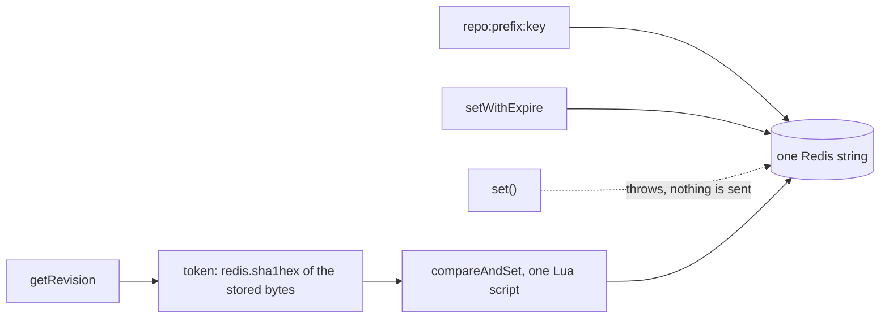

# @yingyeothon/repository-redis

Redis-backed implementation of the `@yingyeothon/repository` abstractions: a `Repository` that stores each value as one Redis string (key = `repo:` + optional prefix + repository key), encodes values with a pluggable `Codec` (JSON by default), and stores every key with a TTL (`setWithExpire`; a TTL-less `set` throws). It is also a `CasRepository`: `getRevision`/`compareAndSet` do conditional writes through one Lua script, so versioned documents from `@yingyeothon/repository` retry instead of overwriting each other. Because it satisfies the `Repository` contract, versioned list/map documents from `@yingyeothon/repository` work out of the box. Redis I/O goes through `@yingyeothon/naive-redis`, so a single lightweight socket connection is shared by everything.

One Redis string per value, a TTL on every write, and a conditional write that compares a hash of the stored bytes.



## Install

```bash
npm install @yingyeothon/repository-redis
```

## Usage

ESM:

```ts
import { createRedisConnection } from "@yingyeothon/naive-redis";
import { createRedisRepository } from "@yingyeothon/repository-redis";

const repo = createRedisRepository({
  redisConnection: createRedisConnection({
    host: "localhost",
    port: 6379,
    password: "optional-password",
  }),
  prefix: "session", // optional; keys become "repo:session:<key>"
});

const ttl = 30 * 60 * 1000; // every key needs a TTL, in millis
await repo.setWithExpire("hello", { value: 42 }, ttl);
const stored = await repo.get<{ value: number }>("hello"); // { value: 42 }
await repo.get("missing"); // undefined
await repo.set("hello", { value: 1 }); // throws: use setWithExpire
await repo.set("hello", undefined); // still the same as repo.delete("hello")
await repo.delete("hello");

// Conditional writes: the token is the SHA-1 of the stored string.
const revision = await repo.getRevision<{ value: number }>("hello"); // undefined when absent
await repo.compareAndSet(
  "hello",
  revision?.token,
  { value: 43 },
  { expiresInMillis: ttl },
); // false when someone else wrote in between

// Versioned documents from @yingyeothon/repository (CAS-backed, TTL required):
import { createMapDocument } from "@yingyeothon/repository";
const mapDoc = createMapDocument<string>({
  repository: repo,
  key: "map-doc",
  expiresInMillis: ttl,
});
await mapDoc.insertOrUpdate("key", "value");

// Derive a repository that shares the connection/codec but uses another prefix:
const nested = repo.withPrefix("nested");
```

CJS:

```js
const { createRedisConnection } = require("@yingyeothon/naive-redis");
const { createRedisRepository } = require("@yingyeothon/repository-redis");

const repo = createRedisRepository({
  redisConnection: createRedisConnection({ host: "localhost" }),
});
```

## Public API

- `createRedisRepository(options)` — builds a `RedisRepository` backed by Redis:
  - `get<T>(key)` — reads and decodes the value; returns `undefined` when the key does not exist or has expired; a Redis/socket error is logged via the injected `logger` and also yields `undefined`.
  - `set<T>(key, value)` — `set(key, undefined)` deletes; any other value throws `@yingyeothon/repository-redis stores every key with a TTL; use setWithExpire.` (nothing is sent to Redis).
  - `setWithExpire<T>(key, value, expiresInMillis)` — encodes and writes the value with a TTL (`SET ... PX`); throws when `expiresInMillis <= 0`; `undefined` deletes instead.
  - `delete(key)` — removes the key.
  - `getRevision<T>(key)` — `GET` plus a revision token: the hex SHA-1 of the raw stored string (before codec decoding), i.e. what Redis's `redis.sha1hex` computes. Returns `undefined` for a missing key. Unlike `get`, a Redis error is thrown, not swallowed, so a document retry never runs on a guessed revision.
  - `compareAndSet<T>(key, expectedToken, value, { expiresInMillis })` — one `EVAL` of a Lua script that writes only when the key's current SHA-1 equals `expectedToken` (or when the key is absent and `expectedToken` is `undefined`), then `SET ... PX expiresInMillis`. Resolves `false` without writing otherwise. The key, token, value, and TTL travel as `KEYS`/`ARGV`, never inside the script text. Throws the TTL error when `expiresInMillis` is missing or `<= 0`, and throws for an `undefined` value (use `delete`).
  - Documents (`createListDocument`/`createMapDocument`) must pass `expiresInMillis`; they use `getRevision`/`compareAndSet` automatically and retry up to `maxRetries` (see `@yingyeothon/repository` "Concurrent writers").
  - `withPrefix(prefix)` — new `RedisRepository` sharing the same connection and codec.
  - Key layout: `repo:<key>`, or `repo:<prefix>:<key>` when a prefix is set.
- `RedisRepository` — `ExpirableRepository & CasRepository` plus `withPrefix` (type)
- `RedisRepositoryOptions` — factory options `{ redisConnection, prefix?, codec?, logger? }`; `logger` is a `Logger` from `@yingyeothon/logger` and defaults to `nullLogger` (type)

## Migrating from the legacy package

- The package now ships dual ESM/CJS with types; deep imports (`@yingyeothon/repository-redis/lib/...`) are no longer supported — import everything from the package root.
- The `RedisRepository` class is gone: call `createRedisRepository(options)` instead of `new RedisRepository(args)`. The returned object implements `ExpirableRepository` and keeps `withPrefix`; `getListDocument`/`getMapDocument` moved to `createListDocument`/`createMapDocument` in `@yingyeothon/repository`.
- `RedisRepositoryArguments` is now `RedisRepositoryOptions`.
- `@yingyeothon/naive-redis` renamed `redisConnect` to `createRedisConnection`; import it from the package root instead of `@yingyeothon/naive-redis/lib/connection`.
- Every key now carries a TTL: `set(key, value)` throws unless `value` is `undefined`. Replace `repo.set(key, value)` with `repo.setWithExpire(key, value, expiresInMillis)` and pass `expiresInMillis` to every `createListDocument`/`createMapDocument` backed by this repository; a document without it fails on its first write.
- `RedisRepository` is now also a `CasRepository` (`getRevision`/`compareAndSet`), so document edits from concurrent writers are retried instead of silently overwriting each other.
- Redis read errors are no longer reported with `console.error`; pass `logger` (from `@yingyeothon/logger`) in the options to observe them. Behavior and the key layout are unchanged.
