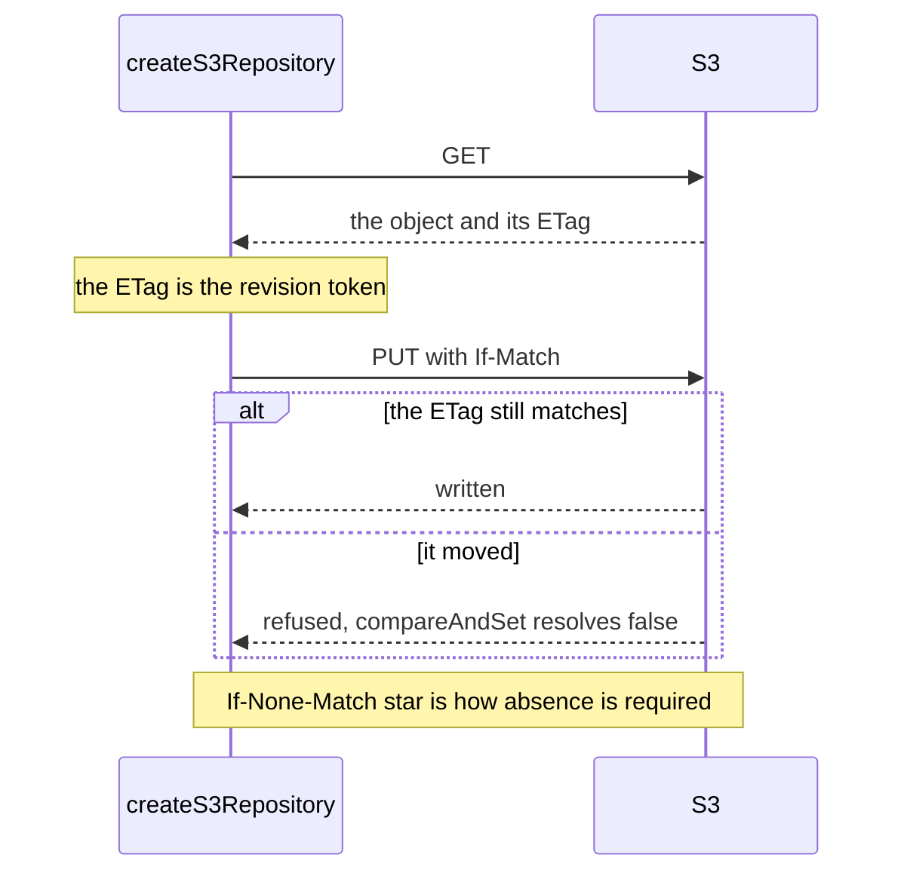

# @yingyeothon/repository-s3

S3-backed implementation of the `@yingyeothon/repository` abstractions: a `Repository` that stores each value as one S3 object (key = optional prefix + repository key), encodes values with a pluggable `Codec` (JSON by default), and treats a missing key (`NoSuchKey`) as `undefined`. It is a `CasRepository`: conditional writes ride on S3's own `If-Match`/`If-None-Match` ETag checks, so `createListDocument`/`createMapDocument` from `@yingyeothon/repository` retry instead of clobbering when two writers race on one document.

Conditional writes ride on S3's own ETag checks, so two writers on one document retry instead of clobbering.



## Install

```bash
npm install @yingyeothon/repository-s3 @aws-sdk/client-s3
```

`@aws-sdk/client-s3` is a peer dependency.

## Usage

ESM:

```ts
import { createMapDocument } from "@yingyeothon/repository";
import { createS3Repository } from "@yingyeothon/repository-s3";

const repo = createS3Repository({
  bucketName: "my-bucket",
  prefix: "app-state/", // optional; prepended verbatim to every key
});

await repo.set("hello", { value: 42 });
const stored = await repo.get<{ value: number }>("hello"); // { value: 42 }
await repo.get("missing"); // undefined (NoSuchKey is swallowed)
await repo.set("hello", undefined); // same as repo.delete("hello")
await repo.delete("hello");

// Versioned documents from @yingyeothon/repository:
const mapDoc = createMapDocument<string>({ repository: repo, key: "map-doc" });
await mapDoc.insertOrUpdate("key", "value");

// Conditional writes (ETag-based; a lost race resolves false, nothing is written):
const revision = await repo.getRevision<{ value: number }>("hello");
await repo.compareAndSet("hello", revision?.token, { value: 43 }); // true
await repo.compareAndSet("hello", revision?.token, { value: 44 }); // false: ETag changed
await repo.compareAndSet("fresh", undefined, { value: 0 }); // true only if "fresh" did not exist

// Derive a repository that shares the client/codec but uses another prefix:
const nested = repo.withPrefix("app-state/nested/");
```

Notes on conditional writes:

- The token is the object's ETag, passed verbatim as `IfMatch` (`IfNoneMatch: "*"` when the expected token is `undefined`). A 412 `PreconditionFailed` or 409 `ConditionalRequestConflict` response resolves `false`; any other error is rethrown. There is no extra cost: a failed conditional `PutObject` is billed like any other `PutObject`.
- S3 has no per-object TTL, so `expiresInMillis` (on `compareAndSet` and on the document options) is ignored. Use a bucket lifecycle rule to expire objects.
- General-purpose buckets only: directory buckets do not support `If-Match` on `PutObject`.

CJS:

```js
const { createS3Repository } = require("@yingyeothon/repository-s3");
const { S3 } = require("@aws-sdk/client-s3");

const repo = createS3Repository({
  bucketName: "my-bucket",
  s3: new S3({ region: "ap-northeast-2" }), // optional; defaults to new S3()
});
```

## Public API

- `createS3Repository(options: S3RepositoryOptions): S3Repository` — `Repository` backed by an S3 bucket:
  - `get<T>(key)` — reads and decodes the object; returns `undefined` when the key does not exist (`NoSuchKey`) or the object has no body; other errors are rethrown (note: without `listObject` permission S3 reports missing keys as `Access Denied`, which is rethrown).
  - `set<T>(key, value)` — encodes and writes the object; `set(key, undefined)` deletes instead.
  - `delete(key)` — removes the object.
  - `getRevision<T>(key)` — `{ value, token }` where `token` is the object's ETag (quotes included); `undefined` for a missing key or empty body. Throws if S3 returns no ETag, since such an object cannot be written conditionally.
  - `compareAndSet<T>(key, expectedToken, value, options?)` — `PutObject` with `IfMatch: expectedToken`, or `IfNoneMatch: "*"` when `expectedToken` is `undefined`; resolves `false` on 412/409 without writing, rethrows other errors. `options.expiresInMillis` is ignored (no TTL on S3; use lifecycle rules).
  - `withPrefix(prefix)` — new `S3Repository` sharing the same bucket, client, and codec.
- `S3Repository` — the returned repository interface, `Repository & CasRepository` plus `withPrefix` (type)
- `S3RepositoryOptions` — factory options `{ bucketName, s3?, prefix?, codec? }` (type)

## Migrating from the legacy package

- The package now ships dual ESM/CJS with types; deep imports (`@yingyeothon/repository-s3/lib/...`) are no longer supported — import everything from the package root.
- The `S3Repository` class is gone: call `createS3Repository(options)` instead of `new S3Repository(args)`; the returned object has the same `get`/`set`/`delete`/`withPrefix` behavior, and `S3Repository` is now the type of that object.
- `S3RepositoryArguments` was renamed to `S3RepositoryOptions` (type-only export).
- `getListDocument`/`getMapDocument` are no longer methods on the repository; use `createListDocument({ repository, key })` / `createMapDocument({ repository, key })` from `@yingyeothon/repository`.
