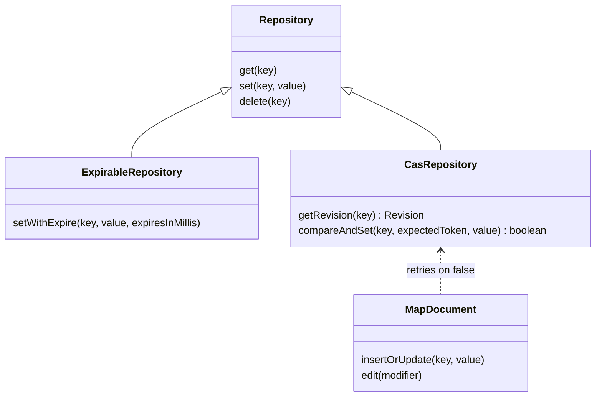

# @yingyeothon/repository

Key-value repository abstractions for asynchronous storage backends: a minimal `Repository` interface, an `ExpirableRepository` extension for TTL-based entries, a `CasRepository` extension for conditional (compare-and-set) writes, a `createRepositoryFromKV` building block that turns primitive string get/set/delete operations into a full JSON repository, versioned list/map document helpers, and a `createInMemoryRepository` implementation useful for tests and local development.

One interface with two optional extensions, and the documents that use them when they are there.



## Install

```bash
npm install @yingyeothon/repository
```

## Usage

ESM:

```ts
import {
  createInMemoryRepository,
  createListDocument,
  createMapDocument,
} from "@yingyeothon/repository";

const repo = createInMemoryRepository();
await repo.set("greeting", { hi: "there" });
const value = await repo.get<{ hi: string }>("greeting");

// TTL entries
await repo.setWithExpire("session", "token", 60_000);

// Conditional writes: a token from getRevision guards compareAndSet
const rev = await repo.getRevision<string>("session");
await repo.compareAndSet("session", rev?.token, "rotated", {
  expiresInMillis: 60_000,
});

// Versioned document helpers
const list = createListDocument<string>({ repository: repo, key: "todo" });
await list.insert("write docs");
const doc = await list.read(); // { version: 1, content: ["write docs"] }

const map = createMapDocument<number>({ repository: repo, key: "scores" });
await map.insertOrUpdate("alice", 10);
await map.delete("alice");
```

CJS:

```js
const { createInMemoryRepository } = require("@yingyeothon/repository");

const repo = createInMemoryRepository();
repo.set("key", "value").then(() => repo.get("key"));
```

Building a repository from primitive string operations (how backends like Redis or S3 plug in):

```ts
import { createRepositoryFromKV } from "@yingyeothon/repository";

const repo = createRepositoryFromKV({
  get: (key) => backend.read(key), // Promise<string | undefined>
  set: (key, serialized) => backend.write(key, serialized),
  delete: (key) => backend.remove(key),
  // Optional; providing it makes the result an ExpirableRepository.
  setWithExpire: (key, serialized, expiresInMillis) =>
    backend.writeWithTTL(key, serialized, expiresInMillis),
  // Optional; providing both makes the result a CasRepository.
  getRevision: (key) => backend.readWithEtag(key), // { serialized, token }
  compareAndSet: (key, expectedToken, serialized, expiresInMillis) =>
    backend.writeIfMatch(key, expectedToken, serialized),
});
```

### Concurrent writers

`ListDocument`/`MapDocument` do a read-modify-write on every `edit`, `insert`, `insertOrUpdate`, `deleteIf` and `delete`. On a `CasRepository` (in-memory, `repository-redis`, `repository-s3`, `repository-dynamodb`) that write is conditioned on the revision that was read and retried from a fresh read when another writer got in between — up to `maxRetries` (default 3) times, after which `edit` throws `Concurrent modification of "<key>"`. On a repository without CAS the last writer wins, so serialize writers yourself there (an actor lock does).

## Public API

- `Repository` (type) — async key-value interface: `get<T>(key)`, `set<T>(key, value)`, `delete(key)`.
- `ExpirableRepository` (type) — extends `Repository` with `setWithExpire<T>(key, value, expiresInMillis)`; a non-positive TTL means "never expires".
- `CasRepository` (type) — extends `Repository` with `getRevision<T>(key): Promise<Revision<T> | undefined>` and `compareAndSet<T>(key, expectedToken, value, options?)`. `compareAndSet` writes only while the key still holds the revision `expectedToken` (`undefined` = the key must not exist) and resolves `false` without writing otherwise. `options.expiresInMillis` applies a TTL where the backend has one.
- `Revision<T>` (type) — `{ value: T; token: string }`; `token` is backend-specific and opaque (an ETag, a content hash, a row revision).
- `CompareAndSetOptions` (type) — `{ expiresInMillis?: number }`.
- `isCasRepository(repository)` / `isExpirableRepository(repository)` — type guards for the two extensions.
- `createRepositoryFromKV(primitives)` — builds a `Repository` from primitive string-valued operations. The primitives contract (`KVPrimitives`): `get(key): Promise<string | undefined>` (`undefined` means "no value"), `set(key, serialized): Promise<void>`, `delete(key): Promise<void>`, and optionally `setWithExpire(key, serialized, expiresInMillis): Promise<void>`, `getRevision(key): Promise<{ serialized, token } | undefined>` and `compareAndSet(key, expectedToken, serialized, expiresInMillis?): Promise<boolean>`. Values are serialized with `JSON.stringify` before writes and parsed with `JSON.parse` after reads. When `setWithExpire` is provided the returned object is an `ExpirableRepository`; when both `getRevision` and `compareAndSet` are provided it is a `CasRepository`; otherwise those members are absent.
- `KVPrimitives` (type) — the primitives contract accepted by `createRepositoryFromKV`.
- `createInMemoryRepository()` — returns an `InMemoryRepository` (an `ExpirableRepository`) backed by an in-process `Map`.
- `InMemoryRepository` (type) — `ExpirableRepository & CasRepository`, the return type of `createInMemoryRepository`; its revision token is a SHA-1 of the serialized value.
- `createListDocument<V>(options: ListDocumentOptions)` — returns a `ListDocument<V>`, a versioned list stored under `options.key` in `options.repository`: `insert`, `deleteIf`, `truncate`, `read`, `edit`, `view`.
- `createMapDocument<V>(options: MapDocumentOptions)` — returns a `MapDocument<V>`, a versioned string-keyed map stored under `options.key` in `options.repository`: `insertOrUpdate`, `delete`, `truncate`, `read`, `edit`, `view`.
- `ListDocument<V>` / `MapDocument<V>` (types) — the document interfaces returned by the factories.
- `ListDocumentOptions` / `MapDocumentOptions` (types) — `{ repository: Repository; key: string; expiresInMillis?: number; maxRetries?: number }`. `expiresInMillis` is applied on every write (through `compareAndSet` or `setWithExpire`; ignored on backends without per-key TTL). `maxRetries` bounds the CAS retries, see "Concurrent writers".
- `DocumentWriteOptions` (type) — the `{ expiresInMillis?, maxRetries? }` part shared by both option types.
- `Versioned<T>` (type) — `{ version: number; content: T }` envelope used by the document helpers.
- `Values<V>` (type) — alias for `V[]`, the content type of `ListDocument`.
- `KeyValues<V>` (type) — alias for `Record<string, V>`, the content type of `MapDocument`.

## Migrating from the legacy package

Classes are gone; every construct is now a factory returning an interface:

- `new InMemoryRepository()` → `createInMemoryRepository()`. `InMemoryRepository` remains exported as a type (equal to `ExpirableRepository`).
- `new ListDocument(repository, key)` → `createListDocument({ repository, key })`. `ListDocument<V>` is now an interface with the same methods.
- `new MapDocument(repository, key)` → `createMapDocument({ repository, key })`. `MapDocument<V>` is now an interface with the same methods.
- `SimpleRepository` (abstract class) is removed. Its `getListDocument`/`getMapDocument` helpers are replaced by the standalone `createListDocument`/`createMapDocument` factories, which work with any `Repository`. Backends that previously subclassed `SimpleRepository` should instead implement primitive string operations and call `createRepositoryFromKV(primitives)`.

Behavior is otherwise unchanged. `Versioned<T>` and `KeyValues<V>` remain exported, and the in-memory store still uses a `Map`, avoiding prototype-key pitfalls of the old plain-object store.
