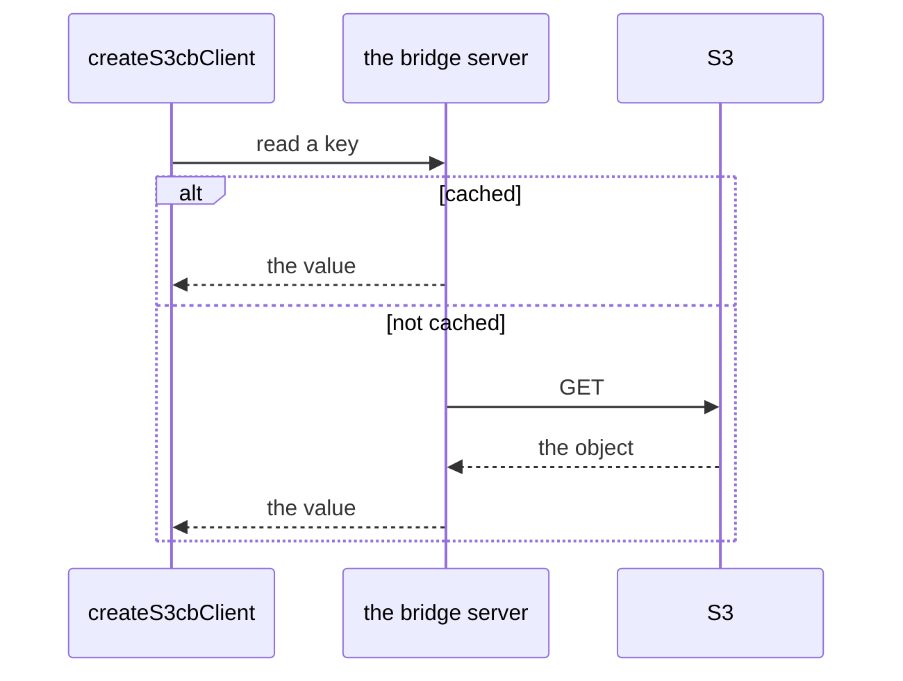

# @yingyeothon/s3-cache-bridge-client

HTTP client for the [s3-cache-bridge](https://github.com/yingyeothon) server: read, write, delete, and append cached objects, patch JSON documents in place, control per-key locks, and trigger cache sync or invalidation — all over plain HTTP with optional basic auth. Built on the global `fetch` with zero runtime dependencies.

The bridge answers from its cache when it can, and reaches S3 when it cannot.



## Install

```bash
npm install @yingyeothon/s3-cache-bridge-client
```

## Usage

ESM:

```ts
import { createS3cbClient } from "@yingyeothon/s3-cache-bridge-client";

const cb = createS3cbClient({
  apiUrl: "https://cache.example.com/",
  apiId: "my-id",
  apiPassword: "my-password",
});

await cb.put("greeting", "WORLD");
const text = await cb.get("greeting"); // "WORLD"
await cb.append("greeting", "!");
const exists = await cb.exists("greeting"); // true

// JSON modification protocol.
const fetched = await cb.patch<{ a: { b: { c: number } } }>(
  "doc",
  { operation: "append", path: "a.b", value: { c: 10 } },
  { fetch: true },
);

// Manual locking.
await cb.lock("greeting");
await cb.put("greeting", "LOCKED WRITE", { noLock: true });
await cb.unlock("greeting");

// Binary and file transfer.
const bytes = await cb.getBuffer("image");
await cb.download("image", "/tmp/image.png");

await cb.del("greeting");
```

CJS:

```js
const { createS3cbClient } = require("@yingyeothon/s3-cache-bridge-client");
const cb = createS3cbClient({ apiUrl: "http://localhost:3000/" });
cb.get("key").then(console.log);
```

## Public API

- `createS3cbClient(options)` — factory that binds every method below to one server environment
- `S3cbClientOptions` — `{ apiUrl, apiId?, apiPassword? }`; credentials become a `Basic` Authorization header (type)
- `S3cbClient` — the object returned by `createS3cbClient` (type)
- `s3cbClientOptionsFromEnv()` — builds `S3cbClientOptions` from the `S3CB_URL`, `S3CB_ID`, and `S3CB_PASSWORD` environment variables; throws if `S3CB_URL` is unset. Calling it is the caller's choice — the library itself never reads `process.env`
- `JSONModificationRequest` — `append` / `modify` / `remove` / `fetch` operations for `patch` (type)
- `LockOptions` — `{ noLock?: boolean }` (type)
- `SyncOptions` — `{ sync?: boolean }` (type)
- `FetchOptions` — `{ fetch?: boolean }` (type)

Client methods:

- `get(key, options?)` — GET the object as a UTF-8 string
- `put(key, body, options?)` — PUT a string, `Buffer`, or `Uint8Array`
- `del(key, options?)` — DELETE the object
- `append(key, body, options?)` — PUT with `append=1` to append to the object
- `sync(key)` — POST with `sync=1` to flush the key to S3
- `invalidate(key)` — DELETE with `cache=1` to drop the cached copy
- `lock(key)` / `unlock(key)` — POST with `lock=acquire` / `lock=release`
- `patch<T>(key, modRequest, options?)` — PATCH a JSON document; resolves the fetched value when `fetch` is on (defaults to on for the `fetch` operation), otherwise `null`
- `getBuffer(key, options?)` — GET the object as a `Buffer`
- `download(key, downloadPath, options?)` — stream the object into a local file, resolving the path
- `exists(key, options?)` — HEAD the object; `false` on 404, throws on other errors

Every method rejects with an `Error` whose message is `"<status> <statusText>"` (for example `"404 Not Found"`) when the server does not answer 200.

## Migrating from the legacy package

- The default export is gone and the factory was renamed: `S3cb` → `createS3cbClient` (named export, `import { createS3cbClient } from ...`), and the `S3cbEnv` type → `S3cbClientOptions`. Every method is unchanged.
- The package now ships dual ESM/CJS with types; deep imports (`.../lib/...`) are no longer supported — import everything from the package root.
- Implemented on the global `fetch` (Node >= 20) instead of `node-fetch`/`https`; `get-stream` is no longer a dependency.
- `put` no longer sets a manual `Content-Length` header; `fetch` derives the identical value from the buffered body automatically.
- The `DEBUG=1` console tracing of the legacy HTTP layer was removed.
